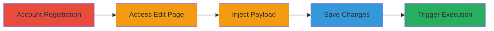

# Stored XSS via JavaScript URL in Shopify Partner Account Website Field

Multi-stage attack chain demonstrating a complete stored XSS workflow in Shopify's partner platform, allowing arbitrary JavaScript execution in victims' browsers for session hijacking.

## Chain Metrics Dashboard

| Metric | Value |
|--------|-------|
| Chain Status | Unverified |
| Total Steps | 5 |
| Execution Time | ~5 minutes |
| Skill Level | Intermediate |
| Complexity | Medium |
| Impact Level | High |

## Attack Flow Visualization

## Prerequisites & Requirements

### Required Tools

- Web browser (e.g., Chrome, Firefox)

### Target Environment

- Shopify Partner Platform (https://app.shopify.com)
- Web-based application

### Initial Access Requirements

- No prior credentials needed; registration is open
- Internet access to Shopify's partner signup

## Detailed Attack Procedures

### Step 1: Account Registration
procedure: [[procedures/Register-Shopify-Partner-Account]]

**Objective**: Create a new Shopify partner account to gain access to editable profile features.

**Instructions**: Navigate to the Shopify partner signup page and complete the registration form with valid details.

**Expected Output**: Confirmation email and access to the partner dashboard.

**Success Indicators**:
- Successful login to https://app.shopify.com
- Dashboard loads without errors

### Step 2: Access Account Edit Page
procedure: [[procedures/Access-Shopify-Partner-Account-Edit-Page]]

**Objective**: Navigate to the account settings where the vulnerable website field is located.

**Instructions**: From the dashboard, go directly to the edit URL: https://app.shopify.com/services/partners/account/edit.

**Expected Output**: Form page with fields including 'Website (optional)'.

**Success Indicators**:
- Edit form is visible and editable
- No authentication errors

### Step 3: Inject Malicious Payload
procedure: [[procedures/Inject-Malicious-JavaScript-URL-Payload]]

**Objective**: Enter a javascript: URL payload into the website field to store malicious code.

**Instructions**: In the 'Website (optional)' field, input the payload `javascript:alert(document.cookie);// http://dgddfgdfgg.ua/`.

**Expected Output**: Payload entered without validation errors.

**Success Indicators**:
- Field accepts the input
- No immediate JavaScript blocking

### Step 4: Save Changes
procedure: [[procedures/Save-XSS-Payload-in-Account-Settings]]

**Objective**: Persist the malicious payload in the account profile.

**Instructions**: Submit the form to save the updated website field.

**Expected Output**: Success message confirming changes saved.

**Success Indicators**:
- Profile updates without errors
- Payload is stored server-side

### Step 5: Trigger Stored XSS
procedure: [[procedures/Trigger-Stored-XSS-by-Clicking-Website-Link]]

**Objective**: Execute the stored JavaScript by interacting with the rendered link.

**Instructions**: View the account details page and click the saved website link, which executes the javascript: payload.

**Expected Output**: Alert box displaying document.cookie contents.

**Success Indicators**:
- JavaScript alert pops up
- Cookies are accessible via the payload

## Attack Chain Summary

### Key Achievements

1. Successful registration and access to vulnerable edit page
2. Injection and storage of javascript: URL without sanitization
3. Arbitrary JS execution leading to cookie theft

## Technique & Tactic Coverage

### MITRE ATT&CK Techniques

- [[JavaScript]]

### MITRE ATT&CK Tactics

- [[Initial Access]]
- [[Execution]]
- [[Collection]]

---
*Last updated: 2023-10-01T00:00:00Z*
