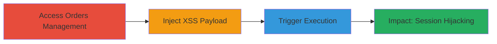

---
tags:
  - xss
  - stored-xss
  - javascript
  - web
  - session-hijacking
type: attack_chain
tools: []
tactics:
  - '[[Execution]]'
  - '[[Collection]]'
verified: false
platforms:
  - Web
submitted: true
complexity: medium
created_at: '2023-10-01T00:00:00Z'
procedures:
  - '[[procedures/Access-VK-Community-Orders-Management]]'
  - '[[procedures/Inject-Malicious-Payload-into-Order-Label]]'
  - '[[procedures/Trigger-Stored-XSS-via-Label-Selection]]'
step_count: 3
techniques:
  - '[[JavaScript]]'
updated_at: '2025-12-14T03:16:37.479Z'
description: >-
  A multi-step attack exploiting a stored XSS vulnerability in VK.com's
  community orders management by injecting malicious JavaScript into label
  filters, leading to arbitrary code execution for other users.
skill_level: intermediate
impact_level: high
id: 25d3bedb-c529-4eda-acc2-d6c80da9c755
validated: true
mitre_tactics:
  - '[[Execution]]'
  - '[[Collection]]'
mitre_techniques:
  - '[[JavaScript]]'
---
# Stored XSS via Label Filtering in VK.com Community Orders

Multi-stage attack chain demonstrating a complete attack workflow exploiting a stored XSS vulnerability in VK.com's community orders management feature.

## Chain Metrics Dashboard

| Metric | Value |
|--------|-------|
| Chain Status | Unverified |
| Total Steps | 3 |
| Execution Time | ~5 minutes |
| Skill Level | Intermediate |
| Complexity | Medium |
| Impact Level | High |

## Attack Flow Visualization

## Prerequisites & Requirements

### Required Tools

- Web browser (e.g., Chrome with developer tools)

### Target Environment

- VK.com web platform
- Access to a community where the attacker has management privileges
- No specific ports or services beyond standard HTTPS (port 443)

### Initial Access Requirements

- Valid VK.com account with administrative access to a community
- Ability to create or manage orders in the community
- Network access to vk.com (no VPN or proxy restrictions assumed)

## Detailed Attack Procedures

### Step 1: Access Orders Management
procedure: [[procedures/Access-VK-Community-Orders-Management]]

**Objective**: Gain entry to the orders list page in a VK.com community to prepare for label manipulation.

**Instructions**: Log in to VK.com with an account that has community admin rights. Navigate to the community settings, select the orders or marketplace section, and access the list of orders where filtering by labels is available. Use the browser's developer tools to inspect the page elements if needed for verification.

**Expected Output**: The orders list page loads, displaying options for label selection and filtering.

**Success Indicators**:
- Orders list page is accessible
- Label creation or selection interface is visible

### Step 2: Inject Malicious Payload into Order Label
procedure: [[procedures/Inject-Malicious-Payload-into-Order-Label]]

**Objective**: Introduce unsanitized JavaScript code into a label used for order filtering, storing it for later execution.

**Instructions**: On the orders list page, locate the label creation or editing feature. Enter a malicious payload such as `` or a more advanced one like `` as the label name or value. Save the label and associate it with an order if required. Verify storage by checking if the label appears in the filter list without alteration.

**Expected Output**: The malicious label is saved and displayed in the filter options without sanitization.

**Success Indicators**:
- Label is stored successfully
- Payload is visible in the UI but not escaped (e.g., no HTML entities)

### Step 3: Trigger Stored XSS via Label Selection
procedure: [[procedures/Trigger-Stored-XSS-via-Label-Selection]]

**Objective**: Cause the execution of the injected JavaScript when another user interacts with the filtered orders list.

**Instructions**: Have a victim (or use another account) view the orders list page and select the malicious label for filtering. The payload will execute automatically upon rendering the filter interface. Monitor for execution via an alert or external callback to the attacker's server.

**Expected Output**: JavaScript executes in the victim's browser, potentially displaying an alert or sending data to the attacker.

**Success Indicators**:
- Alert pops up or network request to attacker server is observed
- Victim's session data is exfiltrated (e.g., cookies stolen)

## Attack Chain Summary

### Key Achievements

1. Successful injection and storage of XSS payload in community labels
2. Arbitrary JavaScript execution in other users' browsers upon label selection
3. Potential for session hijacking, data theft, or phishing via stolen credentials

## Technique & Tactic Coverage

### MITRE ATT&CK Techniques

- [[JavaScript]]

### MITRE ATT&CK Tactics

- [[Execution]]
- [[Collection]]

---
*Last updated: 2023-10-01T00:00:00Z*
