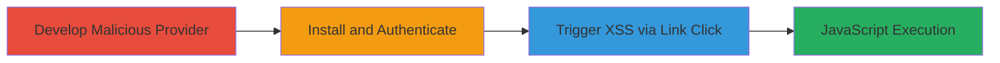

---
tags:
  - xss
  - stored-xss
  - apache-airflow
  - javascript-execution
type: attack_chain
tools: []
tactics:
  - '[[Execution]]'
commands: []
platforms:
  - Web
complexity: medium
procedures:
  - '[[procedures/Develop-Malicious-Airflow-Provider-with-XSS-Payload]]'
  - '[[procedures/Authenticate-and-Navigate-to-Airflow-Providers-Section]]'
  - '[[procedures/Trigger-Stored-XSS-in-Provider-Documentation-Link]]'
step_count: 3
techniques:
  - '[[JavaScript]]'
description: >-
  Multi-stage attack exploiting a stored XSS vulnerability in Apache Airflow by
  installing a malicious provider package, leading to arbitrary JavaScript
  execution upon clicking the documentation link in the web UI.
skill_level: intermediate
impact_level: high
id: 126eaa8c-3579-4d33-9c9a-5860ee05a79e
created_at: '2025-12-13T23:52:55.737Z'
updated_at: '2025-12-13T23:52:55.737Z'
verified: false
validated: true
submitted: true
mitre_tactics:
  - '[[Execution]]'
mitre_techniques:
  - '[[JavaScript]]'
---
# Stored XSS via Malicious Apache Airflow Provider Documentation Link

Multi-stage attack chain demonstrating exploitation of CVE-2024-41937, a stored XSS vulnerability in Apache Airflow versions before 2.10.0. A malicious provider package is developed and installed on the target Airflow instance, embedding an XSS payload in the documentation URL. An authenticated user then navigates to the providers section in the web UI and clicks the link, triggering JavaScript execution in the browser context. This can lead to credential theft, session hijacking, or further client-side attacks, requiring provider installation and user interaction.

## Chain Metrics Dashboard

| Metric | Value |
|--------|-------|
| Chain Status | Unverified |
| Total Steps | 3 |
| Execution Time | ~10 minutes |
| Skill Level | Intermediate |
| Complexity | Medium |
| Impact Level | High |

## Attack Flow Visualization

## Prerequisites & Requirements

### Required Tools

- Python development environment
- pip for package installation

### Target Environment

- Apache Airflow web server (versions < 2.10.0)
- Required services/ports: Web UI on default port 8080
- Network access requirements: Ability to install providers on the server (e.g., via SSH or direct access)

### Initial Access Requirements

- Server access to install the malicious provider
- Valid user credentials for Airflow web UI authentication
- No prior network position needed beyond server installation access

## Detailed Attack Procedures

### Step 1: Develop and Install Malicious Provider
procedure: [[procedures/Develop-Malicious-Airflow-Provider-with-XSS-Payload]]

**Objective**: Create and deploy a provider package with an embedded XSS payload in the documentation URL to store the malicious script on the Airflow server.

**Instructions**: Follow the procedure to build a custom provider package, embedding a JavaScript payload like `javascript:alert(document.cookie)` in the documentation URL field. Package it as a Python wheel and install it on the target Airflow instance using pip. Restart Airflow services if necessary to load the provider.

**Expected Output**: The malicious provider appears in the Airflow providers list with the tainted documentation link.

**Success Indicators**:
- Provider package builds without errors
- Installation completes via pip
- Provider is listed in Airflow UI after restart

### Step 2: Authenticate and Navigate to Providers Section
procedure: [[procedures/Authenticate-and-Navigate-to-Airflow-Providers-Section]]

**Objective**: Gain access to the Airflow web UI and locate the malicious provider entry to prepare for payload delivery.

**Instructions**: Use valid credentials to log in to the Airflow web interface. Navigate to the 'Providers' section in the UI menu, where installed providers are listed, including the malicious one.

**Expected Output**: Successful login and display of the providers page with the malicious link visible.

**Success Indicators**:
- Authentication succeeds without errors
- Providers page loads and shows the custom provider
- Documentation link for the provider is present and clickable

### Step 3: Trigger Stored XSS in Provider Documentation Link
procedure: [[procedures/Trigger-Stored-XSS-in-Provider-Documentation-Link]]

**Objective**: Execute the stored XSS payload by interacting with the tainted link, leading to arbitrary JavaScript in the victim's browser.

**Instructions**: In the providers section, click the documentation link for the malicious provider. The browser interprets the javascript: URL and executes the embedded payload, such as stealing session cookies or alerting for proof-of-concept.

**Expected Output**: JavaScript execution, e.g., an alert box or network request exfiltrating data.

**Success Indicators**:
- Payload triggers without browser errors
- JavaScript executes in the context of the authenticated session
- Evidence of data theft or session compromise (e.g., logged exfiltration)

## Attack Chain Summary

### Key Achievements

1. Successful installation of a malicious provider with XSS payload
2. Delivery of the payload via the Airflow web UI without direct code injection
3. Arbitrary JavaScript execution enabling client-side attacks like credential theft

## Technique & Tactic Coverage

### MITRE ATT&CK Techniques

- [[JavaScript]]

### MITRE ATT&CK Tactics

- [[Execution]]

---
*Last updated: 2024-10-01*
