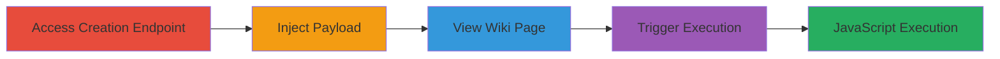

---
tags:
  - xss
  - stored-xss
  - javascript
  - confluence
  - wiki
  - topcoder
type: attack_chain
tools: []
tactics:
  - '[[Initial Access]]'
  - '[[Execution]]'
verified: false
platforms:
  - Web
submitted: true
complexity: medium
created_at: '2023-10-01T00:00:00Z'
procedures:
  - '[[procedures/Access-TopCoder-Bookmark-Creation-Endpoint]]'
  - '[[procedures/Inject-Malicious-JavaScript-URL-Payload]]'
  - '[[procedures/View-Injected-Bookmark-on-Wiki-Page]]'
  - '[[procedures/Trigger-Stored-XSS-by-Clicking-Bookmark]]'
step_count: 4
techniques:
  - '[[Exploit Public-Facing Application]]'
  - '[[JavaScript]]'
updated_at: '2025-12-14T03:16:02.555Z'
description: >-
  A multi-step attack exploiting insufficient sanitization in the TopCoder
  wiki's bookmark creation feature to store and execute JavaScript payloads,
  leading to arbitrary code execution in victims' browsers.
skill_level: intermediate
impact_level: high
id: 19ad144c-b7e0-47b8-a182-25cc7585d2e5
validated: true
mitre_tactics:
  - '[[Initial Access]]'
  - '[[Execution]]'
mitre_techniques:
  - '[[Exploit Public-Facing Application]]'
  - '[[JavaScript]]'
---
# Stored XSS via Malicious Bookmark URL in TopCoder Wiki

Multi-stage attack chain demonstrating a complete attack workflow exploiting a stored XSS vulnerability in the TopCoder wiki's social bookmarking plugin.

## Chain Metrics Dashboard

| Metric | Value |
|--------|-------|
| Chain Status | Unverified |
| Total Steps | 4 |
| Execution Time | ~5 minutes |
| Skill Level | Intermediate |
| Complexity | Medium |
| Impact Level | High |

## Attack Flow Visualization

## Prerequisites & Requirements

### Required Tools

- Web browser (e.g., Chrome, Firefox)

### Target Environment

- Web platform
- Atlassian Confluence-based wiki (TopCoder instance)
- Access to https://apps.topcoder.com/wiki/

### Initial Access Requirements

- Valid user account on TopCoder wiki to create bookmarks (authentication required)
- Network access to the target wiki
- No prior elevated access needed, but victims must view the affected page

## Detailed Attack Procedures

### Step 1: Access Bookmark Creation Endpoint
procedure: [[procedures/Access-TopCoder-Bookmark-Creation-Endpoint]]

**Objective**: Navigate to the vulnerable bookmark creation interface to prepare for payload injection.

**Instructions**: Open a web browser and log in to the TopCoder wiki if required. Directly access the bookmark creation endpoint to begin the process.

**Expected Output**: The bookmark creation form loads, allowing input of title, URL, and other fields.

**Success Indicators**:
- Form is accessible without errors
- Input fields for URL and title are visible

### Step 2: Inject Malicious JavaScript URL Payload
procedure: [[procedures/Inject-Malicious-JavaScript-URL-Payload]]

**Objective**: Submit a bookmark with a javascript: URI scheme payload that will be stored unsanitized.

**Instructions**: In the URL field, enter the payload `javascript:alert(document.domain)`. Provide a title like "powerpuff_hackerone_test" and submit the form.

**Expected Output**: Bookmark is created successfully, and a confirmation or redirect occurs.

**Success Indicators**:
- No validation errors on submission
- Bookmark appears in the wiki or is stored

### Step 3: View Injected Bookmark on Wiki Page
procedure: [[procedures/View-Injected-Bookmark-on-Wiki-Page]]

**Objective**: Locate and display the page containing the stored malicious bookmark for potential victims.

**Instructions**: Navigate to the wiki page URL using the bookmark title, e.g., https://apps.topcoder.com/wiki/display/tcwiki/powerpuff_hackerone_test. Ensure the bookmark is rendered on the page.

**Expected Output**: The wiki page loads, showing the bookmark title linked to the malicious URL.

**Success Indicators**:
- Page loads without errors
- Malicious bookmark title is visible and clickable

### Step 4: Trigger Stored XSS by Clicking Bookmark
procedure: [[procedures/Trigger-Stored-XSS-by-Clicking-Bookmark]]

**Objective**: Execute the stored JavaScript payload in the victim's browser context.

**Instructions**: As a victim, click on the bookmark title on the displayed wiki page. This triggers the javascript: payload.

**Expected Output**: Alert box pops up showing the document domain, confirming XSS execution.

**Success Indicators**:
- JavaScript alert executes
- Browser console shows no blocking errors
- Potential for further payload escalation (e.g., cookie theft)

## Attack Chain Summary

### Key Achievements

1. Successful storage of unsanitized javascript: URI in bookmark URL
2. Rendering of malicious link on wiki page without escaping
3. Arbitrary JavaScript execution upon click, enabling client-side attacks like session hijacking

## Technique & Tactic Coverage

### MITRE ATT&CK Techniques

- [[Exploit Public-Facing Application]]
- [[JavaScript]]

### MITRE ATT&CK Tactics

- [[Initial Access]]
- [[Execution]]

---
*Last updated: 2023-10-01T00:00:00Z*
