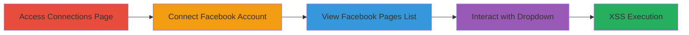

# Stored XSS via Malicious Facebook Page Name in KitCRM Connections

Multi-stage attack chain demonstrating a complete attack workflow exploiting stored XSS in KitCRM's Facebook integration.

## Chain Metrics Dashboard

| Metric | Value |
|--------|-------|
| Chain Status | Unverified |
| Total Steps | 4 |
| Execution Time | ~5 minutes |
| Skill Level | Intermediate |
| Complexity | Low |
| Impact Level | High |

## Attack Flow Visualization

## Prerequisites & Requirements

### Required Tools

- Web browser (e.g., Chrome with developer tools for payload testing)

### Target Environment

- KitCRM application on Shopify (web platform)
- Facebook account with access to create pages
- Authenticated user session in KitCRM

### Initial Access Requirements

- Valid KitCRM/Shopify account credentials
- Facebook account credentials
- No special network access beyond internet connectivity

## Detailed Attack Procedures

### Step 1: Access Social Connections Page
procedure: [[procedures/Access-KitCRM-Social-Connections-Page]]

**Objective**: Navigate to the KitCRM connections page to initiate social account linking.

**Instructions**: Log in to your KitCRM account on Shopify and navigate to the social connections section.

**Expected Output**: Page loads showing options to connect social networks like Facebook.

**Success Indicators**:
- Connections page accessible at https://kitcrm.com/users/[USER_ID]/connections
- Social connection options visible

### Step 2: Connect Facebook Account
procedure: [[procedures/Connect-Facebook-Account-to-KitCRM]]

**Objective**: Link a Facebook account containing a malicious page to KitCRM, storing the payload.

**Instructions**: Ensure a Facebook page with the payload "> in its name exists, then initiate the Facebook OAuth connection from the KitCRM page.

**Expected Output**: Successful authentication and account linkage.

**Success Indicators**:
- Facebook account connected
- No errors during OAuth flow

### Step 3: View Facebook Pages List
procedure: [[procedures/View-Connected-Facebook-Pages-in-KitCRM]]

**Objective**: Display the list of connected Facebook pages, reflecting the unsanitized page name with XSS payload.

**Instructions**: After connection, refresh or navigate back to the connections page to view the Facebook section.

**Expected Output**: Dropdown or list showing Facebook pages, including the malicious name reflected without sanitization.

**Success Indicators**:
- Malicious page name visible in the UI
- HTML source shows unescaped payload in the dropdown

### Step 4: Trigger Stored XSS in Dropdown
procedure: [[procedures/Trigger-Stored-XSS-in-Connections-Dropdown]]

**Objective**: Execute the stored XSS payload by interacting with the vulnerable UI element.

**Instructions**: Click on the dropdown option for the malicious Facebook page.

**Expected Output**: Alert box with '9' pops up, confirming JavaScript execution.

**Success Indicators**:
- JavaScript alert triggered
- Browser console shows payload execution
- Potential for further exploitation like session hijacking

## Attack Chain Summary

### Key Achievements

1. Successful storage of XSS payload via Facebook page name integration
2. Reflection of unsanitized input in KitCRM's connections dropdown
3. Arbitrary JavaScript execution in victim browsers, enabling data theft or session hijacking

## Technique & Tactic Coverage

### MITRE ATT&CK Techniques

- [[JavaScript]]

### MITRE ATT&CK Tactics

- [[Execution]]

---
*Last updated: 2023-10-01T00:00:00Z*
