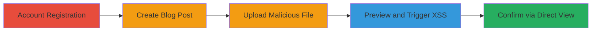

---
tags:
  - xss
  - stored-xss
  - file-upload
  - sharepoint
  - javascript
type: attack_chain
tools: []
tactics:
  - '[[Execution]]'
commands: []
platforms:
  - Web
complexity: low
procedures:
  - '[[procedures/Register-User-Account-on-SharePoint-Site]]'
  - '[[procedures/Create-Blog-Post-and-Upload-Malicious-File]]'
  - '[[procedures/Preview-Post-to-Trigger-XSS]]'
  - '[[procedures/Directly-View-Uploaded-File-for-XSS-Confirmation]]'
step_count: 4
techniques:
  - '[[JavaScript]]'
description: >-
  A multi-step exploitation of a stored XSS vulnerability in a U.S. Department
  of Defense SharePoint-based website's blog feature, allowing arbitrary
  JavaScript execution through uploaded HTML or SVG files.
skill_level: beginner
impact_level: high
id: 77dc69a6-1b04-4619-b313-f818cae5461b
created_at: '2025-12-13T23:56:19.976Z'
updated_at: '2025-12-13T23:56:19.976Z'
verified: false
validated: true
submitted: true
mitre_tactics:
  - '[[Execution]]'
mitre_techniques:
  - '[[JavaScript]]'
---
# Stored XSS via Malicious File Upload in DoD SharePoint Blog

## Overview

This attack chain exploits a stored cross-site scripting (XSS) vulnerability in the blog feature of a U.S. Department of Defense website built on SharePoint. Attackers register an account, create a blog post, and upload malicious HTML or SVG files containing JavaScript payloads via the post's insert functionality. When other users preview or view the post, the payload executes in their browser context, enabling session hijacking, data theft, or further attacks. The vulnerability stems from inadequate sanitization of uploaded files, allowing JavaScript to run unescaped. This high-severity issue led to the removal of the blog component as remediation.

## Chain Metrics Dashboard

| Metric | Value |
|--------|-------|
| Chain Status | Unverified |
| Total Steps | 4 |
| Execution Time | ~5 minutes |
| Skill Level | Beginner |
| Complexity | Low |
| Impact Level | High |

## Attack Flow Visualization

## Prerequisites & Requirements

### Required Tools

- Web browser (e.g., Chrome or Firefox with developer tools for payload testing)

### Target Environment

- SharePoint-based web platform
- Blog feature enabled at paths like /Profiles/My/[Username]/Blog/default.aspx
- No specific ports or services beyond standard HTTPS (443)

### Initial Access Requirements

- Public access to registration page
- No prior credentials needed; registration is open
- Internet connection for web interactions

## Detailed Attack Procedures

### Step 1: Account Registration
procedure: [[procedures/Register-User-Account-on-SharePoint-Site]]

**Objective**: Gain authenticated access to create and manage blog posts.

**Instructions**: Navigate to the registration page and complete the form to create a new user account. This establishes the necessary permissions for blog interactions.

**Expected Output**: Successful login credentials and redirection to the user profile.

**Success Indicators**:
- Account creation confirmation
- Ability to access personal blog section

### Step 2: Create Blog Post and Upload Malicious File
procedure: [[procedures/Create-Blog-Post-and-Upload-Malicious-File]]

**Objective**: Embed a malicious file containing JavaScript payload into a blog post body.

**Instructions**: Log in, navigate to the personal blog, start a new post, and use the insert/upload functionality to add the malicious HTML or SVG file. Confirm the upload to process and embed it.

**Expected Output**: The file is uploaded and visible in the post editor without errors.

**Success Indicators**:
- File upload completes successfully
- Malicious file appears embedded in the post body

### Step 3: Preview Post to Trigger XSS
procedure: [[procedures/Preview-Post-to-Trigger-XSS]]

**Objective**: Execute the stored XSS payload in the attacker's or viewer's browser context.

**Instructions**: After embedding the file, click the preview button to render the post and activate the JavaScript, such as displaying an alert.

**Expected Output**: JavaScript alert or payload execution in the browser.

**Success Indicators**:
- Alert box pops up confirming XSS
- Browser console shows script execution

### Step 4: Directly View Uploaded File for XSS Confirmation
procedure: [[procedures/Directly-View-Uploaded-File-for-XSS-Confirmation]]

**Objective**: Verify the vulnerability by accessing the file directly, simulating victim viewing.

**Instructions**: Log in if needed, then navigate directly to the uploaded file's URL in the blog's photo list to trigger the payload again.

**Expected Output**: XSS payload executes upon loading the file.

**Success Indicators**:
- Direct file access triggers JavaScript
- Consistent alert or payload behavior across views

## Attack Chain Summary

### Key Achievements

1. Successful account registration to access blog features
2. Upload of unsanitized malicious files leading to stored XSS
3. Arbitrary JavaScript execution in victim browsers via post preview or direct file view
4. Demonstration of high-impact potential for session theft or data exfiltration

## Technique & Tactic Coverage

### MITRE ATT&CK Techniques

- [[JavaScript]]

### MITRE ATT&CK Tactics

- [[Execution]]

---
*Last updated: 2023-10-01T00:00:00Z*
