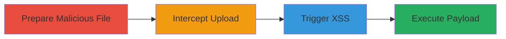

# Stored XSS via Malicious File Upload in MoPub App Icon

Multi-stage attack chain demonstrating a complete attack workflow exploiting improper file validation in MoPub's app icon upload to achieve stored XSS.

## Chain Metrics Dashboard

| Metric | Value |
|--------|-------|
| Chain Status | Unverified |
| Total Steps | 3 |
| Execution Time | ~5 minutes |
| Skill Level | Intermediate |
| Complexity | Medium |
| Impact Level | High |

## Attack Flow Visualization

## Prerequisites & Requirements

### Required Tools

- [[tools/Burp-Suite]]

### Target Environment

- Web platform
- MoPub app management service at app.mopub.com
- Access to /inventory/app_icon/upload/ endpoint

### Initial Access Requirements

- Authenticated access to MoPub app settings (user or admin account)
- Network access to app.mopub.com and images.mopub.com
- No prior compromise needed, but valid session required

## Detailed Attack Procedures

### Step 1: Prepare and Attempt Upload
procedure: [[procedures/Prepare-Malicious-HTML-File-for-Upload]]

**Objective**: Create and initiate upload of a malicious HTML file disguised as an image to bypass initial client-side checks.

**Instructions**: Navigate to the app settings on app.mopub.com. Select a file named 'xssfileuploadcopy.jpg' containing HTML with JavaScript payload (e.g., ), and attempt to upload it as the app icon.

**Expected Output**: Upload request initiated, but intercepted before completion.

**Success Indicators**:
- File selection successful in app settings
- Request captured in proxy tool

### Step 2: Intercept and Modify Request
procedure: [[procedures/Intercept-and-Modify-File-Upload-Request]]

**Objective**: Manipulate the upload request to change the file extension and Content-Type, tricking the server into accepting HTML as an uploadable file.

**Instructions**: Using [[tools/Burp-Suite]], intercept the POST request to /inventory/app_icon/upload/. Modify the filename to 'xssfileuploadcopy.html' and set Content-Type to text/html, then forward the request.

**Expected Output**: Server accepts the upload and returns a URL like https://images.mopub.com/app_icons/[hash].

**Success Indicators**:
- Modified request forwarded successfully
- Upload response contains a valid image URL with hash

### Step 3: Trigger XSS Execution
procedure: [[procedures/Access-Uploaded-File-to-Trigger-XSS]]

**Objective**: Access the uploaded file's URL to execute the stored JavaScript payload, demonstrating XSS.

**Instructions**: Open the provided URL (e.g., https://images.mopub.com/app_icons/126cb3308e1a464385a49c4c7aaeac56) in a browser.

**Expected Output**: Browser executes the HTML content, triggering the JavaScript alert('XSS').

**Success Indicators**:
- Alert popup or JS execution observed
- File served as HTML instead of image

## Attack Chain Summary

### Key Achievements

1. Successful upload of arbitrary HTML via disguised file
2. Server-side bypass of file validation
3. Stored XSS execution on image domain, enabling session hijacking or data theft

## Technique & Tactic Coverage

### MITRE ATT&CK Techniques

- [[JavaScript]]
- [[Exploit Public-Facing Application]]

### MITRE ATT&CK Tactics

- [[Execution]]
- [[Initial Access]]

---

*Last updated: 2023-10-01T00:00:00Z*
