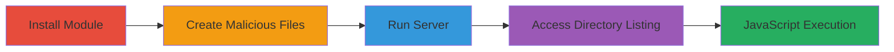

---
tags:
  - xss
  - stored-xss
  - node.js
  - directory-listing
type: attack_chain
tools:
  - '[[tools/npm]]'
  - '[[tools/buttle]]'
  - '[[tools/Chromium]]'
tactics:
  - '[[Execution]]'
  - '[[Collection]]'
verified: false
platforms:
  - Web
  - Node.js
submitted: true
complexity: medium
created_at: '2023-10-01T00:00:00Z'
procedures:
  - '[[procedures/Install-Buttle-Module]]'
  - '[[procedures/Create-Malicious-Filename]]'
  - '[[procedures/Create-Malicious-HTML-File]]'
  - '[[procedures/Run-Buttle-Server]]'
  - '[[procedures/Trigger-XSS-in-Browser]]'
step_count: 5
techniques:
  - '[[JavaScript]]'
updated_at: '2025-12-14T03:15:30.892Z'
description: >-
  Demonstrates a stored XSS vulnerability in the buttle Node.js module by
  injecting HTML via unsanitized filenames, leading to arbitrary JavaScript
  execution in the browser.
skill_level: intermediate
impact_level: high
id: 4180f074-923d-444a-adbd-8bd2547aa6ca
validated: true
mitre_tactics:
  - '[[Execution]]'
  - '[[Collection]]'
mitre_techniques:
  - '[[JavaScript]]'
---
# Stored XSS via Malicious Filename Injection in Buttle Directory Listing

Multi-stage attack chain demonstrating a complete attack workflow exploiting a stored XSS vulnerability in the buttle Node.js module (version 0.2.0). The attack involves installing the module, creating files with malicious names and content to inject an iframe, running the server, and accessing the directory listing to execute JavaScript in the victim's browser. This can lead to session cookie theft or other client-side attacks.

## Chain Metrics Dashboard

| Metric | Value |
|--------|-------|
| Chain Status | Unverified |
| Total Steps | 5 |
| Execution Time | ~5 minutes |
| Skill Level | Intermediate |
| Complexity | Medium |
| Impact Level | High |

## Attack Flow Visualization



## Prerequisites & Requirements

### Required Tools

- [[tools/npm]]
- [[tools/buttle]]
- [[tools/Chromium]]

### Target Environment

- Node.js runtime (version compatible with buttle 0.2.0)
- Local file system access for creating files
- Port 8080 available
- Web browser for accessing the server

### Initial Access Requirements

- Local machine with Node.js installed
- No network credentials needed; local exploitation
- Administrative access not required

## Detailed Attack Procedures

### Step 1: Install Buttle Module
procedure: [[procedures/Install-Buttle-Module]]

**Objective**: Set up the vulnerable buttle module using npm to prepare the environment for the exploit.

**Instructions**: Install the buttle package version 0.2.0, which contains the unsanitized directory listing feature.

Use [[commands/npm-install-buttle]]:

```bash
npm i buttle
```

**Expected Output**: Installation logs confirming the package is added to node_modules, including dependencies like the outdated connect module.

**Success Indicators**:
- buttle directory appears in node_modules
- No installation errors

### Step 2: Create Malicious Filename
procedure: [[procedures/Create-Malicious-Filename]]

**Objective**: Craft a filename that breaks out of HTML attributes in the directory listing to inject an iframe tag.

**Instructions**: Create an empty file with a specially crafted name to exploit the lack of filename sanitization.

No command needed; manually create a file named "><iframe src=\"malware_frame.html\"> (note the escaped quotes for JSON, but use literal in practice).

**Expected Output**: File created in the current directory without errors.

**Success Indicators**:
- File exists with the malicious name
- Directory listing will later render the injected HTML

### Step 3: Create Malicious HTML File
procedure: [[procedures/Create-Malicious-HTML-File]]

**Objective**: Prepare the payload file that the injected iframe will load, containing JavaScript to execute.

**Instructions**: Create the referenced HTML file with malicious JavaScript content.

No command; manually create malware_frame.html with:

```html
<script>alert('Uh oh, I am bad, bad malware!!!');</script>
```

**Expected Output**: HTML file saved in the same directory.

**Success Indicators**:
- File contains the script tag
- Script will execute when loaded

### Step 4: Run Buttle Server
procedure: [[procedures/Run-Buttle-Server]]

**Objective**: Start the static file server to serve the directory and trigger the rendering of the vulnerable listing.

**Instructions**: Execute the buttle binary to host files on port 8080.

Use [[commands/buttle-run-server]]:

```bash
./node_modules/buttle/bin/buttle -p 8080
```

**Expected Output**: Server starts and logs "Listening on port 8080".

**Success Indicators**:
- Server running without errors
- Accessible at http://localhost:8080

### Step 5: Trigger XSS in Browser
procedure: [[procedures/Trigger-XSS-in-Browser]]

**Objective**: Access the root URL to render the directory listing, executing the injected JavaScript.

**Instructions**: Open the server URL in a browser to view the listing and load the iframe.

Navigate to http://localhost:8080 in [[tools/Chromium]].

**Expected Output**: Directory listing displays, iframe loads malware_frame.html, and alert pops up with 'Uh oh, I am bad, bad malware!!!'.

**Success Indicators**:
- JavaScript alert executes
- Potential for cookie theft if extended

## Attack Chain Summary

### Key Achievements

1. Successful installation and setup of vulnerable buttle module
2. Injection of HTML via filename leading to iframe embedding
3. Execution of arbitrary JavaScript in the browser context

## Technique & Tactic Coverage

### MITRE ATT&CK Techniques

- [[JavaScript]]

### MITRE ATT&CK Tactics

- [[Execution]]
- [[Collection]]

---

*Last updated: 2023-10-01T00:00:00Z*
