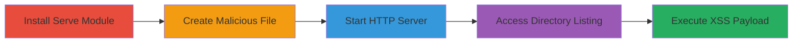

# Stored XSS via Malicious Filename Injection in Serve Module Directory Listing

Multi-stage attack chain demonstrating a complete exploitation of a stored XSS vulnerability in the serve Node.js module's directory listing feature, where unsanitized filenames allow HTML/JS injection, leading to client-side JavaScript execution for potential session hijacking or data theft.

## Chain Metrics Dashboard

| Metric | Value |
|--------|-------|
| Chain Status | Unverified |
| Total Steps | 4 |
| Execution Time | ~5 minutes |
| Skill Level | Intermediate |
| Complexity | Medium |
| Impact Level | High |

## Attack Flow Visualization



## Prerequisites & Requirements

### Required Tools

- [[tools/yarn]]
- [[tools/npm]]
- [[tools/serve]]
- [[tools/Firefox]]

### Target Environment

- Node.js runtime (v10.9.0 or compatible)
- Local file system access for creating files
- Port 5000 available for HTTP server
- Web browser for payload execution

### Initial Access Requirements

- Local machine with Node.js installed
- No network credentials needed; local exploitation
- Administrative privileges not required

## Detailed Attack Procedures

### Step 1: Install Serve Module Globally

procedure: [[procedures/Install-Serve-Module-Globally]]

**Objective**: Set up the vulnerable serve module to host static directories.

**Instructions**: Install the serve package globally using yarn or npm to enable the directory listing feature.

Use [[commands/yarn-global-add-serve]]:

```bash
yarn global add serve
```

Alternatively, use [[commands/npm-install-serve-global]]:

```bash
npm i serve -g
```

**Expected Output**: Installation success message, with serve command available in PATH.

**Success Indicators**:
- Serve command executable via terminal
- Version 9.6.0 confirmed vulnerable

### Step 2: Create Malicious XSS Filename

procedure: [[procedures/Create-Malicious-XSS-Filename]]

**Objective**: Inject XSS payload into a filename to exploit unsanitized HTML rendering in directory listings.

**Instructions**: Create a file in the current directory with a filename containing an HTML/JS payload that breaks out of the <a> tag context.

Example payload filename: `.txt`

Use touch or echo to create it:

```bash
touch '.txt'
```

**Expected Output**: File created successfully in the directory.

**Success Indicators**:
- File exists with malicious name
- No immediate execution; payload dormant until listing viewed

### Step 3: Start Serve Server for Directory Hosting

procedure: [[procedures/Start-Serve-Server-for-Directory-Hosting]]

**Objective**: Launch the HTTP server to expose the directory listing, rendering the malicious filename unsanitized.

**Instructions**: Run the serve command in the directory containing the malicious file to start hosting on localhost:5000.

Execute [[commands/serve-start]]:

```bash
serve
```

**Expected Output**: Server startup message: "Serving at http://localhost:5000".

**Success Indicators**:
- Server listening on port 5000
- Directory listing accessible at root URL

### Step 4: Trigger XSS via Browser Access

procedure: [[procedures/Trigger-XSS-via-Browser-Access]]

**Objective**: View the directory listing to execute the injected JavaScript payload in the browser context.

**Instructions**: Open the server URL in a browser, where the filename is inserted into an <a> tag without escaping, triggering the XSS.

Navigate to http://localhost:5000 in [[tools/Firefox]].

**Expected Output**: Alert box pops up with 'XSS' or iframe loads, confirming execution.

**Success Indicators**:
- JavaScript alert or malicious action triggers
- Potential for session hijacking if in a multi-user scenario

## Attack Chain Summary

### Key Achievements

1. Successful installation and setup of vulnerable serve module
2. Injection of persistent XSS payload via filename
3. Exposure of directory listing leading to payload execution
4. Demonstration of arbitrary JS execution for client-side attacks

## Technique & Tactic Coverage

### MITRE ATT&CK Techniques

- [[JavaScript]]

### MITRE ATT&CK Tactics

- [[Execution]]

---

*Last updated: 2024-10-01T00:00:00Z*
