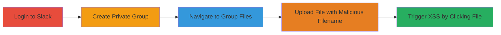

---
tags:
  - xss
  - stored-xss
  - slack
  - file-upload
  - javascript-injection
type: attack_chain
tools: []
tactics:
  - '[[Execution]]'
  - '[[Collection]]'
verified: false
platforms:
  - Web
submitted: true
complexity: medium
created_at: '2023-10-01T00:00:00Z'
procedures:
  - '[[procedures/Exploit-Stored-XSS-in-Slack-File-Upload]]'
step_count: 5
techniques:
  - '[[JavaScript]]'
updated_at: '2025-12-14T03:15:53.194Z'
description: >-
  A multi-step attack exploiting a stored XSS vulnerability in Slack's file
  upload feature by injecting JavaScript into filenames, leading to arbitrary
  code execution in victims' browsers.
skill_level: intermediate
impact_level: high
id: 086b9779-3937-46f8-9435-7c6f1cb2abc8
validated: true
mitre_tactics:
  - '[[Execution]]'
  - '[[Collection]]'
mitre_techniques:
  - '[[JavaScript]]'
---
# Stored XSS via Malicious Filename in Slack File Upload

Multi-stage attack chain demonstrating exploitation of a stored XSS vulnerability in Slack's group file upload feature, allowing injection of malicious JavaScript into filenames that executes when victims interact with the file.

## Chain Metrics Dashboard

| Metric | Value |
|--------|-------|
| Chain Status | Unverified |
| Total Steps | 5 |
| Execution Time | ~5 minutes |
| Skill Level | Intermediate |
| Complexity | Medium |
| Impact Level | High |

## Attack Flow Visualization

## Prerequisites & Requirements

### Required Tools

- Web browser (e.g., Chrome, Firefox)

### Target Environment

- Slack web application (username.slack.com)
- Valid Slack account with permission to create private groups

### Initial Access Requirements

- Authenticated Slack user session
- No special privileges beyond standard user access
- Direct access to the Slack web interface

## Detailed Attack Procedures

### Step 1: Login to Slack Account
procedure: [[procedures/Exploit-Stored-XSS-in-Slack-File-Upload]]

**Objective**: Authenticate to the Slack web application to gain access for subsequent actions.

**Instructions**: Open a web browser and navigate to https://slack.com, then enter valid credentials to log in. Ensure you are redirected to your workspace (e.g., https://username.slack.com).

**Expected Output**: Successful login with access to workspace channels and features.

**Success Indicators**:
- Workspace dashboard loads without errors
- User profile and channels are visible

### Step 2: Create a Private Group
procedure: [[procedures/Exploit-Stored-XSS-in-Slack-File-Upload]]

**Objective**: Establish a private channel where files can be uploaded without public visibility, targeting potential victims.

**Instructions**: In the Slack sidebar, click the "+" icon next to "Channels", select "Create a private channel", enter a name (e.g., "test-group") and optional purpose, then click "Create".

**Expected Output**: New private group appears in the sidebar, accessible only to invited members.

**Success Indicators**:
- Group is listed under private channels
- No errors during creation

### Step 3: Navigate to the Group's Files Section
procedure: [[procedures/Exploit-Stored-XSS-in-Slack-File-Upload]]

**Objective**: Access the file management area within the private group to prepare for upload.

**Instructions**: Click on the newly created private group in the sidebar, then select the "Files" tab at the top of the channel view. The URL should update to something like https://username.slack.com/messages/groupname/files/.

**Expected Output**: Files section loads, showing any existing files or an empty state.

**Success Indicators**:
- Files tab is active
- URL includes "/files/" path

### Step 4: Upload a File with Malicious Filename
procedure: [[procedures/Exploit-Stored-XSS-in-Slack-File-Upload]]

**Objective**: Inject malicious JavaScript payload into the filename during upload, storing the XSS for later execution.

**Instructions**: In the files section, click the upload icon (paperclip or "^" symbol), select a benign file (e.g., a simple JPEG image), and rename it during upload to include the payload: '>.jpeg'. Confirm the upload.

**Expected Output**: File appears in the files list with the malicious filename displayed.

**Success Indicators**:
- File uploads successfully
- Filename shows the injected script in the list

### Step 5: Click on the Uploaded Image or File Title to Trigger Execution
procedure: [[procedures/Exploit-Stored-XSS-in-Slack-File-Upload]]

**Objective**: Trigger the stored XSS payload by interacting with the file, executing JavaScript in the victim's browser context.

**Instructions**: Click on the uploaded file's title or the image thumbnail to open it in the lightbox view. The onerror handler in the payload should execute, displaying an alert box (or performing other actions like session theft in a real attack).

**Expected Output**: JavaScript alert pops up with "1", confirming execution. In a malicious scenario, this could lead to cookie theft or further exploitation.

**Success Indicators**:
- Alert dialog appears
- Browser console shows no blocking errors
- Potential for data exfiltration if payload is modified

## Attack Chain Summary

### Key Achievements

1. Successful injection of JavaScript via filename without server-side detection
2. Persistent storage of XSS payload in group files
3. Arbitrary code execution upon victim interaction, enabling session hijacking

## Technique & Tactic Coverage

### MITRE ATT&CK Techniques

- [[JavaScript]]

### MITRE ATT&CK Tactics

- [[Execution]]
- [[Collection]]

---
*Last updated: 2023-10-01T00:00:00Z*
