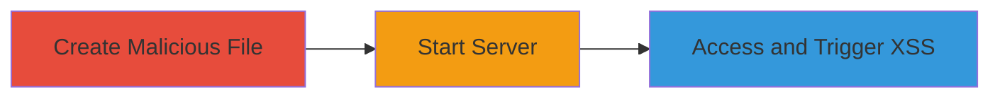

---
tags:
  - xss
  - stored-xss
  - node-js
  - web-vulnerability
type: attack_chain
tools: []
tactics:
  - '[[Execution]]'
verified: false
platforms:
  - Web
  - Node.js
submitted: true
complexity: low
created_at: '2023-10-01T00:00:00Z'
procedures:
  - '[[procedures/Create-Malicious-Filename-for-XSS]]'
  - '[[procedures/Start-tianma-static-Server]]'
  - '[[procedures/Trigger-Stored-XSS-via-File-Access]]'
step_count: 3
techniques:
  - '[[JavaScript]]'
updated_at: '2025-12-14T03:16:14.002Z'
description: >-
  A multi-step attack exploiting a stored XSS vulnerability in the tianma-static
  Node.js module by embedding JavaScript in filenames, leading to arbitrary code
  execution in victims' browsers when files are accessed.
skill_level: beginner
impact_level: high
id: 9647d71e-0d2e-4c41-9f2f-07f01ff85429
validated: true
mitre_tactics:
  - '[[Execution]]'
mitre_techniques:
  - '[[JavaScript]]'
---
# Stored XSS via Malicious Filename in tianma-static Node.js Module

Multi-stage attack chain demonstrating exploitation of a stored XSS vulnerability in the tianma-static Node.js module version 1.0.4, where unsanitized filenames allow embedding of malicious JavaScript. An attacker creates a file with a payload in its name, starts the static file server, and tricks a victim into accessing the directory or file, executing arbitrary JavaScript in the browser context.

## Chain Metrics Dashboard

| Metric | Value |
|--------|-------|
| Chain Status | Unverified |
| Total Steps | 3 |
| Execution Time | ~5 minutes |
| Skill Level | Beginner |
| Complexity | Low |
| Impact Level | High |

## Attack Flow Visualization



## Prerequisites & Requirements

### Required Tools

- Node.js (version 10+ recommended)
- npm package manager

### Target Environment

- Node.js runtime
- tianma-static module version 1.0.4
- Local or remote web server setup for static files
- Victim browser accessing the served files

### Initial Access Requirements

- Ability to create files in the server's directory
- Control over the server startup (local testing or compromised host)
- Victim interaction: accessing the served directory via browser

## Detailed Attack Procedures

### Step 1: Create Malicious Filename
procedure: [[procedures/Create-Malicious-Filename-for-XSS]]

**Objective**: Embed a JavaScript XSS payload in a filename to store malicious code that will be rendered unsanitized by the server.

**Instructions**: Set up a project directory and create a file with the payload in its name. Use the following to initialize and create the file:

First, initialize an npm project using [[commands/npm-init]]:

```bash
npm init -y
```

Then install the vulnerable module using [[commands/npm-install-tianma-static]]:

```bash
npm install tianma-static@1.0.4
```

Create an empty file with the malicious filename using [[commands/create-malicious-file]]:

```bash
touch '.txt'
```

**Expected Output**: A file named '.txt' is created in the directory, containing no content but with the payload in the name.

**Success Indicators**:
- File exists with the exact malicious name
- No errors during file creation

### Step 2: Start tianma-static Server
procedure: [[procedures/Start-tianma-static-Server]]

**Objective**: Launch the static file server to begin serving the directory, including the malicious filename, without sanitization.

**Instructions**: Create a simple server script and start it. First, create a server.js file using [[commands/create-server-script]]:

```bash
echo "const tianma = require('tianma-static');
tianma.serve(__dirname, 3000);" > server.js
```

Then start the server using [[commands/node-start-server]]:

```bash
node server.js
```

**Expected Output**: Server starts listening on port 3000, serving static files from the current directory.

**Success Indicators**:
- Console output shows server running on http://localhost:3000
- No startup errors

### Step 3: Trigger Stored XSS
procedure: [[procedures/Trigger-Stored-XSS-via-File-Access]]

**Objective**: Access the directory or file in a browser to render the unsanitized filename, executing the embedded JavaScript payload.

**Instructions**: Open a web browser and navigate to the served directory. Use a browser or curl to access, but for execution, browser is required. Visit http://localhost:3000/ or http://localhost:3000/'.txt' using [[commands/browser-access]] (manual browser step):

In a browser, enter the URL: http://localhost:3000/

**Expected Output**: The directory listing renders the filename, triggering the onerror event and displaying an alert box with '1'.

**Success Indicators**:
- Alert popup appears in the browser
- JavaScript executes, confirming arbitrary code capability (e.g., replace alert with data exfiltration)

## Attack Chain Summary

### Key Achievements

1. Successfully stored XSS payload in a filename without detection.
2. Served the vulnerable file via tianma-static without sanitization.
3. Executed arbitrary JavaScript in a victim's browser, enabling session hijacking, data theft, or further attacks.

## Technique & Tactic Coverage

### MITRE ATT&CK Techniques

- [[JavaScript]]

### MITRE ATT&CK Tactics

- [[Execution]]

---
*Last updated: 2023-10-01T00:00:00Z*
