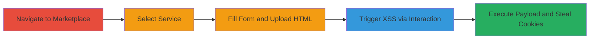

---
tags:
  - xss
  - stored-xss
  - shopify
  - file-upload
  - cookie-theft
type: attack_chain
tools: []
tactics:
  - '[[Initial Access]]'
  - '[[Execution]]'
  - '[[Collection]]'
verified: false
platforms:
  - Web
submitted: true
complexity: medium
created_at: '2023-10-01T00:00:00Z'
procedures:
  - '[[procedures/Exploit-Stored-XSS-via-HTML-File-Upload-in-Shopify]]'
step_count: 5
techniques:
  - '[[JavaScript]]'
updated_at: '2025-12-13T23:52:39.433Z'
description: >-
  Exploits a stored XSS vulnerability in Shopify's admin services marketplace by
  uploading an HTML file with JavaScript payloads, leading to cookie theft upon
  interaction.
skill_level: intermediate
impact_level: high
id: 99d9fd6f-82d9-4f63-ac12-825e036e0520
validated: true
mitre_tactics:
  - '[[Initial Access]]'
  - '[[Execution]]'
  - '[[Collection]]'
mitre_techniques:
  - '[[JavaScript]]'
---
# Stored XSS via Malicious HTML Upload in Shopify Services Marketplace

Multi-stage attack chain demonstrating a complete attack workflow exploiting stored XSS in Shopify's services marketplace.

## Chain Metrics Dashboard

| Metric | Value |
|--------|-------|
| Chain Status | Unverified |
| Total Steps | 5 |
| Execution Time | ~5 minutes |
| Skill Level | Intermediate |
| Complexity | Medium |
| Impact Level | High |

## Attack Flow Visualization

## Prerequisites & Requirements

### Required Tools

- Web browser (e.g., Chrome with developer tools)

### Target Environment

- Shopify admin panel access
- Services marketplace feature enabled
- Web platform

### Initial Access Requirements

- Authenticated Shopify store admin account
- No special network access beyond standard internet
- No prior access needed beyond login

## Detailed Attack Procedures

### Step 1: Navigate to Services Marketplace
procedure: [[procedures/Exploit-Stored-XSS-via-HTML-File-Upload-in-Shopify]]

**Objective**: Access the experts marketplace in the Shopify admin to begin the service selection process.

**Instructions**: Log in to your Shopify admin dashboard and navigate to the services marketplace.

**Expected Output**: The services marketplace page loads at https://(your_store).myshopify.com/admin/apps/experts_marketplace/services_marketplace.

**Success Indicators**:
- Marketplace interface visible
- Authentication confirmed

### Step 2: Select Service Category
procedure: [[procedures/Exploit-Stored-XSS-via-HTML-File-Upload-in-Shopify]]

**Objective**: Choose a specific service option that allows file attachments, such as email template design.

**Instructions**: In the marketplace, go to "All services" > "Marketing and sales" > "email marketing" > "Design custom email templates" and click "select".

**Expected Output**: Service selection form appears with options for attachments.

**Success Indicators**:
- Form for service request loads
- Category navigation successful

### Step 3: Fill Form and Locate Attachment
procedure: [[procedures/Exploit-Stored-XSS-via-HTML-File-Upload-in-Shopify]]

**Objective**: Complete the necessary form fields to reach the file upload option.

**Instructions**: Fill in required fields like service details or contact information, where an "attach file" option becomes available.

**Expected Output**: File attachment input field is visible and selectable.

**Success Indicators**:
- Form partially completed
- Attachment option enabled

### Step 4: Upload Malicious HTML File
procedure: [[procedures/Exploit-Stored-XSS-via-HTML-File-Upload-in-Shopify]]

**Objective**: Attach an HTML file containing XSS payloads to store the malicious script.

**Instructions**: Select and upload an HTML file with embedded JavaScript, such as one containing `` or a payload to exfiltrate cookies.

**Expected Output**: File is attached to the form without validation errors.

**Success Indicators**:
- Upload succeeds
- File listed in attachments

### Step 5: Trigger XSS Execution
procedure: [[procedures/Exploit-Stored-XSS-via-HTML-File-Upload-in-Shopify]]

**Objective**: Interact with the uploaded file to execute the stored XSS payload, stealing user cookies.

**Instructions**: After submission or in the attachment view, right-click the attached file and select "go to that location" to open a popup that renders the HTML and executes the script.

**Expected Output**: Popup window displays, JavaScript executes (e.g., alert with cookies or network request to attacker server).

**Success Indicators**:
- Payload executes
- Cookies captured or alert shown

## Attack Chain Summary

### Key Achievements

1. Successful upload of unsanitized HTML file to Shopify services marketplace
2. Triggering of stored XSS via file interaction, bypassing basic protections
3. Potential session hijacking through cookie theft from authenticated users

## Technique & Tactic Coverage

### MITRE ATT&CK Techniques

- [[JavaScript]]

### MITRE ATT&CK Tactics

- [[Initial Access]]
- [[Execution]]
- [[Collection]]

---
*Last updated: 2023-10-01T00:00:00Z*
