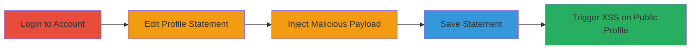

---
tags:
  - xss
  - stored-xss
  - markdown
  - javascript-uri
  - web-exploit
type: attack_chain
tools:
  - '[[tools/mikasa]]'
  - '[[tools/Sundown]]'
  - '[[tools/Hoedown]]'
  - '[[tools/python-xss-filter]]'
tactics:
  - '[[Execution]]'
verified: false
platforms:
  - Web
submitted: true
complexity: low
created_at: '2023-10-01T00:00:00Z'
procedures:
  - '[[procedures/Login-to-Gratipay-Account]]'
  - '[[procedures/Edit-Profile-Statement]]'
  - '[[procedures/Inject-Malicious-Markdown-Payload]]'
  - '[[procedures/Save-Malicious-Statement]]'
  - '[[procedures/Trigger-Stored-XSS]]'
step_count: 5
techniques:
  - '[[JavaScript]]'
updated_at: '2025-12-14T03:16:31.129Z'
description: >-
  A multi-step attack exploiting insufficient Markdown sanitization in the
  profile statement field to store and trigger XSS via javascript: URIs, leading
  to arbitrary JavaScript execution on victim browsers.
skill_level: intermediate
impact_level: high
id: aaf3c943-e108-485d-a113-af06cfe9cf0f
validated: true
mitre_tactics:
  - '[[Execution]]'
mitre_techniques:
  - '[[JavaScript]]'
---
# Stored XSS via Malicious Markdown Links in Profile Statement on Gratipay

Multi-stage attack chain demonstrating a complete Stored XSS workflow on Gratipay.com by injecting malicious Markdown that renders clickable javascript: URI links in public profile statements.

## Chain Metrics Dashboard

| Metric | Value |
|--------|-------|
| Chain Status | Unverified |
| Total Steps | 5 |
| Execution Time | ~5 minutes |
| Skill Level | Intermediate |
| Complexity | Low |
| Impact Level | High |

## Attack Flow Visualization

## Prerequisites & Requirements

### Required Tools

- Web browser (e.g., Chrome, Firefox)
- Valid Gratipay user account

### Target Environment

- Gratipay.com web application
- Public profile pages
- Markdown rendering enabled

### Initial Access Requirements

- Registered user account on Gratipay
- No special privileges needed
- Direct access to the website

## Detailed Attack Procedures

### Step 1: Login to Account
procedure: [[procedures/Login-to-Gratipay-Account]]

**Objective**: Authenticate to gain access to profile editing features.

**Instructions**: Open a web browser and navigate to the Gratipay login page. Enter valid credentials to authenticate as a user.

**Expected Output**: Successful login, redirect to dashboard or profile.

**Success Indicators**:
- User session established
- Access to edit profile options

### Step 2: Edit Profile Statement
procedure: [[procedures/Edit-Profile-Statement]]

**Objective**: Access the statement field for input modification.

**Instructions**: From the dashboard, navigate to your profile page (e.g., https://gratipay.com/~username/) and click the 'Edit Statement' button to open the input form.

**Expected Output**: Editable text field for the profile statement appears.

**Success Indicators**:
- Statement edit form loaded
- Markdown input field visible

### Step 3: Inject Malicious Payload
procedure: [[procedures/Inject-Malicious-Markdown-Payload]]

**Objective**: Insert XSS payload disguised as a Markdown link using javascript: URI.

**Instructions**: In the statement field, enter a payload such as `[notmalicious](javascript:window.onerror=alert;throw%20document.cookie)` or `<javascript:alert(document.cookie)>`. This exploits the lack of sanitization for javascript: protocols.

**Expected Output**: Payload entered without errors in the form.

**Success Indicators**:
- Payload text visible in the input field
- No immediate validation errors

### Step 4: Save Statement
procedure: [[procedures/Save-Malicious-Statement]]

**Objective**: Persist the malicious payload to the public profile.

**Instructions**: Click the 'Save' button to submit the form and store the statement with the embedded XSS payload.

**Expected Output**: Profile updates successfully, payload saved server-side.

**Success Indicators**:
- Confirmation message or redirect to profile
- No save errors

### Step 5: Trigger XSS
procedure: [[procedures/Trigger-Stored-XSS]]

**Objective**: Execute the XSS by rendering and interacting with the malicious link on a victim's browser.

**Instructions**: Visit the public profile page where the statement is rendered as Markdown, creating a clickable link. Click the link to execute the javascript: URI, which can alert document.cookie or perform other actions like onerror handlers.

**Expected Output**: JavaScript execution, e.g., alert popup with cookie data.

**Success Indicators**:
- Malicious link appears on profile
- Clicking triggers JS execution (e.g., alert or console error with cookies)

## Attack Chain Summary

### Key Achievements

1. Successful storage of XSS payload in a public profile field
2. Rendering of unsanitized Markdown allowing javascript: URIs
3. Arbitrary JS execution in victim browsers, enabling cookie theft or session hijacking

## Technique & Tactic Coverage

### MITRE ATT&CK Techniques

- [[JavaScript]]

### MITRE ATT&CK Tactics

- [[Execution]]

---
*Last updated: 2023-10-01T00:00:00Z*
