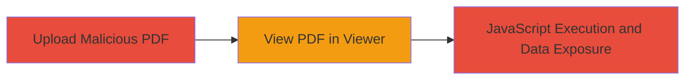

---
tags:
  - xss
  - stored-xss
  - pdf
  - slack
  - javascript-execution
type: attack_chain
tools: []
tactics:
  - '[[Execution]]'
  - '[[Collection]]'
verified: false
platforms:
  - Web
submitted: true
complexity: low
created_at: '2023-10-01T00:00:00Z'
procedures:
  - '[[procedures/Upload-Malicious-PDF-to-Slack-Workspace]]'
  - '[[procedures/Trigger-XSS-Execution-in-Slack-PDF-Viewer]]'
step_count: 2
techniques:
  - '[[Exploit Public-Facing Application]]'
  - '[[JavaScript]]'
updated_at: '2025-12-13T23:55:06.370Z'
description: >-
  A multi-step attack exploiting a stored XSS vulnerability in Slack's PDF
  viewer by uploading a malicious PDF containing JavaScript payloads, leading to
  execution in the victim's browser.
skill_level: intermediate
impact_level: high
id: 667cdc49-4b0a-4b03-bb60-06336eceb0f8
validated: true
mitre_tactics:
  - '[[Execution]]'
  - '[[Collection]]'
mitre_techniques:
  - '[[Exploit Public-Facing Application]]'
  - '[[JavaScript]]'
---
# Stored XSS via Malicious PDF Upload in Slack PDF Viewer

Multi-stage attack chain demonstrating a complete attack workflow exploiting a stored XSS vulnerability in Slack's PDF viewer due to a vulnerable dependency that fails to sanitize PDF contents.

## Chain Metrics Dashboard

| Metric | Value |
|--------|-------|
| Chain Status | Unverified |
| Total Steps | 2 |
| Execution Time | ~5 minutes |
| Skill Level | Intermediate |
| Complexity | Low |
| Impact Level | High |

## Attack Flow Visualization

## Prerequisites & Requirements

### Required Tools

- PDF editing tool (e.g., Adobe Acrobat or open-source alternative like PDFtk) to embed JavaScript payloads.

### Target Environment

- Web platform with access to a Slack workspace.
- Required services: Slack messaging and file sharing.
- No specific ports required; operates over HTTPS.

### Initial Access Requirements

- Valid Slack workspace account with upload permissions.
- Ability to create or obtain a malicious PDF file.
- No prior network position needed beyond internet access; victim must be a Slack user viewing the file.

## Detailed Attack Procedures

### Step 1: Upload Malicious PDF
procedure: [[procedures/Upload-Malicious-PDF-to-Slack-Workspace]]

**Objective**: Inject a malicious PDF containing an XSS payload into the Slack workspace for storage and potential execution.

**Instructions**: Prepare a PDF file embedding JavaScript code that exploits the vulnerable dependency in Slack's PDF viewer. Use a PDF tool to insert the payload, such as a JavaScript action trigger on open. Then, in the Slack client or web app, navigate to a channel and use the file upload feature to share the PDF.

**Expected Output**: The PDF is successfully uploaded and visible in the Slack channel as a shareable file.

**Success Indicators**:
- File upload confirmation in Slack.
- PDF listed in channel with preview thumbnail.

### Step 2: Trigger XSS Execution
procedure: [[procedures/Trigger-XSS-Execution-in-Slack-PDF-Viewer]]

**Objective**: Cause the victim to view the PDF, triggering JavaScript execution in the browser via the vulnerable PDF viewer.

**Instructions**: Share the link to the uploaded PDF in the channel or direct message to entice the victim to open it. When the victim clicks to view, Slack's PDF viewer at https://app.slack.com/pdf-viewer loads the file, failing to sanitize the embedded JavaScript due to the vulnerable dependency, resulting in payload execution.

**Expected Output**: JavaScript runs in the victim's browser context, potentially accessing session data or performing actions like keylogging.

**Success Indicators**:
- Victim reports or anomalous browser behavior observed.
- Payload executes, e.g., alert box or data exfiltration attempt.

## Attack Chain Summary

### Key Achievements

1. Successful injection of XSS payload via file upload without detection.
2. Execution of arbitrary JavaScript in the victim's browser session.
3. Potential exposure of sensitive user data from Slack sessions.

## Technique & Tactic Coverage

### MITRE ATT&CK Techniques

- [[Exploit Public-Facing Application]]
- [[JavaScript]]

### MITRE ATT&CK Tactics

- [[Execution]]
- [[Collection]]

---
*Last updated: 2023-10-01T00:00:00Z*
