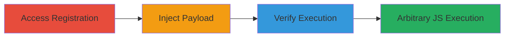

# Stored XSS via Malicious Payload in User Registration Fields

Multi-stage attack chain demonstrating exploitation of a stored Cross-Site Scripting (XSS) vulnerability in the user registration process of a U.S. Department of Defense web application. The attack involves injecting a malicious JavaScript payload into the name and last name fields during account creation. The payload is stored without sanitization and executed when any user views the affected 'my account' page, enabling session hijacking, data theft, or other client-side attacks.

## Chain Metrics Dashboard

| Metric | Value |
|--------|-------|
| Chain Status | Unverified |
| Total Steps | 3 |
| Execution Time | ~5 minutes |
| Skill Level | Intermediate |
| Complexity | Low |
| Impact Level | High |

## Attack Flow Visualization

## Prerequisites & Requirements

### Required Tools

- [[tools/xsshunter]]

### Target Environment

- Web application using CGI scripts (e.g., login.cgi, myaccount.cgi)
- OAuth/OpenID integration for authentication
- No specific ports required; standard HTTPS access

### Initial Access Requirements

- Public access to the login/registration endpoint
- No prior credentials needed for registration
- Network access to the target URL (e.g., https://█████/login/)

## Detailed Attack Procedures

### Step 1: Access Registration Page
procedure: [[procedures/Access-Registration-Page]]

**Objective**: Navigate to the user registration or login page to initiate account creation.

**Instructions**: Open a web browser and access the target's login/registration endpoint. The URL includes OAuth parameters for redirection after authentication.

**Expected Output**: The registration form is displayed, allowing input of user details.

**Success Indicators**:
- Registration form loads successfully
- OAuth client_id and redirect_uri parameters are visible in the URL

### Step 2: Inject Malicious Payload in Registration
procedure: [[procedures/Inject-Malicious-Payload-in-Registration]]

**Objective**: Create a new account by injecting a JavaScript payload into the name and last name fields, which will be stored unsanitized.

**Instructions**: Fill out the registration form with a malicious payload such as `` in the name field. Complete the registration process to store the payload in the backend.

**Expected Output**: Account creation succeeds, and the payload is persisted in the database without sanitization.

**Success Indicators**:
- Account is created successfully
- No errors during form submission

### Step 3: Verify XSS Execution on Profile
procedure: [[procedures/Verify-XSS-Execution-on-Profile]]

**Objective**: Log in to the application and navigate to the 'my account' page to trigger execution of the stored payload.

**Instructions**: Log in with the newly created credentials and visit the myaccount.cgi endpoint. Use [[tools/xsshunter]] to monitor and confirm payload execution if needed.

**Expected Output**: The payload executes, displaying an alert or performing the intended JavaScript action.

**Success Indicators**:
- JavaScript alert or callback fires on page load
- Victim context (e.g., session) is accessible for further exploitation

## Attack Chain Summary

### Key Achievements

1. Successful injection and storage of malicious JavaScript in user profile fields
2. Arbitrary code execution in the browser context of any user viewing the profile
3. Potential for session hijacking or data exfiltration from authenticated users

## Technique & Tactic Coverage

### MITRE ATT&CK Techniques

- [[JavaScript]]

### MITRE ATT&CK Tactics

- [[Execution]]

---

*Last updated: 2023-10-01T00:00:00Z*
