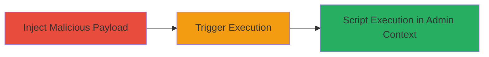

---
tags:
  - xss
  - stored-xss
  - shopify
  - javascript
  - svg
type: attack_chain
tools:
  - '[[tools/Browser]]'
tactics:
  - '[[Execution]]'
verified: false
platforms:
  - Web
submitted: true
complexity: medium
created_at: '2024-01-01T00:00:00Z'
procedures:
  - '[[procedures/Inject-Malicious-SVG-into-Shopify-Product-Description]]'
  - '[[procedures/Trigger-XSS-by-Opening-Image-in-New-Tab]]'
step_count: 2
techniques:
  - '[[JavaScript]]'
updated_at: '2025-12-13T23:56:03.910Z'
description: >-
  A multi-step attack exploiting a stored XSS vulnerability in Shopify's rich
  text editors by injecting malicious SVG images via data: URLs, leading to
  arbitrary JavaScript execution in the admin context.
skill_level: intermediate
impact_level: high
id: 3157e525-cf7d-418f-8fff-5c77ae838aef
validated: true
mitre_tactics:
  - '[[Execution]]'
mitre_techniques:
  - '[[JavaScript]]'
---
# Stored XSS via Malicious SVG Data URLs in Shopify Rich Text Editors

Multi-stage attack chain demonstrating a complete stored XSS workflow in Shopify's admin interface, allowing attackers to execute arbitrary JavaScript in the victim's browser context.

## Chain Metrics Dashboard

| Metric | Value |
|--------|-------|
| Chain Status | Unverified |
| Total Steps | 2 |
| Execution Time | ~5 minutes |
| Skill Level | Intermediate |
| Complexity | Medium |
| Impact Level | High |

## Attack Flow Visualization



## Prerequisites & Requirements

### Required Tools

- [[tools/Browser]]

### Target Environment

- Shopify admin interface with rich text editors (e.g., products, pages)
- Access to create or edit content (e.g., authenticated as a user with product creation privileges)
- No specific ports required; operates over HTTPS

### Initial Access Requirements

- Valid Shopify account with permissions to add products or edit rich text content
- Network access to the Shopify store (e.g., https://shop.myshopify.com/admin)
- No prior admin access needed for injection, but victim must be admin to trigger impact

## Detailed Attack Procedures

### Step 1: Inject Malicious Payload
procedure: [[procedures/Inject-Malicious-SVG-into-Shopify-Product-Description]]

**Objective**: Embed a malicious SVG image via a data: URL in a product description to store the XSS payload persistently.

**Instructions**: Log in to the Shopify admin and create a new product. In the product description rich text editor, insert an  tag with a base64-encoded SVG containing JavaScript in an onload handler. For example:

```html

```

Save the product. The data: URL will be converted to a blob: URL internally.

**Expected Output**: Product saved successfully with the embedded image visible in the description.

**Success Indicators**:
- Image renders in the product preview without errors
- Payload stored persistently in the database

### Step 2: Trigger Execution
procedure: [[procedures/Trigger-XSS-by-Opening-Image-in-New-Tab]]

**Objective**: Cause the victim (e.g., admin user) to open the image in a new tab, executing the JavaScript payload in the admin context.

**Instructions**: Share the product link with the victim or wait for them to view the product in the admin dashboard. When the victim right-clicks the image and selects "Open image in new tab," the blob: URL loads the SVG, triggering the onload JavaScript. Use [[commands/Execute-XMLHttpRequest-to-Access-Admin-Page]] within the payload to demonstrate access:

```javascript
var req = new XMLHttpRequest(); req.open('GET', 'https://us-based-organization-h1.myshopify.com/admin', false); req.setRequestHeader('Upgrade-Insecure-Requests', '1'); req.setRequestHeader('User-Agent', 'Mozilla/5.0 (Windows NT 10.0; Win64; x64) AppleWebKit/537.36 (KHTML, like Gecko) Chrome/75.0.3770.100 Safari/537.36'); req.send(null); var headers = req.response.toLowerCase(); console.log(headers);
```

Monitor the browser console for execution.

**Expected Output**: JavaScript executes, logging admin page response headers to the console.

**Success Indicators**:
- Console logs show admin response headers
- Arbitrary script runs in victim's admin session

## Attack Chain Summary

### Key Achievements

1. Persistent storage of XSS payload via data: URL in rich text editor
2. Bypassing sanitization through SVG onload execution on blob: URL load
3. Arbitrary JavaScript execution in admin context, enabling data access or actions

## Technique & Tactic Coverage

### MITRE ATT&CK Techniques

- [[JavaScript]]

### MITRE ATT&CK Tactics

- [[Execution]]

---
*Last updated: 2024-01-01T00:00:00Z*
