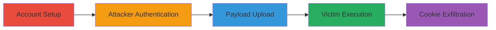

# Stored XSS via Malicious SVG File Upload in Outpost Inbox Leading to Session Cookie Theft

Multi-stage attack chain demonstrating a complete attack workflow exploiting a stored XSS in the file upload feature of Palo Alto Software's Outpost application.

## Chain Metrics Dashboard

| Metric | Value |
|--------|-------|
| Chain Status | Unverified |
| Total Steps | 4 |
| Execution Time | ~5 minutes |
| Skill Level | Intermediate |
| Complexity | Medium |
| Impact Level | High |

## Attack Flow Visualization

## Prerequisites & Requirements

### Required Tools

- [[tools/Notepad]]

### Target Environment

- Web application: Outpost by Palo Alto Software (https://app.outpost.co)
- Required services/ports: HTTPS (443)
- Network access requirements: Internet access to the Outpost web interface

### Initial Access Requirements

- No prior credentials needed; create new accounts
- Attacker must have email access for account verification
- Victim account for testing interaction

## Detailed Attack Procedures

### Step 1: Account Setup
procedure: [[procedures/Create-Attacker-and-Victim-Accounts]]

**Objective**: Establish attacker and victim accounts to simulate the attack scenario.

**Instructions**: Register two separate accounts using email addresses like seq@seq.teamoutpost.com for the attacker and seq1@seq1.teamoutpost.com for the victim. Complete any email verification if required.

**Expected Output**: Two functional accounts ready for login.

**Success Indicators**:
- Attacker account created and verifiable
- Victim account created and accessible

### Step 2: Attacker Authentication
procedure: [[procedures/Authenticate-as-Attacker-in-Outpost]]

**Objective**: Gain access to the Outpost application as the attacker to prepare for payload upload.

**Instructions**: Navigate to the sign-in page at https://app.outpost.co/sign-in and enter the attacker credentials (e.g., seq@seq.teamoutpost.com and password).

**Expected Output**: Successful login to the dashboard.

**Success Indicators**:
- Redirect to the main application interface
- Access to Inbox and conversation features

### Step 3: Payload Upload
procedure: [[procedures/Craft-and-Upload-Malicious-SVG-to-Inbox]]

**Objective**: Create and upload a malicious SVG file disguised as an image to bypass format checks and store the XSS payload.

**Instructions**: Use [[tools/Notepad]] to create an SVG file with the payload `<svg version="1.0" xmlns="http://www.w3.org/2000/svg" width="2560.000000pt" height="1600.000000pt" viewBox="0 0 2560.000000 1600.000000" preserveAspectRatio="xMidYMid meet" onload="alert(document.cookie)">`. Save it as Payload.png, Payload.gif, and Payload.bmp to disguise the extension. In the Outpost Inbox, create a new conversation, attach these files, and send to the victim account.

**Expected Output**: Files uploaded successfully and visible in the conversation.

**Success Indicators**:
- Attachments appear in the victim's Inbox without errors
- No upload rejection due to format

### Step 4: Victim Execution
procedure: [[procedures/Trigger-XSS-via-Victim-Attachment-Click]]

**Objective**: Simulate victim interaction to execute the stored XSS payload and steal session cookies.

**Instructions**: Log in as the victim (seq1@seq1.teamoutpost.com), access the Inbox, and click on each attachment. The file opens in a new tab, triggering the onload event.

**Expected Output**: Alert box displaying document.cookie, indicating successful JavaScript execution.

**Success Indicators**:
- New tab opens with SVG rendering
- JavaScript alert fires, exfiltrating cookies
- Potential for further exploitation like account takeover

## Attack Chain Summary

### Key Achievements

1. Bypassed file upload validation by renaming SVG to image extensions
2. Stored malicious JavaScript payload in conversation attachments
3. Executed XSS upon victim click, stealing session cookies
4. Demonstrated path to full account takeover

## Technique & Tactic Coverage

### MITRE ATT&CK Techniques

- [[JavaScript]]
- [[Keylogging]]

### MITRE ATT&CK Tactics

- [[Execution]]
- [[Collection]]

---
*Last updated: 2023-10-01T00:00:00Z*
