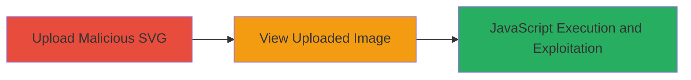

---
tags:
  - xss
  - stored-xss
  - svg-upload
  - file-upload
  - airship-cms
type: attack_chain
tools: []
tactics:
  - '[[Execution]]'
  - '[[Collection]]'
verified: false
platforms:
  - Web
  - PHP
submitted: true
complexity: medium
created_at: '2023-10-01T00:00:00Z'
procedures:
  - '[[procedures/Upload-Malicious-SVG-for-Stored-XSS]]'
  - '[[procedures/Trigger-Stored-XSS-by-Viewing-SVG-Image]]'
step_count: 2
techniques:
  - '[[JavaScript]]'
  - '[[Exploit Public-Facing Application]]'
updated_at: '2025-12-14T03:46:37.845Z'
description: >-
  A multi-stage attack exploiting a stored XSS vulnerability in the Airship CMS
  file upload feature by uploading a malicious SVG containing JavaScript, which
  executes when viewed in a browser.
skill_level: intermediate
impact_level: high
id: 37dfaee5-90da-4a29-b583-0b037faacb6d
validated: true
mitre_tactics:
  - '[[Execution]]'
  - '[[Collection]]'
mitre_techniques:
  - '[[JavaScript]]'
  - '[[Exploit Public-Facing Application]]'
---
# Stored XSS via Malicious SVG Upload in Airship CMS

Multi-stage attack chain demonstrating a complete attack workflow exploiting stored XSS in Airship CMS through SVG file uploads.

## Chain Metrics Dashboard

| Metric | Value |
|--------|-------|
| Chain Status | Unverified |
| Total Steps | 2 |
| Execution Time | ~5 minutes |
| Skill Level | Intermediate |
| Complexity | Medium |
| Impact Level | High |

## Attack Flow Visualization



## Prerequisites & Requirements

### Required Tools

- Web browser (e.g., Chrome, Firefox)
- Text editor for crafting SVG payload

### Target Environment

- Airship CMS web application
- PHP-based backend
- File upload feature enabled for images

### Initial Access Requirements

- Valid user account in Airship CMS
- Access to the file upload interface
- No special privileges required beyond authenticated user

## Detailed Attack Procedures

### Step 1: Upload Malicious SVG
procedure: [[procedures/Upload-Malicious-SVG-for-Stored-XSS]]

**Objective**: Upload an SVG file containing embedded JavaScript to the Airship CMS file upload feature, storing the payload for later execution.

**Instructions**: Craft a malicious SVG file with JavaScript payload, such as an alert or data exfiltration script. Use a text editor to create the file, then upload it via the CMS interface.

Example SVG payload (`malicious.svg`):
```xml
<svg xmlns="http://www.w3.org/2000/svg" onload="alert('XSS Executed')">
  <script>/* Malicious JS here, e.g., fetch cookies and send to attacker server */</script>
</svg>
```

Navigate to the file upload section in Airship CMS, select the SVG file, and submit the upload. The server preserves the `image/svg+xml` MIME type without sanitization.

**Expected Output**: Upload success confirmation; file stored in the user's account or media library.

**Success Indicators**:
- File uploaded without errors
- MIME type remains `image/svg+xml` (verifiable via browser dev tools or server logs)

### Step 2: Trigger Stored XSS by Viewing
procedure: [[procedures/Trigger-Stored-XSS-by-Viewing-SVG-Image]]

**Objective**: Access the uploaded SVG in a browser context where it is rendered as an image, causing the embedded JavaScript to execute in the victim's session.

**Instructions**: Share the uploaded SVG link with a victim or view it yourself in the CMS interface (e.g., image gallery or preview). The browser parses the SVG and executes the JS due to the preserved MIME type.

To test, open the direct URL to the SVG file in a browser, such as `https://target.com/uploads/malicious.svg`. Monitor for JS execution via alerts or network requests to an attacker-controlled server.

**Expected Output**: JavaScript payload executes, e.g., alert popup or data sent to external endpoint.

**Success Indicators**:
- JS alert or network request observed
- Victim's session cookies or data exfiltrated

## Attack Chain Summary

### Key Achievements

1. Successful upload of unsanitized SVG payload
2. Execution of arbitrary JavaScript in victim browsers
3. Potential for session hijacking or data theft

## Technique & Tactic Coverage

### MITRE ATT&CK Techniques

- [[JavaScript]]
- [[Exploit Public-Facing Application]]

### MITRE ATT&CK Tactics

- [[Execution]]
- [[Collection]]

---
*Last updated: 2023-10-01T00:00:00Z*
