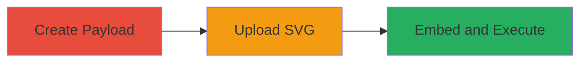

---
tags:
  - xss
  - stored-xss
  - file-upload
  - concrete-cms
  - svg
type: attack_chain
tools: []
tactics:
  - '[[Execution]]'
commands: []
platforms:
  - Web
  - PHP
complexity: medium
procedures:
  - '[[procedures/Create-Malicious-SVG-Payload-for-XSS]]'
  - '[[procedures/Upload-SVG-via-Concrete-CMS-File-Manager]]'
  - '[[procedures/Embed-and-Trigger-XSS-in-Portfolio-Section]]'
step_count: 3
techniques:
  - '[[JavaScript]]'
  - '[[Remote File Copy]]'
description: >-
  Attack chain exploiting incomplete file upload validation in Concrete CMS to
  upload SVG files containing embedded JavaScript, leading to stored XSS
  execution when embedded in site content.
skill_level: intermediate
impact_level: high
id: 5b8bc8a6-338b-48a4-91b3-1c6e94ac26b8
created_at: '2025-12-14T05:32:13.288Z'
updated_at: '2025-12-14T05:32:13.288Z'
verified: false
validated: true
submitted: true
mitre_tactics:
  - '[[Execution]]'
mitre_techniques:
  - '[[JavaScript]]'
  - '[[Remote File Copy]]'
---
# Stored XSS via Malicious SVG Upload in Concrete CMS

## Overview

This attack chain demonstrates how an authenticated administrator can exploit a vulnerability in Concrete CMS's File Manager by uploading SVG files that embed HTML and JavaScript. The whitelist allows .svg extensions without content validation, enabling stored XSS. The payload executes when the SVG is embedded in a portfolio section and viewed in a browser, potentially allowing malicious code injection for data theft or session hijacking.

## Chain Metrics Dashboard

| Metric | Value |
|--------|-------|
| Chain Status | Unverified |
| Total Steps | 3 |
| Execution Time | ~5 minutes |
| Skill Level | Intermediate |
| Complexity | Medium |
| Impact Level | High |

## Attack Flow Visualization



## Prerequisites & Requirements

### Required Tools

- Text editor (e.g., Notepad++ or VS Code) for crafting the SVG

### Target Environment

- Concrete CMS instance (version vulnerable to this issue, e.g., pre-patch for CVE-2019-16772 or similar)
- Web browser for access and verification
- Administrative credentials

### Initial Access Requirements

- Valid admin account in Concrete CMS
- Direct access to the CMS dashboard
- No prior network compromise needed, but assumes authenticated session

## Detailed Attack Procedures

### Step 1: Create Malicious SVG Payload
procedure: [[procedures/Create-Malicious-SVG-Payload-for-XSS]]

**Objective**: Craft an SVG file embedding HTML and JavaScript to bypass upload restrictions and enable XSS execution.

**Instructions**: Use a text editor to create a file named `malicious.svg` with the following content, which includes an HTML structure with a script tag per W3C SVG2 specifications:

```xml
<svg xmlns='http://www.w3.org/2000/svg' viewBox='0 0 96 105'><html><head><title>test</title></head><body><script>alert('xss');</script></body></html></svg>
```

Save the file and verify it opens without errors in a browser (script should not execute standalone yet).

**Expected Output**: A valid .svg file ready for upload.

**Success Indicators**:
- File saves correctly with .svg extension
- Basic SVG rendering confirmed in browser

### Step 2: Upload SVG via File Manager
procedure: [[procedures/Upload-SVG-via-Concrete-CMS-File-Manager]]

**Objective**: Authenticate as admin and upload the malicious SVG, leveraging the incomplete whitelist to bypass HTML restrictions.

**Instructions**: Log in to the Concrete CMS dashboard with admin credentials. Navigate to the File Manager in the dashboard menu. Use the upload button to select and submit the `malicious.svg` file. The system accepts it due to the .svg extension being whitelisted in `concrete/config/concrete.php` (lines 86-88) without content sanitization.

After upload, right-click the file in File Manager and select Properties to note the storage path (e.g., `/files/malicious.svg`).

**Expected Output**: File appears in File Manager with confirmed path.

**Success Indicators**:
- Upload succeeds without errors
- File properties show accessible path

### Step 3: Embed and Trigger XSS in Portfolio Section
procedure: [[procedures/Embed-and-Trigger-XSS-in-Portfolio-Section]]

**Objective**: Embed the uploaded SVG in site content and access it to trigger JavaScript execution, confirming stored XSS.

**Instructions**: In the CMS dashboard, navigate to Portfolio > Project Title section. Edit or add a new slide/block, then insert the uploaded SVG as an image or asset using its path (e.g., via HTML editor or file picker: ``). Save the changes.

View or access the portfolio section in a browser. The SVG renders, parsing the embedded HTML and executing the script.

**Expected Output**: Alert box displays 'xss' upon page load.

**Success Indicators**:
- No rendering errors in portfolio
- JavaScript alert triggers on access

## Attack Chain Summary

### Key Achievements

1. Bypassed file upload restrictions using SVG's ability to embed HTML/JS
2. Achieved stored XSS execution in authenticated admin context
3. Demonstrated potential for broader code injection attacks

## Technique & Tactic Coverage

### MITRE ATT&CK Techniques

- [[JavaScript]]
- [[Remote File Copy]]

### MITRE ATT&CK Tactics

- [[Execution]]

---
*Last updated: 2023-10-01*
