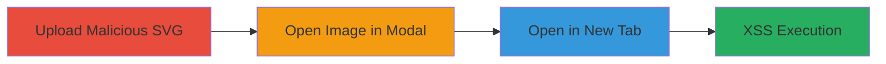

---
tags:
  - xss
  - stored-xss
  - nextcloud
  - svg-upload
  - javascript-execution
type: attack_chain
tools: []
tactics:
  - '[[Execution]]'
verified: false
platforms:
  - Web
submitted: true
complexity: medium
created_at: '2024-10-01T00:00:00Z'
procedures:
  - '[[procedures/Upload-Malicious-SVG-to-Nextcloud-Contact]]'
  - '[[procedures/Open-Contact-Image-in-Modal]]'
  - '[[procedures/Trigger-XSS-by-Opening-Image-in-New-Tab]]'
step_count: 3
techniques:
  - '[[JavaScript]]'
updated_at: '2025-12-14T00:11:09.770Z'
description: >-
  A multi-stage attack exploiting insufficient SVG sanitization in Nextcloud's
  contact image upload to achieve stored XSS, enabling JavaScript execution when
  victims view the image in a new browser tab.
skill_level: intermediate
impact_level: high
id: bec16d7d-fae1-48f5-be33-122c37b4cf2f
validated: true
mitre_tactics:
  - '[[Execution]]'
mitre_techniques:
  - '[[JavaScript]]'
---
# Stored XSS via Malicious SVG Upload in Nextcloud Contacts

Multi-stage attack chain demonstrating a complete attack workflow exploiting a stored XSS vulnerability in Nextcloud's contact image upload feature.

## Chain Metrics Dashboard

| Metric | Value |
|--------|-------|
| Chain Status | Unverified |
| Total Steps | 3 |
| Execution Time | ~5 minutes |
| Skill Level | Intermediate |
| Complexity | Medium |
| Impact Level | High |

## Attack Flow Visualization

## Prerequisites & Requirements

### Required Tools

- Web browser (Chrome/Chromium recommended for trigger; Firefox does not trigger)

### Target Environment

- Nextcloud instance with contacts app enabled
- Web platform access

### Initial Access Requirements

- Authenticated user account in Nextcloud with permission to create/edit contacts
- No special privileges required beyond standard user access

## Detailed Attack Procedures

### Step 1: Upload Malicious SVG
procedure: [[procedures/Upload-Malicious-SVG-to-Nextcloud-Contact]]

**Objective**: Inject a malicious SVG file containing JavaScript payload into a contact's image field to store the XSS payload persistently.

**Instructions**: Create an SVG file with an onload JavaScript payload, such as `redirect.svg` containing `<svg onload="alert(1)"></svg>`. In the Nextcloud contacts interface, create or edit a contact and attach this SVG as the profile image.

**Expected Output**: The SVG is uploaded and associated with the contact without error, appearing as the contact's image thumbnail.

**Success Indicators**:
- SVG file successfully attached to contact
- Thumbnail displays in contacts list without sanitization errors

### Step 2: Open Contact Image in Modal
procedure: [[procedures/Open-Contact-Image-in-Modal]]

**Objective**: Display the malicious image in a popup modal to prepare for the browser-specific trigger.

**Instructions**: Navigate to the contacts app in Nextcloud, locate the contact with the malicious image, and click on the small thumbnail image to open it in the full-size popup modal.

**Expected Output**: The image loads in the modal view, rendering the SVG content.

**Success Indicators**:
- Modal opens displaying the contact image
- No immediate errors or blocks on image rendering

### Step 3: Trigger XSS by Opening Image in New Tab
procedure: [[procedures/Trigger-XSS-by-Opening-Image-in-New-Tab]]

**Objective**: Bypass modal sanitization by opening the raw image URL in a new browser tab, executing the JavaScript payload.

**Instructions**: In the modal, right-click the image and select 'Open image in new tab'. This loads the SVG directly in Chrome/Chromium, triggering the onload JavaScript.

**Expected Output**: The new tab loads the SVG, and the JavaScript executes (e.g., alert pops up or redirect occurs).

**Success Indicators**:
- New tab opens with direct SVG URL
- JavaScript payload executes, confirming XSS

## Attack Chain Summary

### Key Achievements

1. Persistent storage of malicious SVG in contact images
2. Bypass of previous sanitization fixes via modal-to-tab workflow
3. Arbitrary JavaScript execution for any viewer, enabling session hijacking or redirects

## Technique & Tactic Coverage

### MITRE ATT&CK Techniques

- [[JavaScript]]

### MITRE ATT&CK Tactics

- [[Execution]]

---
*Last updated: 2024-10-01T00:00:00Z*
