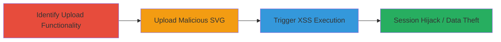

---
tags:
  - xss
  - stored-xss
  - file-upload
  - svg
  - tiktok
  - ads-platform
type: attack_chain
tools: []
tactics:
  - '[[Execution]]'
  - '[[Initial Access]]'
verified: false
platforms:
  - Web
submitted: true
complexity: medium
created_at: '2023-10-01T00:00:00Z'
procedures:
  - '[[procedures/Identify-Vulnerable-File-Upload]]'
  - '[[procedures/Upload-Malicious-SVG-with-XSS-Payload]]'
  - '[[procedures/Trigger-Stored-XSS-Execution]]'
step_count: 3
techniques:
  - '[[JavaScript]]'
  - '[[Exploit Public-Facing Application]]'
updated_at: '2025-12-13T23:52:55.147Z'
description: >-
  A multi-step attack exploiting insufficient file upload validation to store
  and execute malicious JavaScript via SVG files on ads.tiktok.com, leading to
  potential session hijacking and data theft.
skill_level: intermediate
impact_level: high
id: 7c718c4e-0bdd-453b-9f49-e13c7188d9c6
validated: true
mitre_tactics:
  - '[[Execution]]'
  - '[[Initial Access]]'
mitre_techniques:
  - '[[JavaScript]]'
  - '[[Exploit Public-Facing Application]]'
---
# Stored XSS via Malicious SVG Upload in TikTok Ads Ticketing Platform

Multi-stage attack chain demonstrating exploitation of a stored XSS vulnerability through unvalidated file uploads on the TikTok ads ticketing platform at ads.tiktok.com. Attackers can upload SVG files containing JavaScript payloads, which execute in the context of other users viewing the files, enabling session hijacking, data theft, or phishing.

## Chain Metrics Dashboard

| Metric | Value |
|--------|-------|
| Chain Status | Unverified |
| Total Steps | 3 |
| Execution Time | ~5 minutes |
| Skill Level | Intermediate |
| Complexity | Medium |
| Impact Level | High |

## Attack Flow Visualization



## Prerequisites & Requirements

### Required Tools

- Web browser (e.g., Chrome with developer tools)
- Text editor for crafting SVG payload

### Target Environment

- Web platform
- Access to TikTok ads ticketing platform at ads.tiktok.com
- Authenticated user account on the platform

### Initial Access Requirements

- Valid credentials for the ads.tiktok.com subdomain
- No special network position required; standard internet access suffices
- Prior knowledge of the file upload feature in the ticketing system

## Detailed Attack Procedures

### Step 1: Identify Vulnerable File Upload
procedure: [[procedures/Identify-Vulnerable-File-Upload]]

**Objective**: Locate and assess the file upload functionality to confirm lack of validation for executable file types like SVG.

**Instructions**: Navigate to the ads ticketing platform on ads.tiktok.com and explore the interface for file attachment or upload features, typically in ticket submission forms. Inspect the upload endpoint using browser developer tools (F12) to check for MIME type restrictions or content scanning. Test with benign files to verify acceptance of SVG format.

**Expected Output**: Confirmation that SVG files are accepted without validation, visible via successful upload of a test SVG.

**Success Indicators**:
- Upload form found in ticketing interface
- No errors on uploading a simple SVG file
- Endpoint details reveal absence of file type checks

### Step 2: Upload Malicious SVG with XSS Payload
procedure: [[procedures/Upload-Malicious-SVG-with-XSS-Payload]]

**Objective**: Craft and upload an SVG file embedding a JavaScript payload to store the XSS vulnerability on the platform.

**Instructions**: Create an SVG file using a text editor with embedded JavaScript, e.g., save as malicious.svg:

```xml
<svg xmlns="http://www.w3.org/2000/svg">
  <script>alert('XSS Executed');</script>
</svg>
```

Upload this file via the identified upload endpoint in the ticketing form on ads.tiktok.com. Submit the ticket to store the file server-side.

**Expected Output**: File uploads successfully without rejection, and the ticket is created with the SVG attached.

**Success Indicators**:
- No validation errors during upload
- SVG file appears in the ticket attachments
- Payload is stored without sanitization

### Step 3: Trigger Stored XSS Execution
procedure: [[procedures/Trigger-Stored-XSS-Execution]]

**Objective**: Access the uploaded file to trigger execution of the stored JavaScript in the victim's browser context.

**Instructions**: As another user or admin, view the ticket containing the uploaded SVG on ads.tiktok.com. The platform renders the SVG, executing the embedded script. Monitor for payload execution via alert or network requests if customized (e.g., exfiltrate session cookies).

**Expected Output**: JavaScript executes, displaying an alert or performing actions like stealing cookies via `document.cookie`.

**Success Indicators**:
- Alert or custom payload action triggers on view
- Potential session data captured if payload includes exfiltration
- No blocking by browser or platform CSP

## Attack Chain Summary

### Key Achievements

1. Bypassed file upload validation to store malicious SVG
2. Achieved arbitrary JavaScript execution in user context
3. Enabled potential account compromise via session theft

## Technique & Tactic Coverage

### MITRE ATT&CK Techniques

- [[JavaScript]]
- [[Exploit Public-Facing Application]]

### MITRE ATT&CK Tactics

- [[Execution]]
- [[Initial Access]]

---
*Last updated: 2023-10-01T00:00:00Z*
