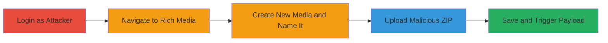

# Stored XSS via Malicious ZIP Upload in Pushwoosh Rich Media

Multi-stage attack chain demonstrating a complete attack workflow exploiting stored XSS in the Rich Media feature of Pushwoosh.

## Chain Metrics Dashboard

| Metric | Value |
|--------|-------|
| Chain Status | Unverified |
| Total Steps | 5 |
| Execution Time | ~5 minutes |
| Skill Level | Intermediate |
| Complexity | Medium |
| Impact Level | High |

## Attack Flow Visualization

## Prerequisites & Requirements

### Required Tools

- [[tools/Firefox]]

### Target Environment

- Web application (Pushwoosh dashboard)
- Required services/ports: HTTPS (443)
- Network access requirements: Valid attacker credentials for Pushwoosh account

### Initial Access Requirements

- Attacker credentials for Pushwoosh
- Network position: Direct access to the web application
- Prior access needed: Authenticated session

## Detailed Attack Procedures

### Step 1: Login as Attacker
procedure: [[procedures/Exploit-Stored-XSS-via-ZIP-Upload-in-Pushwoosh]]

**Objective**: Authenticate to the Pushwoosh application to access the Rich Media feature.

**Instructions**: Open [[tools/Firefox]] and navigate to the Pushwoosh login page. Enter attacker credentials to log in.

**Expected Output**: Successful login and redirection to the dashboard.

**Success Indicators**:
- Dashboard accessible
- No authentication errors

### Step 2: Go to Rich Media and Create New Media
procedure: [[procedures/Exploit-Stored-XSS-via-ZIP-Upload-in-Pushwoosh]]

**Objective**: Navigate to the Rich Media section and start creating a new media item.

**Instructions**: From the dashboard, locate and click on the Rich Media section. Initiate the creation of a new media entry.

**Expected Output**: New media creation form loaded.

**Success Indicators**:
- Rich Media interface visible
- Create new option functional

### Step 3: Fill Name and Choose Zip Upload
procedure: [[procedures/Exploit-Stored-XSS-via-ZIP-Upload-in-Pushwoosh]]

**Objective**: Name the media item and select the ZIP upload option.

**Instructions**: Enter a descriptive name for the media (e.g., "Test Media") and select the ZIP file upload option in the attachments section.

**Expected Output**: Upload interface ready for file selection.

**Success Indicators**:
- Name field populated
- ZIP upload option selected

### Step 4: Upload index.zip in Attachments
procedure: [[procedures/Exploit-Stored-XSS-via-ZIP-Upload-in-Pushwoosh]]

**Objective**: Upload the prepared ZIP file containing the malicious HTML payload.

**Instructions**: Prepare a ZIP file named "index.zip" containing an "index.html" file with an XSS payload, such as ``. Select and upload this file via the attachments interface.

**Expected Output**: File upload progress and confirmation.

**Success Indicators**:
- ZIP file attached successfully
- No upload errors

### Step 5: Click Save and Enter to Media
procedure: [[procedures/Exploit-Stored-XSS-via-ZIP-Upload-in-Pushwoosh]]

**Objective**: Save the media item and trigger the XSS payload execution by viewing the media.

**Instructions**: Click the Save button to store the media. Then, navigate to or refresh the media page to load the contents, which will render the ZIP's index.html and execute the JavaScript.

**Expected Output**: Payload execution, e.g., alert box or arbitrary JS running in the viewer's browser.

**Success Indicators**:
- Media saved without errors
- JavaScript payload triggers on page load or refresh

## Attack Chain Summary

### Key Achievements

1. Successful upload of malicious ZIP containing XSS payload
2. Storage of unsanitized HTML in Rich Media
3. Execution of arbitrary JavaScript for any viewer, enabling data theft or session hijacking

## Technique & Tactic Coverage

### MITRE ATT&CK Techniques

- [[JavaScript]]

### MITRE ATT&CK Tactics

- [[Execution]]

---
*Last updated: 2023-10-01T00:00:00Z*
