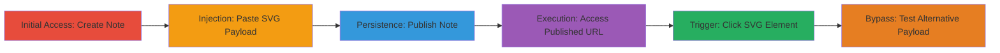

# Stored XSS via Markdown SVG Injection in Simplenote

Multi-stage attack chain demonstrating a complete attack workflow exploiting inadequate SVG sanitization in Simplenote's Markdown renderer, leading to persistent XSS via javascript: URI in animate attributes.

## Chain Metrics Dashboard

| Metric | Value |
|--------|-------|
| Chain Status | Unverified |
| Total Steps | 6 |
| Execution Time | ~5 minutes |
| Skill Level | Intermediate |
| Complexity | Medium |
| Impact Level | High |

## Attack Flow Visualization



## Prerequisites & Requirements

### Required Tools

- [[tools/DOMPurify]] (for payload inspiration and sanitizer testing)

### Target Environment

- Web platform
- Simplenote web app at app.simplenote.com
- Markdown rendering enabled in notes
- No specific ports or services beyond standard HTTPS

### Initial Access Requirements

- Valid user account on Simplenote (authenticated access required to create notes)
- Browser with JavaScript enabled
- Network access to app.simplenote.com

## Detailed Attack Procedures

### Step 1: Create New Note with Markdown Enabled
procedure: [[procedures/Create-and-Inject-Malicious-Note-in-Simplenote]]

**Objective**: Gain initial access to the note creation interface and enable Markdown rendering to prepare for payload injection.

**Instructions**: Log in to app.simplenote.com, navigate to create a new note, and toggle the Markdown formatted option in the note settings.

**Expected Output**: A blank note editor with Markdown rendering active.

**Success Indicators**:
- Successful authentication and note creation
- Markdown option visible and enabled

### Step 2: Inject Crafted SVG Payload
procedure: [[procedures/Create-and-Inject-Malicious-Note-in-Simplenote]]

**Objective**: Insert the malicious SVG payload into the note to exploit the Markdown parser's sanitization bypass.

**Instructions**: Paste the following payload into the edit window:

```html
<div id="137"><svg><a xmlns:xlink="http://www.w3.org/1999/xlink" xlink:href="?"><circle r="400"></circle><animate attributeName="xlink:href" begin="0" from="javascript:alert(document.domain)" to="&" /></a>//\\["'\\`-->\\]]></div>
```

**Expected Output**: Payload inserted without immediate errors; note saves with the content.

**Success Indicators**:
- Payload pasted successfully
- No client-side validation blocks the input

### Step 3: Publish the Note
procedure: [[procedures/Publish-Note-for-Persistent-Storage]]

**Objective**: Store the malicious payload persistently by publishing the note, making it accessible via a public URL.

**Instructions**: Click the triple dots icon in the note interface and select the Publish option to generate a shareable URL.

**Expected Output**: A published note with a unique URL provided.

**Success Indicators**:
- Note published successfully
- Public URL generated and accessible

### Step 4: Access the Published Note URL
procedure: [[procedures/Access-and-Execute-XSS-in-Published-Note]]

**Objective**: Render the note in a viewer's browser to trigger Markdown parsing of the SVG payload.

**Instructions**: Open the provided Simplenote URL in a browser, ensuring the viewer is authenticated to app.simplenote.com for full context execution.

**Expected Output**: Note loads with rendered Markdown, including the SVG element.

**Success Indicators**:
- Note renders without errors
- SVG element visible as a black rectangle

### Step 5: Trigger XSS by Interacting with SVG
procedure: [[procedures/Access-and-Execute-XSS-in-Published-Note]]

**Objective**: Execute arbitrary JavaScript by clicking the rendered malicious SVG element, exploiting the animate attribute.

**Instructions**: Click on the black rectangle (rendered circle from the SVG) to initiate the xlink:href animation, which executes the javascript:alert(document.domain).

**Expected Output**: Alert box pops up displaying the domain, confirming XSS execution.

**Success Indicators**:
- JavaScript alert triggers
- Potential for session theft or further actions in the authenticated context

### Step 6: Bypass Initial Fix with Updated Payload
procedure: [[procedures/Bypass-Fix-with-Alternative-SVG-Payload]]

**Objective**: Test and exploit a bypass after an initial sanitization fix by using a malformed URI scheme with line breaks.

**Instructions**: After the initial fix, repeat steps 1-3 with the alternative payload:

```html
<div id="137"><svg><a xmlns:xlink="http://www.w3.org/1999/xlink" xlink:href="?"><circle r="400"></circle><animate attributeName="xlink:href" begin="0" from="javaScriPt://www.simplenote.com/test%0aalert(document.domain)" to="&" /></a>//\\["'\\`-->\\]]></div>
```
Then access and click as in steps 4-5.

**Expected Output**: Alert executes despite the fix, bypassing URI scheme checks.

**Success Indicators**:
- Bypass successful
- Alert confirms persistent XSS post-fix

## Attack Chain Summary

### Key Achievements

1. Successful injection of SVG-based XSS payload via Markdown without detection
2. Persistent storage through note publishing, affecting all viewers
3. Arbitrary JS execution in app.simplenote.com context, enabling session hijacking
4. Bypass of initial sanitization fix using case variation and encoded line breaks

## Technique & Tactic Coverage

### MITRE ATT&CK Techniques

- [[JavaScript]]
- [[Exploit Public-Facing Application]]

### MITRE ATT&CK Tactics

- [[Initial Access]]
- [[Execution]]
- [[Collection]]

---
*Last updated: 2024-01-01T00:00:00Z*
