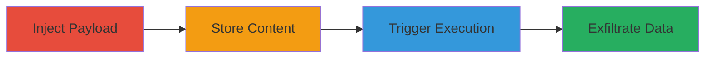

# Stored XSS via Multiple Input Parameters on Stripo Email Platform

Multi-stage attack chain demonstrating the exploitation of a stored XSS vulnerability on https://my.stripo.email/, where malicious JavaScript is injected into various input fields, stored on the server, and executed in the context of authenticated users viewing the affected content. This can lead to session hijacking, cookie theft, or phishing attacks against other users.

## Chain Metrics Dashboard

| Metric | Value |
|--------|-------|
| Chain Status | Unverified |
| Total Steps | 3 |
| Execution Time | ~5 minutes |
| Skill Level | Intermediate |
| Complexity | Low |
| Impact Level | High |

## Attack Flow Visualization

## Prerequisites & Requirements

### Required Tools

- Browser developer tools for payload testing
- Proxy tool like Burp Suite for intercepting requests (optional)

### Target Environment

- Web platform: https://my.stripo.email/
- Required services/ports: HTTPS on port 443
- Network access requirements: Internet access to the target domain

### Initial Access Requirements

- Authenticated account on the Stripo platform
- No special privileges needed beyond basic user access
- Prior access: Valid login credentials for injection

## Detailed Attack Procedures

### Step 1: Authenticate and Identify Input Parameters
procedure: [[procedures/Inject-Malicious-Payload-into-Input-Parameters]]

**Objective**: Gain access to the platform and locate vulnerable input parameters that accept and store user-supplied data without proper sanitization.

**Instructions**: Log in to https://my.stripo.email/ using valid credentials. Navigate to sections involving user inputs such as email template editors, comment fields, or profile settings. Test inputs by submitting simple payloads like `` to identify storage and reflection points.

**Expected Output**: Payload stored on the server and reflected in the page source when content is saved and reloaded.

**Success Indicators**:
- Payload appears in the HTML source without escaping
- Alert or console log triggers on page load

### Step 2: Inject and Store Malicious Payload
procedure: [[procedures/Inject-Malicious-Payload-into-Input-Parameters]]

**Objective**: Submit a crafted JavaScript payload into multiple vulnerable input parameters to ensure it is persisted in the database or storage backend.

**Instructions**: In the identified input fields (e.g., template body, subject lines, or metadata fields), inject a payload such as ``. Submit the form to store the content. Verify storage by creating or editing an email template and saving it.

**Expected Output**: The malicious script is saved and associated with the user's content, ready for execution on view.

**Success Indicators**:
- Content saves without errors
- Payload visible in backend storage or database queries (if accessible)

### Step 3: Trigger Execution and Exfiltrate Data
procedure: [[procedures/Trigger-XSS-Execution-on-Content-View]]

**Objective**: Have a victim (or self) view the stored content to execute the injected JavaScript in their browser context, leading to data theft.

**Instructions**: Share the affected content (e.g., via email template link) with a target user. When the victim authenticates and views the page, the script executes automatically. Monitor the attacker's server for exfiltrated data like session cookies.

**Expected Output**: JavaScript runs in the victim's session, sending sensitive data to the attacker's controlled endpoint.

**Success Indicators**:
- Network request to attacker.com with stolen cookies
- Victim's session hijacked or data captured

## Attack Chain Summary

### Key Achievements

1. Successful injection and storage of XSS payload in multiple parameters
2. Execution of arbitrary JavaScript in victim browsers
3. Potential compromise of user accounts through session theft or keylogging

## Technique & Tactic Coverage

### MITRE ATT&CK Techniques

- [[JavaScript]]

### MITRE ATT&CK Tactics

- [[Execution]]
- [[Collection]]

---
*Last updated: 2023-10-01T00:00:00Z*
