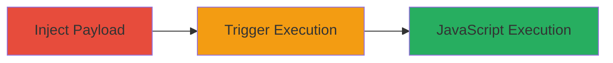

---
tags:
  - xss
  - stored-xss
  - forum
  - javascript
  - client-side-attack
type: attack_chain
tools: []
tactics:
  - '[[Execution]]'
verified: false
platforms:
  - Web
submitted: true
complexity: medium
created_at: '2023-10-01T00:00:00Z'
procedures:
  - '[[procedures/Inject-XSS-Payload-into-User-Nickname]]'
  - '[[procedures/Trigger-Stored-XSS-via-Author-Search]]'
step_count: 2
techniques:
  - '[[JavaScript]]'
updated_at: '2025-12-14T00:11:09.553Z'
description: >-
  A multi-step attack exploiting a stored XSS vulnerability in the Acronis
  forum's nickname feature to inject and trigger malicious JavaScript when users
  search for authors.
skill_level: intermediate
impact_level: high
id: 7511b7c1-72a6-43dd-aa8c-7c42ae5722e1
validated: true
mitre_tactics:
  - '[[Execution]]'
mitre_techniques:
  - '[[JavaScript]]'
---
# Stored XSS via Nickname Injection Leading to JavaScript Execution in Acronis Forum

Multi-stage attack chain demonstrating a complete attack workflow exploiting improper input sanitization in the forum's nickname modification feature.

## Chain Metrics Dashboard

| Metric | Value |
|--------|-------|
| Chain Status | Unverified |
| Total Steps | 2 |
| Execution Time | ~5 minutes |
| Skill Level | Intermediate |
| Complexity | Medium |
| Impact Level | High |

## Attack Flow Visualization

## Prerequisites & Requirements

### Required Tools

- Web browser (e.g., Chrome with developer tools)

### Target Environment

- Web platform
- Access to forum.acronis.com
- Registered user account on the forum

### Initial Access Requirements

- Valid forum account credentials
- No special network position required; public access to the forum
- Ability to modify own profile

## Detailed Attack Procedures

### Step 1: Payload Injection
procedure: [[procedures/Inject-XSS-Payload-into-User-Nickname]]

**Objective**: Store a malicious JavaScript payload in the user's nickname to persist the XSS vulnerability.

**Instructions**: Log in to your forum account on forum.acronis.com, navigate to the profile settings, and modify the nickname by appending the payload `` to the existing nickname. Save the changes.

**Expected Output**: Nickname updated successfully without errors, payload stored in the backend.

**Success Indicators**:
- Profile update confirmation
- No immediate errors or sanitization warnings

### Step 2: Trigger Execution
procedure: [[procedures/Trigger-Stored-XSS-via-Author-Search]]

**Objective**: Execute the stored JavaScript by searching for the malicious nickname, affecting any user who performs the search.

**Instructions**: Use the forum's search function, enter the modified nickname (including the payload keywords) in the Author field, and submit the search. The unsanitized reflection in search results will execute the JavaScript.

**Expected Output**: JavaScript alert popup (e.g., alert(0)) displayed in the victim's browser.

**Success Indicators**:
- Alert or arbitrary code execution observed
- Potential for session hijacking if payload is modified to steal cookies

## Attack Chain Summary

### Key Achievements

1. Successful storage of XSS payload in nickname without detection
2. Triggering of client-side JavaScript execution via legitimate search functionality
3. Potential for broader impacts like session theft or phishing when other users search

## Technique & Tactic Coverage

### MITRE ATT&CK Techniques

- [[JavaScript]]

### MITRE ATT&CK Tactics

- [[Execution]]

---
*Last updated: 2023-10-01T00:00:00Z*
