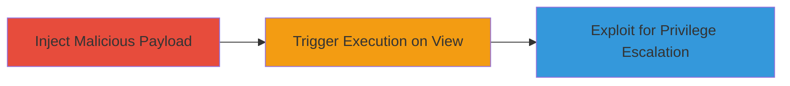

---
tags:
  - xss
  - stored-xss
  - web-vulnerability
  - privilege-escalation
type: attack_chain
tools: []
tactics:
  - '[[Execution]]'
  - '[[Privilege Escalation]]'
verified: false
platforms:
  - Web
submitted: true
complexity: medium
created_at: '2023-10-01T00:00:00Z'
procedures:
  - '[[procedures/Exploit-Stored-XSS-in-Post-Title]]'
step_count: 2
techniques:
  - '[[JavaScript]]'
updated_at: '2025-12-13T23:56:03.892Z'
description: >-
  A stored XSS vulnerability in the post title field of Autodesk Forums allows a
  non-privileged user to inject malicious JavaScript that executes when viewed
  by other users, including privileged administrators, potentially leading to
  session hijacking or unauthorized actions.
skill_level: intermediate
impact_level: high
id: 6532388b-2300-4f89-bae1-2d2e15298e15
validated: true
mitre_tactics:
  - '[[Execution]]'
  - '[[Privilege Escalation]]'
mitre_techniques:
  - '[[JavaScript]]'
---
# Stored XSS via Post Title in Autodesk Forums Enabling Non-Privileged to Privileged User Exploitation

Multi-stage attack chain demonstrating exploitation of a stored XSS vulnerability in the Autodesk Forums post title feature, allowing injection of malicious JavaScript that executes in the context of viewers, including privileged users, to achieve session hijacking or unauthorized actions.

## Chain Metrics Dashboard

| Metric | Value |
|--------|-------|
| Chain Status | Unverified |
| Total Steps | 2 |
| Execution Time | ~5 minutes |
| Skill Level | Intermediate |
| Complexity | Medium |
| Impact Level | High |

## Attack Flow Visualization

## Prerequisites & Requirements

### Required Tools

- Browser with developer tools (e.g., Chrome DevTools)

### Target Environment

- Web platform: Autodesk Forums (https://forums.autodesk.com/)
- Required services/ports: HTTPS on port 443
- Network access requirements: Internet access to the forum

### Initial Access Requirements

- Valid non-privileged user account on Autodesk Forums
- No prior privileged access needed

## Detailed Attack Procedures

### Step 1: Inject Malicious Payload
procedure: [[procedures/Exploit-Stored-XSS-in-Post-Title]]

**Objective**: Create a forum post with a title containing unsanitized JavaScript payload that will be stored and rendered for other users.

**Instructions**: Log in to the Autodesk Forums with a non-privileged account. Navigate to create a new post and enter a malicious JavaScript payload in the title field, such as ``. Submit the post to store the payload.

**Expected Output**: The post is created successfully, and the title appears to render the script when previewed or viewed by others.

**Success Indicators**:
- Post created without errors
- Payload stored in the database (verifiable by viewing the post source)

### Step 2: Trigger Execution and Escalate
procedure: [[procedures/Exploit-Stored-XSS-in-Post-Title]]

**Objective**: Induce a privileged user (e.g., administrator) to view the post, triggering the XSS payload execution in their browser context to steal session data or perform unauthorized actions.

**Instructions**: Share the post link with a target privileged user or wait for them to moderate/view the forum. Upon viewing, the JavaScript executes, potentially capturing cookies or redirecting to a phishing site for session hijacking.

**Expected Output**: Alert box or network request showing stolen data (e.g., session cookies) exfiltrated to an attacker-controlled server.

**Success Indicators**:
- JavaScript executes in the viewer's browser
- Session data captured or unauthorized action performed

## Attack Chain Summary

### Key Achievements

1. Successful injection of stored XSS payload in post title without detection.
2. Execution of malicious JavaScript in the context of privileged users viewing the post.
3. Potential for session hijacking, leading to unauthorized access as a privileged user.

## Technique & Tactic Coverage

### MITRE ATT&CK Techniques

- [[JavaScript]]

### MITRE ATT&CK Tactics

- [[Execution]]
- [[Privilege Escalation]]

---
*Last updated: 2023-10-01T00:00:00Z*
