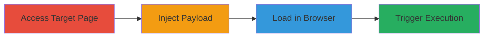

# Stored XSS via Query Parameter on Shopify Help Page Leading to Arbitrary JavaScript Execution

Multi-stage attack chain demonstrating a complete stored XSS exploitation on Shopify's help documentation site, specifically the Italian partners resources page. The attack leverages insufficient input sanitization in a query parameter, storing and reflecting malicious JavaScript that executes when users interact with the feedback feature.

## Chain Metrics Dashboard

| Metric | Value |
|--------|-------|
| Chain Status | Unverified |
| Total Steps | 4 |
| Execution Time | ~2 minutes |
| Skill Level | Intermediate |
| Complexity | Low |
| Impact Level | High |

## Attack Flow Visualization

## Prerequisites & Requirements

### Required Tools

- [[tools/Microsoft-Edge]]
- [[tools/Internet-Explorer]]

### Target Environment

- Web platform (Shopify help site)
- Vulnerable browsers: Microsoft Edge or Internet Explorer on Windows 10
- No specific ports or services required beyond standard HTTPS access

### Initial Access Requirements

- Public access to https://help.shopify.com (no credentials needed)
- Network access to the internet
- No prior access needed

## Detailed Attack Procedures

### Step 1: Access Target Page
procedure: [[procedures/Access-Shopify-Help-Page]]

**Objective**: Navigate to the vulnerable page to prepare for payload injection.

**Instructions**: Open a web browser and directly access the base URL of the Italian partners resources page.

**Expected Output**: The page loads successfully, displaying marketing resources for accountants.

**Success Indicators**:
- Page title matches "Marketing pack for accountants"
- Feedback button "Condividi il tuo feedback" is visible

### Step 2: Inject XSS Payload into Query Parameter
procedure: [[procedures/Inject-XSS-Payload-into-Query-Parameter]]

**Objective**: Append a malicious JavaScript payload to the URL query parameter to store the XSS vector.

**Instructions**: Modify the URL by appending the payload ?v0sjx'-alert(1)-'uyvvr=1 (URL-encoded as %27-alert(1)-%27uyvvr=1) to the base URL.

**Expected Output**: The modified URL is ready for loading, e.g., https://help.shopify.com/it/partners/resources/marketing-pack-for-accountants?v0sjx'-alert(1)-'uyvvr=1.

**Success Indicators**:
- URL contains the injected payload without errors
- Payload is properly URL-encoded if necessary

### Step 3: Load URL in Vulnerable Browser
procedure: [[procedures/Load-URL-in-Vulnerable-Browser]]

**Objective**: Load the malicious URL in a browser known to be vulnerable to the reflection.

**Instructions**: Open the prepared URL in Microsoft Edge (version 44.17763.1.0) or Internet Explorer on Windows 10.

**Expected Output**: The page loads without immediate alerts, but the payload is reflected in the DOM or stored for later execution.

**Success Indicators**:
- Page renders correctly in the specified browser
- No browser errors on load

### Step 4: Trigger XSS via Feedback Button
procedure: [[procedures/Trigger-XSS-via-Feedback-Button]]

**Objective**: Interact with the feedback element to execute the stored JavaScript payload.

**Instructions**: Click the "Condividi il tuo feedback" button or link on the page.

**Expected Output**: An alert(1) popup appears, confirming JavaScript execution.

**Success Indicators**:
- Alert box with "1" displays
- Browser console shows no blocking errors

## Attack Chain Summary

### Key Achievements

1. Successful injection and storage of XSS payload via query parameter
2. Reflection and execution in vulnerable legacy browsers
3. Demonstration of arbitrary JS execution, enabling session hijacking or data theft

## Technique & Tactic Coverage

### MITRE ATT&CK Techniques

- [[JavaScript]]

### MITRE ATT&CK Tactics

- [[Execution]]
- [[Collection]]

---

*Last updated: 2023-10-01T00:00:00Z*
