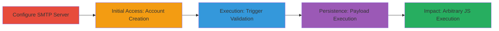

# Stored XSS via SMTP Error Message Injection on Account Email Page

Multi-stage attack chain demonstrating exploitation of a stored XSS vulnerability on www.xvideos.com by manipulating SMTP error messages from a controlled Postfix server to include malicious JavaScript payloads, which are inserted into the /account/email page via the unsanitized html() method.

## Chain Metrics Dashboard

| Metric | Value |
|--------|-------|
| Chain Status | Unverified |
| Total Steps | 4 |
| Execution Time | ~45 minutes |
| Skill Level | Intermediate |
| Complexity | Medium |
| Impact Level | High |

## Attack Flow Visualization



## Prerequisites & Requirements

### Required Tools

- [[tools/Postfix]]

### Target Environment

- Web platform (www.xvideos.com)
- Required services/ports: SMTP (port 25 or 587 for email validation)
- Network access requirements: Ability to host a custom SMTP server reachable by the target

### Initial Access Requirements

- No prior credentials needed
- Local network for SMTP server setup
- Valid browser for web interactions

## Detailed Attack Procedures

### Step 1: Configure SMTP Server
procedure: [[procedures/Configure-Postfix-for-XSS-Injection]]

**Objective**: Set up a Postfix SMTP server to reject emails for a specific invalid address and inject an XSS payload into the error message.

**Instructions**: Install and configure Postfix with recipient restrictions to reject emails to 'invalid@example.org' and return a custom error containing the XSS payload ''. Use [[commands/postmap-update-recipient-access]] to hash the access file and [[commands/systemctl-restart-postfix]] to apply changes.

```bash
postmap /etc/postfix/recipient_access
systemctl restart postfix
```

**Expected Output**: Postfix service restarts successfully, and test email rejections return the custom error with payload.

**Success Indicators**:
- Postfix logs show rejection with XSS payload in error message
- SMTP server is listening on the configured port

### Step 2: Initial Access: Account Creation
procedure: [[procedures/Register-Account-with-Invalid-Email]]

**Objective**: Create an account on the target site using the invalid email address that triggers SMTP rejection.

**Instructions**: Navigate to www.xvideos.com in an up-to-date browser, click 'Join for FREE', and register using 'invalid@example.org' as the email address.

**Expected Output**: Account created successfully, but email remains unvalidated.

**Success Indicators**:
- Account dashboard accessible
- Email listed as invalid/unverified

### Step 3: Execution: Trigger Validation
procedure: [[procedures/Trigger-Email-Validation]]

**Objective**: Initiate email validation to send a request to the controlled SMTP server, causing the XSS payload to be stored via the error message.

**Instructions**: After login, navigate to the /account/email page and click 'Please click Here to validate it' to trigger the validation email send.

**Expected Output**: Validation request sent; no immediate alert, but error message processed by the site.

**Success Indicators**:
- Site attempts to send validation email
- No errors on the client side during trigger

### Step 4: Persistence: Observe Payload Execution
procedure: [[procedures/Observe-XSS-Payload-Execution]]

**Objective**: Wait for the site to process and render the stored SMTP error message, executing the injected JavaScript.

**Instructions**: Refresh or revisit the /account/email page after approximately 45 minutes to observe the payload execution.

**Expected Output**: JavaScript alert('hackerone!') pops up on the page.

**Success Indicators**:
- Alert box appears with the payload message
- Browser console shows JavaScript execution from the error message

## Attack Chain Summary

### Key Achievements

1. Successful injection of XSS payload via SMTP error manipulation
2. Storage and delayed execution of arbitrary JavaScript on the target page
3. Potential for information disclosure or account takeover on staff views of bounce history

## Technique & Tactic Coverage

### MITRE ATT&CK Techniques

- [[JavaScript]]
- [[Drive-by Compromise]]

### MITRE ATT&CK Tactics

- [[Execution]]
- [[Collection]]

---
*Last updated: 2023-10-01T00:00:00Z*
