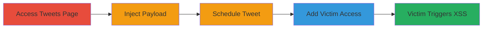

# Stored XSS via Scheduled Tweets on Twitter Ads for Authorized User Compromise

Multi-stage attack chain demonstrating a complete attack workflow exploiting a stored XSS vulnerability in the tweet composition feature of ads.twitter.com.

## Chain Metrics Dashboard

| Metric | Value |
|--------|-------|
| Chain Status | Unverified |
| Total Steps | 5 |
| Execution Time | ~5 minutes |
| Skill Level | Intermediate |
| Complexity | Low |
| Impact Level | High |

## Attack Flow Visualization

## Prerequisites & Requirements

### Required Tools

- Web browser (e.g., Chrome with developer tools for payload testing)

### Target Environment

- Twitter Ads platform (ads.twitter.com)
- Authorized access to an ad account with tweet scheduling permissions

### Initial Access Requirements

- Valid Twitter ad account credentials with permissions to compose and schedule tweets, and manage account access
- No special network position required; standard internet access

## Detailed Attack Procedures

### Step 1: Access the Tweets Page
procedure: [[procedures/Access-Twitter-Ads-Tweets-Page]]

**Objective**: Gain entry to the ad account's tweets management interface to prepare for payload injection.

**Instructions**: Log in to ads.twitter.com and navigate to the specific ad account's tweets section.

**Expected Output**: The tweets page loads, showing existing tweets and the compose option.

**Success Indicators**:
- Tweets page accessible without errors
- Compose tweet button visible

### Step 2: Compose Tweet with Malicious Payload
procedure: [[procedures/Inject-XSS-Payload-into-Scheduled-Tweet]]

**Objective**: Insert a JavaScript payload into the tweet composition field to exploit the lack of sanitization.

**Instructions**: Click the compose tweet option and enter the payload `'><svg/onload=prompt(123);>'` in the text field. This payload uses an SVG tag to execute JavaScript on load.

**Expected Output**: Payload accepted in the compose dialog without immediate execution or rejection.

**Success Indicators**:
- Payload enters the field successfully
- No client-side validation errors

### Step 3: Schedule the Tweet
procedure: [[procedures/Inject-XSS-Payload-into-Scheduled-Tweet]]

**Objective**: Store the malicious payload by scheduling the tweet for future execution when rendered.

**Instructions**: In the compose dialog, select the schedule option, set a time in the near future (e.g., 5 minutes ahead), and confirm by clicking 'Tweet now' to schedule it.

**Expected Output**: Confirmation that the tweet is scheduled; payload stored in the backend.

**Success Indicators**:
- Schedule confirmation message
- Tweet appears in scheduled list

### Step 4: Add Victim to the Ad Account
procedure: [[procedures/Add-User-to-Twitter-Ad-Account]]

**Objective**: Grant the target user access to the ad account so they can view the tweets page and trigger the XSS.

**Instructions**: Navigate to the ad account settings, add the victim's Twitter username or email, and assign permissions for tweets access.

**Expected Output**: Victim receives invitation and can log in to view the ad account.

**Success Indicators**:
- Victim added successfully
- Permissions granted for tweets viewing

### Step 5: Victim Visits Tweets Page Triggering XSS

**Objective**: Observe the payload execution when the victim accesses the vulnerable page.

**Instructions**: Have the victim log in to ads.twitter.com, select the ad account, and navigate to the tweets page. The scheduled tweet renders the payload, executing the JavaScript.

**Expected Output**: A prompt dialog appears displaying '123' in the victim's browser, confirming XSS execution.

**Success Indicators**:
- JavaScript alert/prompt fires
- Potential for further exploitation like cookie theft via modified payload (e.g., sending document.cookie to attacker server)

## Attack Chain Summary

### Key Achievements

1. Successful injection and storage of unsanitized JavaScript payload in scheduled tweet.
2. Bypassing input validation to achieve persistent XSS affecting authorized users.
3. Demonstration of client-side execution leading to arbitrary JavaScript in victim browsers, enabling session theft or phishing.

## Technique & Tactic Coverage

### MITRE ATT&CK Techniques

- [[JavaScript]]

### MITRE ATT&CK Tactics

- [[Execution]]

---
*Last updated: 2024-10-01T00:00:00Z*
