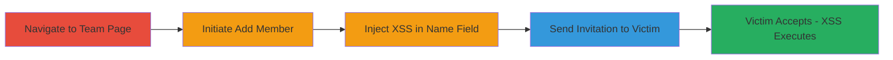

---
tags:
  - xss
  - stored-xss
  - javascript
  - web-exploit
type: attack_chain
tools: []
tactics:
  - '[[Execution]]'
commands: []
verified: false
platforms:
  - Web
submitted: true
complexity: low
procedures:
  - '[[procedures/Navigate-to-Localize-Team-Management-Page]]'
  - '[[procedures/Initiate-Add-New-Team-Member]]'
  - '[[procedures/Inject-XSS-Payload-into-Name-Field]]'
  - '[[procedures/Enter-Victim-Email-and-Send-Invitation]]'
  - '[[procedures/Accept-Invitation-to-Trigger-Stored-XSS]]'
step_count: 5
techniques:
  - '[[JavaScript]]'
description: >-
  Exploits a stored XSS vulnerability in the name field of Localize's team
  member invitation feature, allowing arbitrary JavaScript execution in a
  victim's browser when they join the team, resulting in alerts and account
  functionality disruption.
skill_level: beginner
impact_level: medium
id: aedcf699-0268-4f7c-bf2d-46560f0ad65e
created_at: '2025-12-14T03:46:38.283Z'
updated_at: '2025-12-14T03:46:38.283Z'
validated: true
mitre_tactics:
  - '[[Execution]]'
mitre_techniques:
  - '[[JavaScript]]'
---
# Stored XSS via Team Member Invitation Name Field for Account Disruption

Multi-stage attack chain demonstrating exploitation of a stored XSS vulnerability in Localize's staging site team invitation feature.

## Chain Metrics Dashboard

| Metric | Value |
|--------|-------|
| Chain Status | Unverified |
| Total Steps | 5 |
| Execution Time | ~5 minutes |
| Skill Level | Beginner |
| Complexity | Low |
| Impact Level | Medium |

## Attack Flow Visualization

## Prerequisites & Requirements

### Required Tools

- Web browser (e.g., Chrome, Firefox)

### Target Environment

- Web platform: Localize staging site (https://localizestaging.com)
- Required services/ports: Standard HTTPS (443)
- Network access requirements: Internet access to the staging site

### Initial Access Requirements

- Valid Localize account with permissions to manage team members and send invitations
- Victim's email address
- No prior access to victim's account needed

## Detailed Attack Procedures

### Step 1: Navigate to Team Management Page
procedure: [[procedures/Navigate-to-Localize-Team-Management-Page]]

**Objective**: Access the team management interface to begin adding a new team member.

**Instructions**: Open a web browser and navigate to the team management URL. Ensure you are logged in with an account that has team management privileges.

**Expected Output**: The team management page loads, displaying existing team members and an option to add new ones.

**Success Indicators**:
- Page loads without errors
- 'Add team member' button is visible

### Step 2: Initiate Add New Team Member
procedure: [[procedures/Initiate-Add-New-Team-Member]]

**Objective**: Start the process of inviting a new team member to expose the input form for the vulnerability.

**Instructions**: On the team management page, locate and click the 'Add team member' button or link to open the invitation form.

**Expected Output**: The add team member form appears, including fields for name, email, and other details.

**Success Indicators**:
- Form opens successfully
- Input fields for name and email are present

### Step 3: Inject XSS Payload into Name Field
procedure: [[procedures/Inject-XSS-Payload-into-Name-Field]]

**Objective**: Insert a malicious JavaScript payload into the name field to store XSS for execution when the victim views the team.

**Instructions**: In the name input field of the form, enter the payload `</script><svg onload=alert(document.domain)>`. This payload closes any existing script tag and injects an SVG element that triggers an alert on load.

**Expected Output**: The payload is accepted in the field without immediate errors.

**Success Indicators**:
- Payload enters the field
- No client-side validation blocks the input

### Step 4: Enter Victim Email and Send Invitation
procedure: [[procedures/Enter-Victim-Email-and-Send-Invitation]]

**Objective**: Complete the invitation with the victim's email to store the payload and deliver it via email.

**Instructions**: Fill in the victim's email address in the email field, then submit the form to send the invitation.

**Expected Output**: Invitation is sent successfully, and a confirmation may appear.

**Success Indicators**:
- Form submits without errors
- Email invitation is dispatched to the victim

### Step 5: Accept Invitation to Trigger Stored XSS
procedure: [[procedures/Accept-Invitation-to-Trigger-Stored-XSS]]

**Objective**: Have the victim accept the invitation, causing the stored payload to execute in their browser.

**Instructions**: The victim receives the email, clicks to accept the invitation, and joins the team. Upon joining, the team view renders the malicious name, executing the payload.

**Expected Output**: An alert box displays the document domain (e.g., localizestaging.com), and account actions like logout are disrupted.

**Success Indicators**:
- Alert pops up in victim's browser
- Victim experiences UI disruptions, such as inability to logout

## Attack Chain Summary

### Key Achievements

1. Successful injection and storage of XSS payload in the team member name
2. Delivery of the malicious invitation to a victim via email
3. Arbitrary JavaScript execution in the victim's browser, displaying domain info and disrupting account functionality

## Technique & Tactic Coverage

### MITRE ATT&CK Techniques

- [[JavaScript]]

### MITRE ATT&CK Tactics

- [[Execution]]

---
*Last updated: 2024-01-01*
