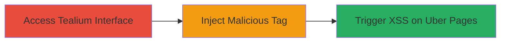

---
tags:
  - xss
  - stored-xss
  - authorization-bypass
  - tealium
  - uber
  - javascript-injection
type: attack_chain
tools: []
tactics:
  - '[[Initial Access]]'
  - '[[Execution]]'
  - '[[Impact]]'
verified: false
platforms:
  - Web
submitted: true
complexity: medium
created_at: '2023-10-01T00:00:00Z'
procedures:
  - '[[procedures/Bypass-Authorization-in-Tealium-Tag-Creation]]'
  - '[[procedures/Inject-Malicious-JavaScript-into-Tealium-Tag]]'
  - '[[procedures/Trigger-Stored-XSS-on-Uber-Pages]]'
step_count: 3
techniques:
  - '[[Exploit Public-Facing Application]]'
  - '[[JavaScript]]'
updated_at: '2025-12-13T23:52:44.474Z'
description: >-
  An attack chain exploiting authorization bypass in Tealium's tag management to
  inject malicious JavaScript, resulting in stored XSS across Uber web pages.
skill_level: intermediate
impact_level: high
id: 9dcf9116-107b-4e32-b06c-d4117a4f6c45
validated: true
mitre_tactics:
  - '[[Initial Access]]'
  - '[[Execution]]'
  - '[[Impact]]'
mitre_techniques:
  - '[[Exploit Public-Facing Application]]'
  - '[[JavaScript]]'
---
# Stored XSS via Unauthorized Tealium Tag Injection on Uber Domains

Multi-stage attack chain demonstrating exploitation of improper access controls in Tealium's tag creation process to inject malicious JavaScript, leading to stored cross-site scripting (XSS) on Uber domains.

## Chain Metrics Dashboard

| Metric | Value |
|--------|-------|
| Chain Status | Unverified |
| Total Steps | 3 |
| Execution Time | ~5 minutes |
| Skill Level | Intermediate |
| Complexity | Medium |
| Impact Level | High |

## Attack Flow Visualization

## Prerequisites & Requirements

### Required Tools

- Web browser with developer tools (e.g., Chrome DevTools)
- Access to a Tealium account (legitimate or compromised)

### Target Environment

- Tealium tag management platform
- Uber web domains loading utag.js from tags.tiqcdn.com
- Web platform with JavaScript execution

### Initial Access Requirements

- Valid Tealium login credentials (any account level)
- No special network access beyond internet connectivity
- Prior knowledge of target Uber account IDs in Tealium

## Detailed Attack Procedures

### Step 1: Bypass Authorization in Tealium Tag Creation
procedure: [[procedures/Bypass-Authorization-in-Tealium-Tag-Creation]]

**Objective**: Gain unauthorized access to create tags for target accounts without proper validation.

**Instructions**: Log into the Tealium interface using valid credentials for any account. Navigate to the tag creation section and attempt to specify an unauthorized account ID (e.g., Uber's account ID) in the tag configuration. The system fails to verify authorization, allowing tag creation to proceed.

**Expected Output**: Successful tag creation interface response without error, confirming bypass.

**Success Indicators**:
- Tag creation form accepts unauthorized account ID
- No authorization denial message appears

### Step 2: Inject Malicious JavaScript into Tealium Tag
procedure: [[procedures/Inject-Malicious-JavaScript-into-Tealium-Tag]]

**Objective**: Embed arbitrary JavaScript payload into the newly created tag for execution on loading pages.

**Instructions**: In the tag editor, insert a malicious JavaScript payload into the utag.js configuration, such as `` or more advanced code for DOM manipulation. Save and publish the tag. The payload is served from tags.tiqcdn.com without sanitization.

**Expected Output**: Tag saved and published successfully; payload visible in the generated utag.js file via browser inspection.

**Success Indicators**:
- Payload appears in the utag.js source when inspected
- No validation errors during save

### Step 3: Trigger Stored XSS on Uber Pages
procedure: [[procedures/Trigger-Stored-XSS-on-Uber-Pages]]

**Objective**: Execute the injected script on Uber domains, injecting content into the DOM for any visitor.

**Instructions**: Visit any Uber domain (e.g., uber.com) that loads utag.js from tags.tiqcdn.com. The tag executes automatically, injecting the malicious JavaScript into the page DOM.

**Expected Output**: Alert or DOM alteration visible on the page load; inspect elements to confirm script execution.

**Success Indicators**:
- Malicious script runs on page load
- DOM shows injected text, HTML, or script effects

## Attack Chain Summary

### Key Achievements

1. Bypassed authorization to create tags for unauthorized accounts
2. Injected arbitrary JavaScript via utag.js without validation
3. Achieved stored XSS impacting all users on affected Uber domains

## Technique & Tactic Coverage

### MITRE ATT&CK Techniques

- [[Exploit Public-Facing Application]] Exploit Public-Facing Application
- [[JavaScript]] JavaScript

### MITRE ATT&CK Tactics

- [[Initial Access]] Initial Access
- [[Execution]] Execution
- [[Impact]] Impact

---
*Last updated: 2023-10-01T00:00:00Z*
