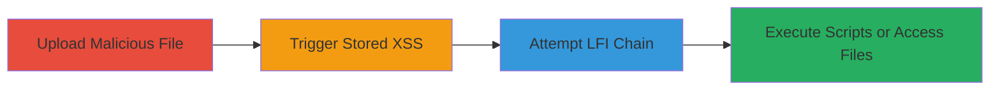

---
tags:
  - stored-xss
  - file-upload
  - lfi
  - web-vulnerability
type: attack_chain
tools: []
tactics:
  - '[[Initial Access]]'
  - '[[Execution]]'
  - '[[Discovery]]'
verified: false
platforms:
  - Web
submitted: true
complexity: medium
created_at: '2023-10-01T00:00:00Z'
procedures:
  - '[[procedures/Exploit-Unrestricted-File-Upload-for-Stored-XSS]]'
  - '[[procedures/Attempt-Local-File-Inclusion-via-Uploaded-Files]]'
step_count: 2
techniques:
  - '[[Exploit Public-Facing Application]]'
  - '[[JavaScript]]'
  - '[[File and Directory Discovery]]'
updated_at: '2025-12-14T03:15:30.730Z'
description: >-
  Exploits an unrestricted file upload in the ████████helpdesk system to store
  malicious scripts, enabling Stored XSS for JavaScript execution in users'
  browsers and potentially chaining to Local File Inclusion for server-side file
  access.
skill_level: intermediate
impact_level: high
id: c4f27fb1-42f0-4460-a712-32821043dc31
validated: true
mitre_tactics:
  - '[[Initial Access]]'
  - '[[Execution]]'
  - '[[Discovery]]'
mitre_techniques:
  - '[[Exploit Public-Facing Application]]'
  - '[[JavaScript]]'
  - '[[File and Directory Discovery]]'
---
# Stored XSS via Unrestricted File Upload Leading to Potential LFI in Helpdesk System

Multi-stage attack chain demonstrating exploitation of an unrestricted file upload vulnerability in a Department of Defense helpdesk system, allowing storage of malicious files that trigger Stored XSS and potentially enable Local File Inclusion (LFI) for server compromise.

## Chain Metrics Dashboard

| Metric | Value |
|--------|-------|
| Chain Status | Unverified |
| Total Steps | 2 |
| Execution Time | ~5 minutes |
| Skill Level | Intermediate |
| Complexity | Medium |
| Impact Level | High |

## Attack Flow Visualization



## Prerequisites & Requirements

### Required Tools

- Browser for testing (e.g., Chrome Developer Tools)
- [[commands/curl-upload-malicious-file]]

### Target Environment

- Web-based helpdesk system (████████helpdesk)
- Required services/ports: HTTP/HTTPS on standard web ports (80/443)
- Network access requirements: Authenticated access to the file upload feature

### Initial Access Requirements

- Valid user credentials for the helpdesk system
- Network position: Internal or authenticated external access
- Prior access needed: User-level authentication

## Detailed Attack Procedures

### Step 1: Upload Malicious File for Stored XSS
procedure: [[procedures/Exploit-Unrestricted-File-Upload-for-Stored-XSS]]

**Objective**: Upload a file containing malicious JavaScript to the helpdesk system, storing it for later execution as Stored XSS when viewed by users.

**Instructions**: Prepare a simple HTML file with embedded JavaScript, such as one that alerts or steals session data. Use [[commands/curl-upload-malicious-file]] to upload it via the file upload endpoint:

```bash
curl -X POST -F "file=@malicious.html" -H "Cookie: session=your_session" https://target.helpdesk/upload
```

Verify the upload by accessing the stored file URL provided by the system.

**Expected Output**: File uploaded successfully, accessible via a URL like https://target.helpdesk/files/malicious.html.

**Success Indicators**:
- Upload confirmation from server
- File accessible and renders HTML/JS

### Step 2: Trigger XSS and Attempt LFI
procedure: [[procedures/Attempt-Local-File-Inclusion-via-Uploaded-Files]]

**Objective**: Induce a victim (or admin) to view the uploaded file, executing the XSS payload, and chain to LFI if the upload allows path traversal or inclusion of local files.

**Instructions**: Share the uploaded file link with a target user. For LFI, modify the upload to include traversal payloads (e.g., ../../etc/passwd in filename). Use browser to view and confirm JS execution, then test LFI by including the uploaded file in a way that traverses server paths.

**Expected Output**: JavaScript alert or session theft on view; for LFI, disclosure of server files like /etc/passwd.

**Success Indicators**:
- JS execution in victim's browser (e.g., alert popup)
- Local file contents leaked if LFI succeeds

## Attack Chain Summary

### Key Achievements

1. Successful upload of malicious script bypassing file type restrictions
2. Execution of arbitrary JavaScript via Stored XSS, enabling session hijacking or data theft
3. Potential server-side file inclusion leading to information disclosure

## Technique & Tactic Coverage

### MITRE ATT&CK Techniques

- [[Exploit Public-Facing Application]]
- [[JavaScript]]
- [[File and Directory Discovery]]

### MITRE ATT&CK Tactics

- [[Initial Access]]
- [[Execution]]
- [[Discovery]]

---
*Last updated: 2023-10-01T00:00:00Z*
