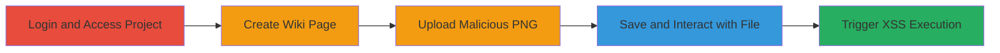

# Stored XSS via Unrestricted File Upload in GitLab Wiki

Multi-stage attack chain demonstrating a complete attack workflow exploiting GitLab's Wiki file upload to inject and execute malicious JavaScript via a crafted PNG file containing SVG code.

## Chain Metrics Dashboard

| Metric | Value |
|--------|-------|
| Chain Status | Unverified |
| Total Steps | 8 |
| Execution Time | ~5 minutes |
| Skill Level | Intermediate |
| Complexity | Low |
| Impact Level | High |

## Attack Flow Visualization

## Prerequisites & Requirements

### Required Tools

- [[tools/Google-Chrome]]

### Target Environment

- GitLab instance (self-hosted or SaaS)
- Access to a project with Wiki enabled
- No specific ports; web access via HTTPS (default port 443)

### Initial Access Requirements

- Valid GitLab user credentials with project access
- Network access to the GitLab instance
- No prior elevated access needed; works with standard user privileges

## Detailed Attack Procedures

### Step 1: Login to GitLab Account
procedure: [[procedures/Exploit-Stored-XSS-via-Malicious-PNG-Upload-in-GitLab-Wiki]]

**Objective**: Authenticate to the GitLab platform to gain access to the target project.

**Instructions**: Open [[tools/Google-Chrome]] and navigate to the GitLab login page. Enter your username and password to authenticate.

**Expected Output**: Successful login, redirect to the dashboard.

**Success Indicators**:
- User dashboard loads
- Project list visible

### Step 2: Open Your Project
procedure: [[procedures/Exploit-Stored-XSS-via-Malicious-PNG-Upload-in-GitLab-Wiki]]

**Objective**: Navigate to the specific project containing the Wiki feature.

**Instructions**: From the dashboard, select and enter the target project.

**Expected Output**: Project overview page loads.

**Success Indicators**:
- Project menu items visible (e.g., Issues, Merge Requests, Wiki)

### Step 3: Open Wiki Page
procedure: [[procedures/Exploit-Stored-XSS-via-Malicious-PNG-Upload-in-GitLab-Wiki]]

**Objective**: Access the Wiki section where file uploads are possible.

**Instructions**: Click on the "Wiki" tab in the project sidebar.

**Expected Output**: Wiki homepage or list of pages displays.

**Success Indicators**:
- Wiki interface loads without errors

### Step 4: Click 'New Page' Button
procedure: [[procedures/Exploit-Stored-XSS-via-Malicious-PNG-Upload-in-GitLab-Wiki]]

**Objective**: Initiate creation of a new Wiki page to enable file attachment.

**Instructions**: In the Wiki section, locate and click the "New page" button.

**Expected Output**: New page editor opens with title and content fields.

**Success Indicators**:
- Editor interface appears, including attachment options

### Step 5: Attach PNG File Containing Malicious SVG Code
procedure: [[procedures/Exploit-Stored-XSS-via-Malicious-PNG-Upload-in-GitLab-Wiki]]

**Objective**: Upload the crafted malicious file to embed the XSS payload.

**Instructions**: In the editor, use the attachment feature to upload a PNG file (e.g., named "1111111.png") with embedded SVG content: `<?xml version="1.0" standalone="no"?><!DOCTYPE svg PUBLIC "-//W3C//DTD SVG 1.1//EN" "http://www.w3.org/Graphics/SVG/1.1/DTD/svg11.dtd"><svg onload="alert(1)" xmlns="http://www.w3.org/2000/svg"> <polygon id="triangle" points="0,0 0,50 50,0" fill="#009900" stroke="#004400"/> </svg>`. Ensure the file is saved locally before upload.

**Expected Output**: File uploads successfully and appears in the page preview.

**Success Indicators**:
- File listed in attachments
- No upload errors

### Step 6: Click 'Create Page' Button
procedure: [[procedures/Exploit-Stored-XSS-via-Malicious-PNG-Upload-in-GitLab-Wiki]]

**Objective**: Save the Wiki page with the malicious attachment.

**Instructions**: Provide a title for the page and click "Create page" to publish.

**Expected Output**: Page saves and renders, displaying the uploaded image.

**Success Indicators**:
- Page accessible via URL
- Image (green triangle) visible on the page

### Step 7: Click on Green Triangle in the Created Page
procedure: [[procedures/Exploit-Stored-XSS-via-Malicious-PNG-Upload-in-GitLab-Wiki]]

**Objective**: Interact with the rendered SVG to trigger the onload JavaScript event.

**Instructions**: View the saved Wiki page and click on the green triangle element in the image.

**Expected Output**: JavaScript executes, potentially showing an alert dialog.

**Success Indicators**:
- Alert box appears with payload (e.g., alert(1))
- Browser console shows script execution

### Step 8: If Alert Does Not Appear, Click Again
procedure: [[procedures/Exploit-Stored-XSS-via-Malicious-PNG-Upload-in-GitLab-Wiki]]

**Objective**: Ensure reliable triggering of the XSS payload.

**Instructions**: Repeat the click on the triangle if no immediate execution occurs.

**Expected Output**: Alert dialog displays on subsequent interaction.

**Success Indicators**:
- Consistent JavaScript execution across views
- Potential for further payload expansion (e.g., cookie theft)

## Attack Chain Summary

### Key Achievements

1. Successful upload of malicious PNG with embedded SVG JavaScript to GitLab Wiki.
2. Rendering of the file as image/svg+xml, bypassing PNG validation.
3. Execution of stored XSS, allowing arbitrary JavaScript in victim browsers viewing the public Wiki page.

## Technique & Tactic Coverage

### MITRE ATT&CK Techniques

- [[JavaScript]]

### MITRE ATT&CK Tactics

- [[Execution]]
- [[Collection]]

---
*Last updated: 2023-10-01T00:00:00Z*
