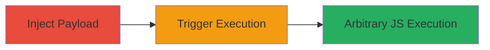

---
tags:
  - xss
  - stored-xss
  - javascript
  - web-vulnerability
type: attack_chain
tools: []
tactics:
  - '[[Execution]]'
verified: false
platforms:
  - Web
submitted: true
complexity: low
created_at: '2023-10-01T00:00:00Z'
procedures:
  - '[[procedures/Inject-Malicious-Payload-into-Comment-Field]]'
  - '[[procedures/Trigger-Stored-XSS-by-Viewing-Profile]]'
step_count: 2
techniques:
  - '[[JavaScript]]'
updated_at: '2025-12-14T03:15:41.616Z'
description: >-
  A multi-stage attack exploiting a stored XSS vulnerability in comment fields
  on apps.owncloud.com, allowing arbitrary JavaScript execution on profile
  viewers.
skill_level: beginner
impact_level: high
id: ae6fee1e-cec6-472a-bc47-cfbff4c96a3c
validated: true
mitre_tactics:
  - '[[Execution]]'
mitre_techniques:
  - '[[JavaScript]]'
---
# Stored XSS via Unsanitized Comments on Profile Page

Multi-stage attack chain demonstrating a complete attack workflow exploiting a stored cross-site scripting (XSS) vulnerability in the profile comments section of apps.owncloud.com.

## Chain Metrics Dashboard

| Metric | Value |
|--------|-------|
| Chain Status | Unverified |
| Total Steps | 2 |
| Execution Time | ~2 minutes |
| Skill Level | Beginner |
| Complexity | Low |
| Impact Level | High |

## Attack Flow Visualization

## Prerequisites & Requirements

### Required Tools

- Web browser (e.g., Chrome, Firefox)

### Target Environment

- Web platform
- Access to apps.owncloud.com
- No specific services/ports required beyond standard HTTP/HTTPS (ports 80/443)

### Initial Access Requirements

- Valid user account on apps.owncloud.com (for posting comments)
- Network access to the internet
- No prior privileged access needed

## Detailed Attack Procedures

### Step 1: Inject Payload
procedure: [[procedures/Inject-Malicious-Payload-into-Comment-Field]]

**Objective**: Introduce a malicious JavaScript payload into a comment field that will be stored and later displayed unsanitized on the profile page.

**Instructions**: Navigate to any comment section on apps.owncloud.com, such as under an app review or discussion. Enter the payload `'>` as the comment content and submit it. This payload closes any open HTML tags and injects an image element that executes JavaScript on error.

**Expected Output**: The comment is successfully posted and stored on the server without immediate execution.

**Success Indicators**:
- Comment appears in the submission confirmation
- No errors during posting

### Step 2: Trigger Execution
procedure: [[procedures/Trigger-Stored-XSS-by-Viewing-Profile]]

**Objective**: View the infected profile page to trigger the stored payload, resulting in arbitrary JavaScript execution for any visitor.

**Instructions**: Access the profile page of the user who posted the malicious comment (your own or another if applicable). The comment will be rendered unsanitized, causing the `onerror` handler to execute and display a confirm dialog with value 2.

**Expected Output**: A JavaScript alert or confirm dialog pops up, confirming execution. In a real attack, this could be replaced with more malicious code like session theft.

**Success Indicators**:
- JavaScript alert/confirm triggers on page load
- Browser console shows no sanitization errors

## Attack Chain Summary

### Key Achievements

1. Successful injection of stored XSS payload into comment fields
2. Arbitrary JavaScript execution on unauthenticated profile viewers
3. Potential for session hijacking, phishing, or client-side attacks

## Technique & Tactic Coverage

### MITRE ATT&CK Techniques

- [[JavaScript]]

### MITRE ATT&CK Tactics

- [[Execution]]

---
*Last updated: 2023-10-01T00:00:00Z*
