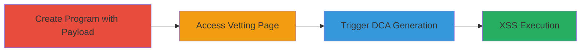

# Stored XSS via Unsanitized Program Name in Advanced Vetting Example DCA

Multi-stage attack chain demonstrating a complete attack workflow for exploiting a stored XSS vulnerability in HackerOne's sandbox program features.

## Chain Metrics Dashboard

| Metric | Value |
|--------|-------|
| Chain Status | Unverified |
| Total Steps | 3 |
| Execution Time | ~5 minutes |
| Skill Level | Intermediate |
| Complexity | Medium |
| Impact Level | Medium |

## Attack Flow Visualization

## Prerequisites & Requirements

### Required Tools

- Web browser (e.g., Chrome with developer tools for payload verification)

### Target Environment

- HackerOne platform (production or local PoC at http://localhost:8080)
- Web-based application using React and Markdown components
- Access to port 8080 for local testing

### Initial Access Requirements

- Authenticated as a Program Manager user
- Ability to create sandbox programs
- No prior access needed beyond standard user credentials

## Detailed Attack Procedures

### Step 1: Create Program with Malicious Payload
procedure: [[procedures/Create-Malicious-Program-with-XSS-Payload]]

**Objective**: Set up a sandbox program with an unsanitized Program Name containing an XSS payload to store the malicious input.

**Instructions**: Log in to HackerOne, navigate to the new program creation page, and enter the payload in the Program Name field. The payload uses HTML tags that will be reflected later.

**Expected Output**: Successful program creation with the malicious name stored.

**Success Indicators**:
- Program created without errors
- Program handle visible in the dashboard

### Step 2: Navigate to Advanced Vetting Page
procedure: [[procedures/Navigate-to-Advanced-Vetting-Page]]

**Objective**: Access the advanced vetting settings page for the newly created program to prepare for payload triggering.

**Instructions**: From the program dashboard, go to the advanced vetting URL, replacing :handle with the program's handle. In local PoC, use http://localhost:8080/handle/advanced_vetting.

**Expected Output**: Advanced vetting page loads without errors.

**Success Indicators**:
- Page accessible and settings visible
- No sanitization errors on load

### Step 3: Trigger XSS Execution
procedure: [[procedures/Trigger-XSS-via-View-Document-Button]]

**Objective**: Generate the example Custom Digital Agreement (DCA) to render the unsanitized Program Name in a Markdown React component, executing the XSS payload.

**Instructions**: On the advanced vetting page, click the 'View document' button to generate the example DCA. The component will process the stored payload.

**Expected Output**: Arbitrary HTML/JS executes, such as blinking marquee text or link activation.

**Success Indicators**:
- Visual effects from payload (e.g., <blink> and <marquee> tags render)
- JavaScript execution confirmed via browser console

## Attack Chain Summary

### Key Achievements

1. Stored malicious input in Program Name without sanitization
2. Navigated to vulnerable page in sandbox mode
3. Triggered payload execution limited to program members viewing the DCA

## Technique & Tactic Coverage

### MITRE ATT&CK Techniques

- [[JavaScript]]

### MITRE ATT&CK Tactics

- [[Execution]]

---

*Last updated: 2024-01-01T00:00:00Z*
