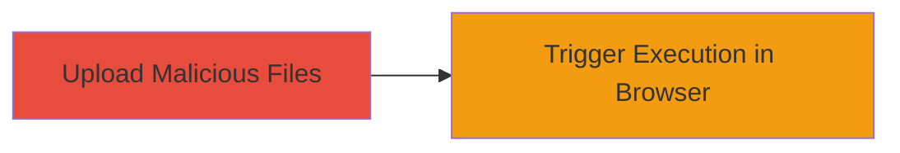

---
tags:
  - xss
  - stored-xss
  - web-vulnerability
  - file-upload
type: attack_chain
tools:
  - '[[tools/curl]]'
tactics:
  - '[[Initial Access]]'
  - '[[Execution]]'
commands:
  - '[[commands/curl-upload-malicious-file]]'
platforms:
  - Web
complexity: medium
procedures:
  - '[[procedures/Upload-Malicious-Files-to-TikTok-Ads-Video-Function]]'
  - '[[procedures/Trigger-Stored-XSS-Execution-in-Victim-Browser]]'
step_count: 2
techniques:
  - '[[JavaScript]]'
description: >-
  Exploitation of a stored XSS vulnerability in the video upload function of
  ads.tiktok.com by uploading malicious MP4 or XML files containing HTML and
  JavaScript code, leading to arbitrary code execution in the victim's browser.
skill_level: intermediate
impact_level: high
id: ddcb2253-1f7b-4785-9282-5444098c1413
created_at: '2025-12-14T00:11:16.679Z'
updated_at: '2025-12-14T00:11:16.679Z'
verified: false
validated: true
submitted: true
mitre_tactics:
  - '[[Initial Access]]'
  - '[[Execution]]'
mitre_techniques:
  - '[[JavaScript]]'
---
# Stored XSS via Video Upload on TikTok Ads Platform

Multi-stage attack chain demonstrating the exploitation of a stored XSS vulnerability in TikTok's ads platform, allowing attackers to upload malicious files and execute arbitrary code in victims' browsers.

## Chain Metrics Dashboard

| Metric | Value |
|--------|-------|
| Chain Status | Unverified |
| Total Steps | 2 |
| Execution Time | ~5 minutes |
| Skill Level | Intermediate |
| Complexity | Medium |
| Impact Level | High |

## Attack Flow Visualization



## Prerequisites & Requirements

### Required Tools

- [[tools/curl]]

### Target Environment

- Web platform: TikTok Ads (ads.tiktok.com)
- Required services/ports: HTTPS access to ads.tiktok.com
- Network access requirements: Internet access to the target domain

### Initial Access Requirements

- Credential requirements: Valid TikTok Ads account credentials for upload access
- Network position: External internet access
- Prior access needed: Ability to authenticate to the ads platform

## Detailed Attack Procedures

### Step 1: Upload Malicious Files
procedure: [[procedures/Upload-Malicious-Files-to-TikTok-Ads-Video-Function]]

**Objective**: Upload MP4 or XML files embedded with malicious HTML and JavaScript code to exploit the lack of content validation in the video upload function.

**Instructions**: Prepare a malicious file (e.g., an XML file containing <script>alert('XSS');</script>). Use [[commands/curl-upload-malicious-file]] to perform the upload:

```bash
curl -X POST https://ads.tiktok.com/upload -H 'Authorization: Bearer YOUR_TOKEN' -F 'file=@malicious.xml' -F 'type=video'
```

**Expected Output**: Successful upload confirmation from the server, with the file stored on the platform.

**Success Indicators**:
- File upload succeeds without validation errors
- Server responds with 200 OK or similar status

### Step 2: Trigger Execution in Victim Browser
procedure: [[procedures/Trigger-Stored-XSS-Execution-in-Victim-Browser]]

**Objective**: Induce the victim to access the uploaded content, causing the embedded code to execute in their browser.

**Instructions**: Share a link to the uploaded video or ad content with the victim. When the victim views the content, the stored XSS payload executes automatically due to rendering of the malicious HTML/JS.

No specific command is needed for this step, as it relies on victim interaction with the platform.

**Expected Output**: Arbitrary JavaScript execution in the victim's browser, such as displaying an alert or exfiltrating data.

**Success Indicators**:
- Victim reports unexpected behavior (e.g., pop-up alerts)
- Browser console shows execution of injected code

## Attack Chain Summary

### Key Achievements

1. Successful upload of malicious files bypassing validation
2. Execution of arbitrary code in victim browsers
3. Potential for data theft or session hijacking via XSS

## Technique & Tactic Coverage

### MITRE ATT&CK Techniques

- [[JavaScript]]

### MITRE ATT&CK Tactics

- [[Initial Access]]
- [[Execution]]

*Last updated: 2023-10-01*
