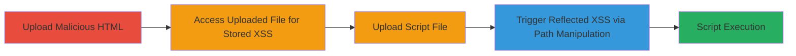

---
tags:
  - xss
  - stored-xss
  - reflected-xss
  - file-upload
  - path-injection
  - node-js
type: attack_chain
tools: []
tactics:
  - '[[Execution]]'
  - '[[Initial Access]]'
commands:
  - '[[commands/echo-create-malicious-html]]'
  - '[[commands/echo-create-script-file]]'
platforms:
  - Web
  - Node.js
complexity: medium
procedures:
  - '[[procedures/Stored-XSS-via-Malicious-HTML-Upload]]'
  - '[[procedures/Reflected-XSS-via-Path-Injection]]'
step_count: 4
techniques:
  - '[[JavaScript]]'
  - '[[Exploit Public-Facing Application]]'
description: >-
  Multi-stage attack exploiting stored and reflected XSS vulnerabilities in the
  tianma-static Node.js module through malicious file uploads and URL path
  manipulation, leading to arbitrary JavaScript execution in users' browsers.
skill_level: intermediate
impact_level: high
id: 86c8eb77-b136-4e08-ae64-6f65bef5e9cc
created_at: '2025-12-14T03:15:10.429Z'
updated_at: '2025-12-14T03:15:10.429Z'
verified: false
validated: true
submitted: true
mitre_tactics:
  - '[[Execution]]'
  - '[[Initial Access]]'
mitre_techniques:
  - '[[JavaScript]]'
  - '[[Exploit Public-Facing Application]]'
---
# Stored and Reflected XSS in tianma-static via File Upload and Path Manipulation

Multi-stage attack chain demonstrating exploitation of stored and reflected XSS in the tianma-static Node.js static file server module. The attack leverages improper content-type handling for uploaded HTML files and vulnerable path decoding with decodeURI, allowing attackers to inject and execute malicious scripts in users' browsers when file upload functionality is available.

## Chain Metrics Dashboard

| Metric | Value |
|--------|-------|
| Chain Status | Unverified |
| Total Steps | 4 |
| Execution Time | ~5 minutes |
| Skill Level | Intermediate |
| Complexity | Medium |
| Impact Level | High |

## Attack Flow Visualization



## Prerequisites & Requirements

### Required Tools

- None (uses built-in shell commands for file creation)

### Target Environment

- Node.js application using tianma-static module
- Web server exposing static file serving on port 8080
- File upload capability enabled in the application

### Initial Access Requirements

- Ability to upload files to the server (e.g., via application form or API)
- Network access to the web server
- No prior credentials needed if upload is unauthenticated

## Detailed Attack Procedures

### Step 1: Upload Malicious HTML File
procedure: [[procedures/Stored-XSS-via-Malicious-HTML-Upload]]

**Objective**: Create and upload an HTML file containing an XSS payload to store malicious script on the server.

**Instructions**: Prepare the malicious file using [[commands/echo-create-malicious-html]]:

```bash
echo "<script>alert(1);</script>" > ex.html
```

Upload the file `ex.html` to the target application where tianma-static serves it. The module will serve it with `text/html` content-type without sanitization.

**Expected Output**: File uploaded successfully; accessing the file URL serves the HTML and executes the script.

**Success Indicators**:
- File upload confirmation
- Script alert triggers on access

### Step 2: Access Uploaded File to Trigger Stored XSS
procedure: [[procedures/Stored-XSS-via-Malicious-HTML-Upload]]

**Objective**: Retrieve the uploaded file to execute the stored XSS payload in the victim's browser.

**Instructions**: Request the URL of the uploaded file, e.g., `http://target:8080/ex.html`. The server responds with the HTML content, executing the embedded script.

**Expected Output**: Browser renders the HTML and pops an alert with '1'.

**Success Indicators**:
- JavaScript execution confirmed via alert or console
- No content-type blocking

### Step 3: Upload Script File for Reflected XSS
procedure: [[procedures/Reflected-XSS-via-Path-Injection]]

**Objective**: Create and upload a plain script file to use as a payload source for reflected injection.

**Instructions**: Prepare the script file using [[commands/echo-create-script-file]]:

```bash
echo "alert(1);" > ex
```

Upload the file `ex` to the server.

**Expected Output**: File uploaded; ready for path-based loading.

**Success Indicators**:
- Upload successful
- File accessible via direct URL

### Step 4: Trigger Reflected XSS via Path Manipulation
procedure: [[procedures/Reflected-XSS-via-Path-Injection]]

**Objective**: Manipulate the URL path to inject an HTML script tag that loads and executes the uploaded script.

**Instructions**: Request a manipulated path like `/<script src='/ex'></script>`, but encoded to bypass: `/%2f<script src='/[ex]'></script>`. The decodeURI function decodes `%2f` to `/`, injecting the tag into the response and loading the script from `/ex`.

**Expected Output**: Injected script tag in response; alert '1' executes.

**Success Indicators**:
- Response contains injected HTML
- Script from uploaded file loads and runs

## Attack Chain Summary

### Key Achievements

1. Stored malicious HTML on the server via upload, leading to persistent XSS on access.
2. Injected script tags via path manipulation for reflected XSS, loading external payloads.
3. Achieved arbitrary JavaScript execution in browsers, potentially stealing cookies or session data.

## Technique & Tactic Coverage

### MITRE ATT&CK Techniques

- [[JavaScript]]
- [[Exploit Public-Facing Application]]

### MITRE ATT&CK Tactics

- [[Execution]]
- [[Initial Access]]

---
*Last updated: 2023-10-01T00:00:00Z*
