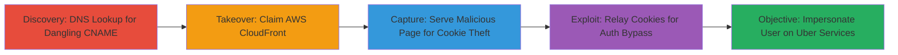

# Subdomain Takeover Leading to Authentication Bypass on Uber SSO

Multi-stage attack chain demonstrating a complete attack workflow exploiting a dangling CNAME record on saostatic.uber.com for subdomain takeover, followed by cookie theft and relay to bypass Uber's SSO authentication, enabling full user impersonation across *.uber.com subdomains.

## Chain Metrics Dashboard

| Metric | Value |
|--------|-------|
| Chain Status | Unverified |
| Total Steps | 4 |
| Execution Time | ~15 minutes |
| Skill Level | Intermediate |
| Complexity | Medium |
| Impact Level | High |

## Attack Flow Visualization



## Prerequisites & Requirements

### Required Tools

- [[tools/nslookup]]
- [[tools/AWS-CloudFront-Console]]
- [[tools/Intercepting-Proxy-Tool]]

### Target Environment

- Web platform with DNS records pointing to AWS CloudFront
- SSO system using shared domain cookies (e.g., domain=.uber.com)
- Required services: AWS CloudFront, Uber-like SSO at auth.uber.com
- Network access: Public internet access to resolve DNS and access AWS console

### Initial Access Requirements

- No prior credentials needed for discovery and takeover
- Attacker AWS account for claiming distribution
- Victim must be authenticated to target SSO (e.g., logged into auth.uber.com)
- Network position: External attacker with ability to host malicious content

## Detailed Attack Procedures

### Step 1: Discover Subdomain Takeover Vulnerability
procedure: [[procedures/Discover-Subdomain-Takeover-Via-DNS-Lookup]]

**Objective**: Identify dangling DNS records pointing to unclaimed cloud resources, such as AWS CloudFront distributions, to enable subdomain takeover.

**Instructions**: Use [[commands/nslookup-dns-query-for-cname]] to perform a DNS lookup on the target subdomain:

```bash
nslookup saostatic.uber.com 8.8.8.8
```

Then, visit the subdomain in a browser to confirm the unclaimed status by checking for a CloudFront error page indicating the hostname is not configured.

**Expected Output**: DNS resolution showing CNAME to an unclaimed resource like d3i4yxtzktqr9n.cloudfront.net, and browser error confirming takeover potential.

**Success Indicators**:
- CNAME record points to unclaimed AWS CloudFront hostname
- Subdomain visit shows CloudFront 'hostname not configured' error

### Step 2: Claim Unclaimed AWS CloudFront Distribution
procedure: [[procedures/Claim-Unclaimed-AWS-CloudFront-Distribution]]

**Objective**: Take control of the dangling subdomain by creating and configuring an AWS CloudFront distribution to claim the hostname.

**Instructions**: Log into the AWS CloudFront Console, create a new distribution with an attacker-controlled origin (e.g., S3 bucket or EC2 server), and add the target subdomain (saostatic.uber.com) as an alternate domain name. Deploy the distribution and serve custom content, such as a PoC page at http://saostatic.uber.com/subdomaintakeoverbyarneswinnen.html.

**Expected Output**: Successful distribution creation with the subdomain resolving to attacker-controlled content.

**Success Indicators**:
- Subdomain now serves attacker content instead of error page
- DNS propagation confirms control (re-run nslookup to verify)

### Step 3: Capture Victim's SSO Cookies Via Malicious Page
procedure: [[procedures/Capture-Victims-SSO-Cookies-Via-Malicious-Page]]

**Objective**: Trick the victim into visiting the taken-over subdomain to initiate an SSO flow and capture shared session cookies and CSRF tokens.

**Instructions**: Host a PHP script (e.g., prepareuberattack.php) on the controlled subdomain that redirects or iframes a login to riders.uber.com, capturing the redirect URL from auth.uber.com (including state=CSRFTOKEN), Cookie header with state cookie, and Set-Cookie headers with _csid. Ensure the victim is already logged into auth.uber.com and riders.uber.com.

**Expected Output**: Captured data including auth URL, state cookie, and _csid shared session cookie.

**Success Indicators**:
- Victim visits malicious page without suspicion
- All SSO-related cookies and tokens are logged or exfiltrated

### Step 4: Relay Captured Cookies To Bypass Authentication
procedure: [[procedures/Relay-Captured-Cookies-To-Bypass-Authentication]]

**Objective**: Use an intercepting proxy to replay the victim's captured cookies and tokens in the attacker's session, completing the SSO flow and gaining authenticated access.

**Instructions**: In a new browser session, use an intercepting proxy to send the captured URL to auth.uber.com with the state cookie. Intercept the response, replace the _csid cookie with the victim's stolen value, and forward the modified Set-Cookie headers to inject the session. This bypasses CSRF by relaying the state token.

**Expected Output**: Successful login redirect to https://riders.uber.com/trips as the victim, with full access to *.uber.com services.

**Success Indicators**:
- Attacker browser gains victim's session without direct credentials
- Access to protected resources like trips or partner dashboards

## Attack Chain Summary

### Key Achievements

1. Full control over saostatic.uber.com via subdomain takeover, enabling phishing with valid SSL.
2. Stealthy theft of shared _csid cookies without user interaction beyond page visit.
3. Bypassed SSO CSRF protections via cookie relay, achieving account takeover across Uber ecosystem.

## Technique & Tactic Coverage

### MITRE ATT&CK Techniques

- [[Hardware]] Gather Victim Host Information: Domains
- [[T1078.004]] Valid Accounts: Cloud Accounts
- [[Pass the Hash]] Use Alternate Authentication Material: Pass the Cookie

### MITRE ATT&CK Tactics

- [[Discovery]] Discovery
- [[Initial Access]] Initial Access

---

*Last updated: 2023-10-01T00:00:00Z*
