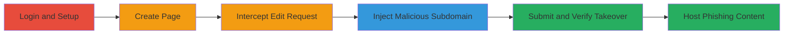

# Subdomain Takeover in Unbounce Pages via page[url] Validation Bypass

Multi-stage attack chain demonstrating a complete subdomain takeover workflow in the Unbounce Pages application by bypassing insufficient validation on the page[url] parameter. This vulnerability allows attackers to claim arbitrary subdomains, such as info.hacker.one, despite prior fixes. The attack involves logging in, creating a page, intercepting an edit request, injecting a malicious subdomain, and verifying the takeover. Successful exploitation enables hosting phishing pages or stealing sensitive information like credentials or credit card details from users of platforms like HackerOne.

## Chain Metrics Dashboard

| Metric | Value |
|--------|-------|
| Chain Status | Unverified |
| Total Steps | 7 |
| Execution Time | ~10 minutes |
| Skill Level | Intermediate |
| Complexity | Medium |
| Impact Level | High |

## Attack Flow Visualization

## Prerequisites & Requirements

### Required Tools

- [[tools/Burp-Suite]]

### Target Environment

- Web platform
- Unbounce Pages application
- Valid Unbounce account credentials

### Initial Access Requirements

- Authenticated access to Unbounce
- Proxy tool configured to intercept traffic (e.g., Burp Suite proxy on localhost:8080)
- No prior subdomain ownership required

## Detailed Attack Procedures

### Step 1: Login to Unbounce Account

procedure: [[procedures/Bypass-Unbounce-Subdomain-Validation-with-Burp-Suite]]

**Objective**: Authenticate to gain access to the Unbounce Pages application.

**Instructions**: Open a web browser and navigate to the Unbounce login page. Enter valid credentials to log in.

**Expected Output**: Successful login redirect to the dashboard.

**Success Indicators**:
- Dashboard accessible
- No authentication errors

### Step 2: Create a New Page Under Any Domain

procedure: [[procedures/Bypass-Unbounce-Subdomain-Validation-with-Burp-Suite]]

**Objective**: Set up a basic landing page to enable the edit functionality.

**Instructions**: From the dashboard, use the app interface to create a new landing page under an existing or arbitrary domain.

**Expected Output**: New page created and listed in the interface.

**Success Indicators**:
- Page creation confirmation
- Page editable in the interface

### Step 3: Navigate to 'EDIT NAME'

procedure: [[procedures/Bypass-Unbounce-Subdomain-Validation-with-Burp-Suite]]

**Objective**: Access the name editing feature to trigger the vulnerable update request.

**Instructions**: In the page editing section, select the 'EDIT NAME' option.

**Expected Output**: Name edit field appears.

**Success Indicators**:
- Edit interface loaded
- Update button available

### Step 4: Enter Arbitrary Input in Name Field

procedure: [[procedures/Bypass-Unbounce-Subdomain-Validation-with-Burp-Suite]]

**Objective**: Prepare the request for interception by filling the name field.

**Instructions**: Enter any arbitrary text (e.g., "test") in the name field and prepare to submit.

**Expected Output**: Field populated, ready for update.

**Success Indicators**:
- Input accepted without errors
- Submit action triggers request

### Step 5: Intercept the Update Request with Proxy

procedure: [[procedures/Bypass-Unbounce-Subdomain-Validation-with-Burp-Suite]]

**Objective**: Capture the POST request to the page update endpoint.

**Instructions**: Configure your browser to route traffic through Burp Suite proxy. Submit the name update and intercept the outgoing POST request to `/<account-id>/pages/<page-id>`.

**Expected Output**: Request captured in Burp Suite Repeater or Proxy tab.

**Success Indicators**:
- Request body visible
- Parameters like page[url] present

### Step 6: Modify Request to Inject Malicious Subdomain

procedure: [[procedures/Bypass-Unbounce-Subdomain-Validation-with-Burp-Suite]]

**Objective**: Bypass validation by adding the vulnerable page[url] parameter with target subdomain.

**Instructions**: In the intercepted request body, append `&page[url]=info.hacker.one/takeover-bypass-by-ak1t4` (replace with desired subdomain/path). Forward the modified request.

**Expected Output**: Server accepts the update without validation errors.

**Success Indicators**:
- 200 OK response
- No rejection of subdomain

### Step 7: Refresh and Verify Subdomain Takeover

procedure: [[procedures/Bypass-Unbounce-Subdomain-Validation-with-Burp-Suite]]

**Objective**: Confirm control over the claimed subdomain.

**Instructions**: Refresh the page in the browser or navigate to the target subdomain URL (e.g., http://info.hacker.one). Deploy custom content if needed.

**Expected Output**: Custom page or alert displays under the claimed subdomain.

**Success Indicators**:
- Subdomain resolves to attacker-controlled content
- DNS points to Unbounce-hosted page

## Attack Chain Summary

### Key Achievements

1. Bypassed prior subdomain validation fixes in Unbounce Pages.
2. Claimed arbitrary branded subdomain (e.g., info.hacker.one).
3. Enabled potential phishing or sensitive data theft from users.

## Technique & Tactic Coverage

### MITRE ATT&CK Techniques

- [[Exploit Public-Facing Application]]

### MITRE ATT&CK Tactics

- [[Initial Access]]

---
*Last updated: 2023-10-01T00:00:00Z*
