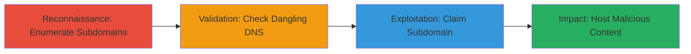

# Subdomain Takeover of Adobe Marketo.net via Dangling DNS Records

Multi-stage attack chain demonstrating a complete subdomain takeover workflow on Adobe's marketo.net domain.

## Chain Metrics Dashboard

| Metric | Value |
|--------|-------|
| Chain Status | Unverified |
| Total Steps | 3 |
| Execution Time | ~30 minutes |
| Skill Level | Intermediate |
| Complexity | Medium |
| Impact Level | High |

## Attack Flow Visualization



## Prerequisites & Requirements

### Required Tools

- [[tools/subfinder]]
- [[dig]]
- [[tools/subjack]]

### Target Environment

- Web platform with DNS resolution
- Access to cloud provider accounts (e.g., AWS, Azure) for claiming services
- No special ports required; standard DNS port 53

### Initial Access Requirements

- Public internet access for DNS queries
- Attacker account on relevant cloud providers
- No prior credentials on target needed

## Detailed Attack Procedures

### Step 1: Enumerate Subdomains and DNS Records
procedure: [[procedures/Enumerate-Subdomains-and-DNS-Records]]

**Objective**: Discover subdomains of the target domain and inspect their DNS records to identify potential dangling pointers.

**Instructions**: Start by enumerating subdomains using [[commands/subfinder-enumerate]] to generate a list of potential subdomains for marketo.net:

```bash
subfinder -d marketo.net -o subdomains.txt
```

Then, for each subdomain, query DNS records using [[commands/dig-cname-query]] to check for CNAME records pointing to cloud services:

```bash
cat subdomains.txt | xargs -I {} dig {} +short
```

**Expected Output**: A file with subdomains and their CNAME targets, such as pointing to unclaimed AWS S3 buckets or Heroku apps.

**Success Indicators**:
- List of subdomains generated
- CNAME records identified pointing to cloud providers

### Step 2: Validate Dangling DNS for Takeover
procedure: [[procedures/Validate-Dangling-DNS-for-Takeover]]

**Objective**: Verify if the identified DNS records are dangling and claimable by checking if the associated cloud service is unregistered.

**Instructions**: Use [[commands/subjack-validate]] to scan the subdomains for known takeover fingerprints:

```bash
subjack -w subdomains.txt -t 100 -o takeovers.json -ssl
```

Follow up with manual validation using [[commands/dig-ns-query]] on suspicious CNAMEs to confirm the service status:

```bash
dig example-subdomain.marketo.net CNAME
```

**Expected Output**: Report of vulnerable subdomains with takeover potential, e.g., "Vulnerable to AWS S3 takeover".

**Success Indicators**:
- Tool identifies dangling records
- Manual DNS query shows unresolved or claimable service

### Step 3: Claim and Control Subdomain
procedure: [[procedures/Claim-and-Control-Subdomain]]

**Objective**: Register the dangling cloud service to gain control over the subdomain and deploy malicious payloads.

**Instructions**: For an identified vulnerable service (e.g., AWS S3), create an account on the provider if needed, then claim the bucket using [[commands/aws-s3-create-bucket]] (assuming AWS example):

```bash
aws s3 mb s3://dangling-bucket-name --region us-east-1
```

Update DNS if possible or host content directly; verify control by accessing the subdomain URL.

**Expected Output**: Successful bucket creation and subdomain resolving to attacker-controlled content.

**Success Indicators**:
- Subdomain points to attacker-hosted page
- Ability to serve custom content or redirects

## Attack Chain Summary

### Key Achievements

1. Identification of dangling DNS on marketo.net subdomains
2. Validation and claiming of unowned cloud resources
3. Potential for phishing or traffic redirection leading to privilege escalation

## Technique & Tactic Coverage

### MITRE ATT&CK Techniques

- [[Exploit Public-Facing Application]]
- [[Active Scanning]]

### MITRE ATT&CK Tactics

- [[Initial Access]]
- [[Reconnaissance]]

---
*Last updated: 2023-10-01T00:00:00Z*
