# Subdomain Takeover of Mail Service Leading to Email Impersonation

Multi-stage attack chain demonstrating a complete subdomain takeover workflow via dangling DNS records, resulting in control over email services for impersonation and phishing.

## Chain Metrics Dashboard

| Metric | Value |
|--------|-------|
| Chain Status | Unverified |
| Total Steps | 7 |
| Execution Time | ~30 minutes |
| Skill Level | Intermediate |
| Complexity | Medium |
| Impact Level | High |

## Attack Flow Visualization

```mermaid
graph LR
    A[Reconnaissance: Scan Subdomains] --> B[Discovery: Identify Dangling Records]
    B --> C[Verification: Confirm Unclaimed Service]
    C --> D[Initial Access: Claim Service]
    D --> E[Execution: Configure Credentials]
    E --> F[Persistence: Set Up Email Server]
    F --> G[Impact: Send Test Email for Impersonation]

    style A fill:#e74c3c
    style B fill:#f39c12
    style C fill:#f39c12
    style D fill:#3498db
    style E fill:#3498db
    style F fill:#9b59b6
    style G fill:#27ae60
```

## Prerequisites & Requirements

### Required Tools

- [[tools/Rapid7-FDNS-Dataset]]

### Target Environment

- DNS infrastructure with potential dangling records
- Third-party services like icn.bg for mail hosting
- Network access to query public DNS datasets

### Initial Access Requirements

- No prior credentials needed; relies on public DNS data
- Internet access for scanning and claiming services
- Basic understanding of DNS resolution and subdomain management

## Detailed Attack Procedures

### Step 1: Initial Reconnaissance
procedure: [[procedures/Scan-for-Subdomains-Using-Rapid7-FDNS-Dataset]]

**Objective**: Enumerate subdomains of the target domain to identify potential attack surfaces for hijacking.

**Instructions**: Download and query the Rapid7 FDNS dataset for subdomains matching the pattern *.starbucks.*. This passive reconnaissance step reveals all registered subdomains without direct interaction with the target.

**Expected Output**: A list of subdomains associated with starbucks.bg, including mail.starbucks.bg.

**Success Indicators**:
- Dataset query returns multiple subdomains
- Subdomains are identified for further analysis

### Step 2: Discovery of Vulnerabilities
procedure: [[procedures/Identify-Dangling-DNS-Records-for-Subdomain-Takeover]]

**Objective**: Analyze DNS records to find dangling pointers to unclaimed third-party services.

**Instructions**: Examine the DNS resolution for identified subdomains, focusing on CNAME or NS records pointing to external providers like icn.bg. Verify if the subdomain resolves but the service is inactive.

**Expected Output**: Confirmation that mail.starbucks.bg points to icn.bg's mail infrastructure without active ownership.

**Success Indicators**:
- Dangling record detected
- Resolution shows unclaimed service endpoint

### Step 3: Verification
procedure: [[procedures/Verify-Unclaimed-Third-Party-Service]]

**Objective**: Confirm the third-party service (icn.bg) has not claimed or is not actively hosting the subdomain.

**Instructions**: Query the service provider's status for the subdomain and check for any active configurations or ownership claims.

**Expected Output**: Verification that the mail service profile for mail.starbucks.bg is available and unclaimed.

**Success Indicators**:
- No active hosting detected
- Service panel shows subdomain as free

### Step 4: Initial Access
procedure: [[procedures/Claim-Unclaimed-Mail-Service-Profile]]

**Objective**: Take ownership of the unclaimed service to gain control over the subdomain's mail functionality.

**Instructions**: Register the subdomain on the icn.bg platform by creating a new profile linked to the dangling DNS record.

**Expected Output**: Successful registration and ownership confirmation in the service dashboard.

**Success Indicators**:
- Profile created
- DNS propagation begins for the claimed service

### Step 5: Execution
procedure: [[procedures/Configure-Credentials-for-Claimed-Service]]

**Objective**: Secure access to the claimed service by setting up authentication.

**Instructions**: Access the web-based control panel of icn.bg and configure login credentials for the mail service.

**Expected Output**: Authenticated access to the service panel for further configuration.

**Success Indicators**:
- Credentials set and verified
- Login successful

### Step 6: Persistence
procedure: [[procedures/Set-Up-Email-Server-on-Hijacked-Subdomain]]

**Objective**: Configure the mail server to handle emails for the hijacked subdomain.

**Instructions**: In the service panel, enable mail routing, set up MX records if needed, and configure incoming/outgoing email handling for @mail.starbucks.bg.

**Expected Output**: Functional email server ready for use under the subdomain.

**Success Indicators**:
- Mail configuration applied
- DNS updates reflect the new setup

### Step 7: Impact Demonstration
procedure: [[procedures/Demonstrate-Control-with-Test-Email]]

**Objective**: Prove control by sending an email from the impersonated domain, enabling phishing or spam.

**Instructions**: Use the configured email client or server interface to compose and send a test email from an @mail.starbucks.bg address to an external recipient.

**Expected Output**: Email successfully delivered, confirming impersonation capability.

**Success Indicators**:
- Test email sent and received
- No delivery failures

## Attack Chain Summary

### Key Achievements

1. Identified vulnerable subdomain via passive DNS scanning
2. Claimed and configured unclaimed mail service for takeover
3. Demonstrated email impersonation potential for phishing attacks

## Technique & Tactic Coverage

### MITRE ATT&CK Techniques

- [[Hardware]] Gather Victim Host Information: Domains
- [[Exploit Public-Facing Application]] Exploit Public-Facing Application

### MITRE ATT&CK Tactics

- [[Reconnaissance]] Reconnaissance
- [[Initial Access]] Initial Access

---
*Last updated: 2023-10-01T00:00:00Z*
