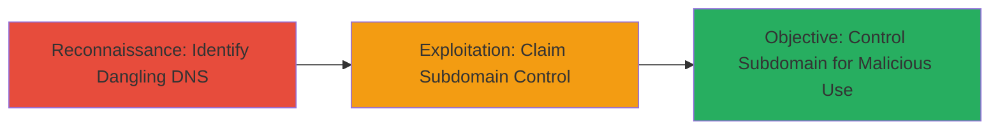

# Subdomain Takeover of Shopify *.ttcdn.co Domains via Dangling DNS Records

Multi-stage attack chain demonstrating reconnaissance and exploitation of dangling DNS records on Shopify-associated *.ttcdn.co subdomains, enabling an attacker to take over the subdomains by registering the pointed-to services.

## Chain Metrics Dashboard

| Metric | Value |
|--------|-------|
| Chain Status | Unverified |
| Total Steps | 2 |
| Execution Time | ~15 minutes |
| Skill Level | Intermediate |
| Complexity | Medium |
| Impact Level | High |

## Attack Flow Visualization



## Prerequisites & Requirements

### Required Tools

- None specific; uses standard DNS query tools like dig (available on most Unix-like systems).

### Target Environment

- DNS infrastructure with public records.
- Access to service providers (e.g., AWS S3, Fastly) for registration.
- No special privileges required beyond public DNS queries.

### Initial Access Requirements

- Public internet access for DNS queries.
- No credentials needed for reconnaissance; service registration may require an account with the provider.
- Prior knowledge of target domain (e.g., ttc dn.co associated with Shopify CDN).

## Detailed Attack Procedures

### Step 1: Reconnaissance - Identify Dangling DNS Records
procedure: [[procedures/Identify-Dangling-DNS-Records-for-Subdomain-Takeover]]

**Objective**: Discover subdomains with DNS records pointing to non-existent or removed backing services, indicating potential takeover vectors.

**Instructions**: Query DNS records for suspected subdomains under *.ttcdn.co to check for dangling pointers. Use [[commands/dig-dns-query]] to resolve CNAME or other records:

```bash
dig example.ttcdn.co
```

Follow up by verifying if the pointed-to service (e.g., an S3 bucket) exists using [[commands/dig-dns-query]] on the target service endpoint:

```bash
dig dangling-bucket.s3.amazonaws.com
```

If the record points to a non-existent service, note it as dangling.

**Expected Output**: DNS response showing CNAME to a service that does not resolve or is claimable.

**Success Indicators**:
- CNAME records pointing to unregistered services (e.g., AWS S3 buckets, Heroku apps).
- No active resolution for the backing service.

### Step 2: Exploitation - Claim Subdomain Control
procedure: [[procedures/Claim-and-Control-Dangling-Subdomains-via-Service-Registration]]

**Objective**: Register the dangling service to gain control over the subdomain's DNS resolution, allowing hosting of malicious content.

**Instructions**: Navigate to the service provider's registration portal (e.g., AWS console for S3) and create the exact resource name matching the dangling record. No specific command-line tool is needed; use web interface. Verify control by updating the service to point to attacker-controlled content and querying DNS again with [[commands/dig-dns-query]]:

```bash
dig example.ttcdn.co
```

Upload a test page to the claimed service and access via the subdomain URL to confirm takeover.

**Expected Output**: Subdomain resolves to attacker-controlled content.

**Success Indicators**:
- Successful registration of the service without conflicts.
- Subdomain loads attacker-hosted page (e.g., verification text).
- DNS propagation confirms new resolution.

## Attack Chain Summary

### Key Achievements

1. Identified multiple dangling *.ttcdn.co subdomains linked to Shopify's removed CDN services.
2. Demonstrated feasibility of takeover by claiming a sample service.
3. Highlighted risk of impersonation or malicious content hosting on trusted domains.

## Technique & Tactic Coverage

### MITRE ATT&CK Techniques

- [[Hardware]] Gather Victim Host Information: Domains
- [[Exploit Public-Facing Application]] Exploit Public-Facing Application

### MITRE ATT&CK Tactics

- [[Reconnaissance]] Reconnaissance
- [[Initial Access]] Initial Access

---
*Last updated: 2023-10-01T00:00:00Z*
