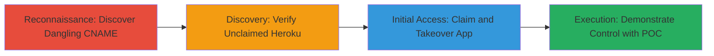

---
tags:
  - subdomain-takeover
  - dns
  - cname
  - heroku
  - cloud-misconfiguration
type: attack_chain
tools:
  - '[[tools/dig]]'
  - '[[tools/heroku-cli]]'
tactics:
  - '[[Reconnaissance]]'
  - '[[Initial Access]]'
verified: false
platforms:
  - Web
  - Cloud (Heroku)
submitted: true
complexity: medium
created_at: '2023-10-01T00:00:00Z'
procedures:
  - '[[procedures/Discover-Dangling-CNAME-Records]]'
  - '[[procedures/Verify-Unclaimed-Heroku-Instance]]'
  - '[[procedures/Claim-and-Takeover-Heroku-App]]'
  - '[[procedures/Demonstrate-Subdomain-Control-with-POC]]'
step_count: 4
techniques:
  - '[[Gather Victim Org Information]]'
  - '[[Compromise Infrastructure]]'
  - '[[Exploit Public-Facing Application]]'
updated_at: '2025-12-14T04:38:39.936Z'
description: >-
  A multi-stage attack demonstrating subdomain takeover by exploiting a dangling
  CNAME record pointing to an unclaimed Heroku app, leading to full control over
  the subdomain for potential phishing or impersonation.
skill_level: intermediate
impact_level: high
id: fe2c1091-4f06-472c-b078-c92a395df6a8
validated: true
mitre_tactics:
  - '[[Reconnaissance]]'
  - '[[Initial Access]]'
mitre_techniques:
  - '[[Gather Victim Org Information]]'
  - '[[Compromise Infrastructure]]'
  - '[[Exploit Public-Facing Application]]'
---
# Subdomain Takeover of Shopify via Unclaimed Heroku Instance

Multi-stage attack chain demonstrating a complete subdomain takeover workflow by exploiting a dangling DNS CNAME record pointing to an unclaimed Heroku instance, allowing full control over a Shopify subdomain for hosting arbitrary content, phishing, or impersonation.

## Chain Metrics Dashboard

| Metric | Value |
|--------|-------|
| Chain Status | Unverified |
| Total Steps | 4 |
| Execution Time | ~15 minutes |
| Skill Level | Intermediate |
| Complexity | Medium |
| Impact Level | High |

## Attack Flow Visualization



## Prerequisites & Requirements

### Required Tools

- [[tools/dig]]
- [[tools/heroku-cli]]

### Target Environment

- Web platform with DNS records
- Heroku cloud services
- Access to public DNS queries
- Heroku account credentials

### Initial Access Requirements

- No prior credentials needed for reconnaissance
- Heroku account for claiming the app
- Network access to DNS resolvers and Heroku API

## Detailed Attack Procedures

### Step 1: Discover Dangling CNAME Record
procedure: [[procedures/Discover-Dangling-CNAME-Records]]

**Objective**: Identify misconfigured DNS records pointing to unclaimed cloud resources.

**Instructions**: Query the DNS records of target subdomains to find CNAMEs pointing to external services like Heroku.

Use [[commands/dig-cname-lookup]] to check the CNAME for the target subdomain:

```bash
dig tim-exclusive.shopify.com CNAME
```

**Expected Output**: Response showing CNAME to a Heroku app name, e.g., "tim-exclusive.herokapp.com".

**Success Indicators**:
- CNAME record points to a Heroku endpoint
- No active resolution to Shopify content

### Step 2: Verify Unclaimed Heroku Instance
procedure: [[procedures/Verify-Unclaimed-Heroku-Instance]]

**Objective**: Confirm that the Heroku app referenced in the CNAME is not owned or active.

**Instructions**: Use Heroku CLI to check if the app exists and is unclaimed.

First, list apps or attempt to access the specific app with [[commands/heroku-apps-list]]:

```bash
heroku apps
```

Then, try to info the target app with [[commands/heroku-app-info]]:

```bash
heroku info --app tim-exclusive
```

**Expected Output**: Error indicating the app does not exist or is unclaimed (e.g., "App not found").

**Success Indicators**:
- App is not registered to any account
- No active dynos or releases

### Step 3: Claim and Takeover Heroku App
procedure: [[procedures/Claim-and-Takeover-Heroku-App]]

**Objective**: Register the unclaimed Heroku app to gain control over the associated subdomain.

**Instructions**: Authenticate with Heroku and create/claim the app.

Login to Heroku CLI with [[commands/heroku-login]]:

```bash
heroku login
```

Then create the app with [[commands/heroku-create-app]]:

```bash
heroku create tim-exclusive
```

**Expected Output**: Confirmation of app creation with the custom domain ready for CNAME pointing.

**Success Indicators**:
- App successfully created under attacker's account
- Subdomain now resolves to attacker's Heroku instance

### Step 4: Demonstrate Subdomain Control with POC
procedure: [[procedures/Demonstrate-Subdomain-Control-with-POC]]

**Objective**: Validate control by hosting and accessing arbitrary content on the subdomain.

**Instructions**: Deploy a simple page to the Heroku app and access it via the subdomain.

Push a POC index.html to the app using git (after initializing a git repo and adding the Heroku remote):

```bash
git add .
git commit -m "POC deployment"
git push heroku main
```

Then access http://tim-exclusive.shopify.com/ in a browser to verify.

**Expected Output**: Custom POC page loads instead of Shopify content.

**Success Indicators**:
- Arbitrary content hosted successfully
- Subdomain fully under attacker control

## Attack Chain Summary

### Key Achievements

1. Identified and exploited a dangling CNAME for subdomain takeover
2. Gained full administrative control over the Heroku instance
3. Demonstrated potential for phishing or content spoofing on a trusted Shopify subdomain

## Technique & Tactic Coverage

### MITRE ATT&CK Techniques

- [[Gather Victim Org Information]] Gather Victim Host Information
- [[Compromise Infrastructure]] Compromise Infrastructure
- [[Exploit Public-Facing Application]] Exploit Public-Facing Application

### MITRE ATT&CK Tactics

- [[Reconnaissance]] Reconnaissance
- [[Initial Access]] Initial Access

---
*Last updated: 2023-10-01T00:00:00Z*
